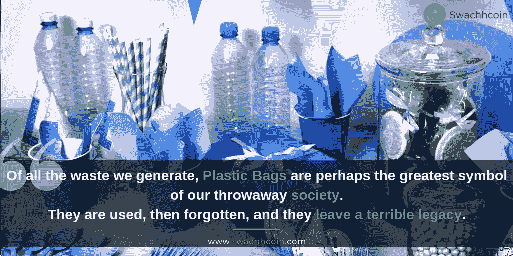

# 塑料垃圾的智能处理

> 原文：<https://medium.com/swlh/smart-disposal-of-plastic-waste-ca9cfafab787>

塑料一直是人类非常重要的资产。通过广泛的研究和技术，我们已经能够对塑料的构成进行新的改变。这些改进有助于制造更新更安全的塑料，尽管如此，使用塑料所涉及的挑战和缺点从未真正解决。

使用塑料的负面影响与日俱增。塑料的一些主要成分；氯乙烯、二恶英和增塑剂是荷尔蒙紊乱、生殖功能障碍、乳房发育和睾丸癌等疾病的主要原因。塑料对新生儿和幼儿的影响也非常明显，尤其是通过直接暴露。

处理塑料最安全有效的方法之一是回收。为了实现有效的回收，我们需要研究智能分类。我们还需要开发更智能的塑料，并改善研究，以开发某些加速塑料降解的微生物。

## **回收塑料**

回收塑料是一个需要回收废料和将塑料材料再加工成新的有用产品的过程。大多数塑料是不可生物降解的。回收是全球当局为帮助减少废物流中的塑料而采取的主要措施。每年都有大量的塑料垃圾流入海洋。与回收玻璃和金属等其他产品相比，塑料回收更具挑战性。这是因为塑料聚合物密度低，价值低。

## P **参与回收塑料的问题**

塑料的回收利用虽然非常重要，但却面临着许多挑战。塑料的回收是非常技术性的。分类和组织塑料材料会给回收公司带来费用。大多数时候，由于回收成本的原因，公司不会购买可回收物品。消费者也没有以正确的方式处理塑料垃圾。他们不使用可回收垃圾箱，而是将塑料垃圾倾倒在任何垃圾箱中。回收塑料的主要问题是分类和收集废料。塑料也需要分为可回收和不可回收塑料。

## **智能回收**

智能回收需要使用自动化垃圾箱，这有助于废物收集和分类。这是利用物联网(IoT)完成的。奖励正确处理塑料垃圾的人将有助于鼓励其他人也这样做。这将有助于提高塑料的回收利用率，从而无意中减少进入垃圾填埋场、焚化炉和海洋的塑料垃圾量。

回收塑料废物还将增加收入，为业务增长创造机会，因为这将降低获得生产材料的成本。这是因为可回收产品可以用来代替新的生产材料。回收也将有助于减少我们生态系统中的废塑料。

就目前而言，回收似乎是我们处理塑料垃圾问题的最好和最安全的方法。每个人都需要在甲板上帮助解决这个问题，如果塑料浪费。从政府、地方市政当局、制造商、中间商、消费者等开始，没有人被排除在外。我们都有责任妥善、明智地处理塑料垃圾。

要了解更多关于兑换硬币的信息，请访问:[https://swachhcoin.com/](https://swachhcoin.com/)

链接到 Swachhcoin 储备出售:【https://swachhcoin.com/sale/ 

## 在此加入我们的社区:

[Official Telegram Discussion Group](https://t.me/swachhcoin)

[Twitter Channel](https://twitter.com/@swachhcoin)

[Facebook FanPage](https://www.facebook.com/swachhcoinofficial/)

[Swachhcoin Subreddit](https://www.reddit.com/r/swachhcoin/)

## 这篇文章发表在[《创业](https://medium.com/swlh)》上，这是 Medium 最大的创业刊物，有+421，678 人关注。

## 在这里订阅接收[我们的头条新闻](https://growthsupply.com/the-startup-newsletter/)。

