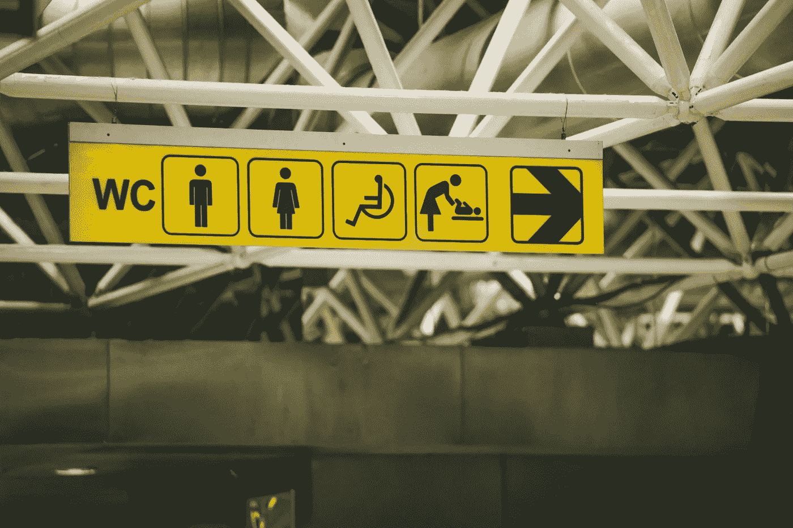

# 智能手机和可访问性

> 原文：<https://medium.com/swlh/smartphones-and-accessibility-ccc1cd6ad4de>

Photo by [Paul Green](https://unsplash.com/photos/gWFXgcH-LeU?utm_source=unsplash&utm_medium=referral&utm_content=creditCopyText) on [Unsplash](https://unsplash.com/search/photos/disabilities?utm_source=unsplash&utm_medium=referral&utm_content=creditCopyText)

我叫 Yenny，是一名 android 智能手机用户。

我记得在我十几岁的时候，有一次我被一个同学羞辱，因为我没有智能手机。我试图合理化，我不需要一台电脑，因为我家里已经有一台电脑，不需要另一台电脑随身携带。