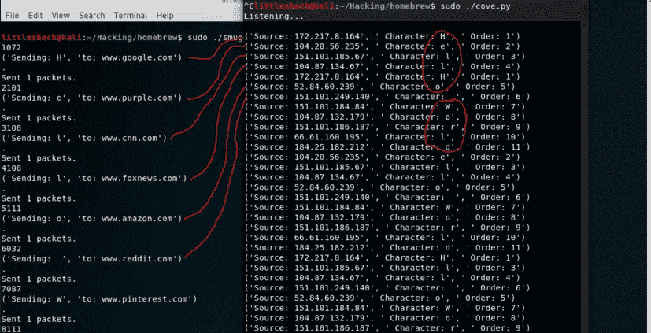
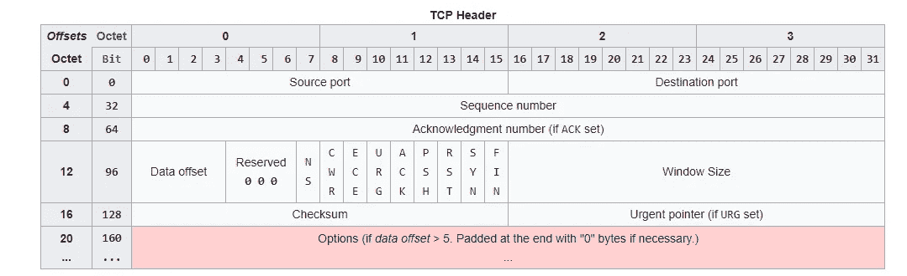
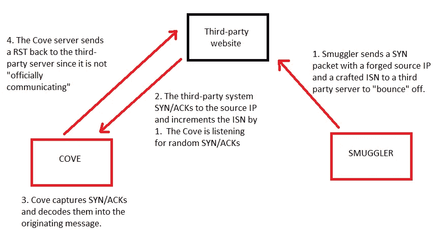
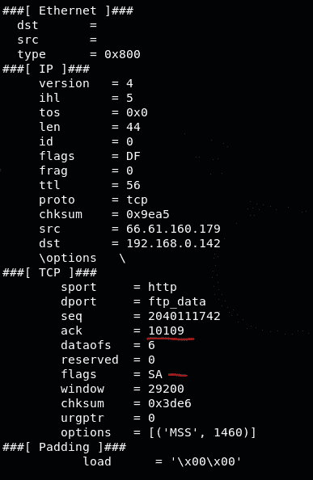
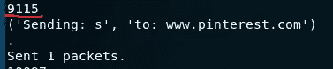
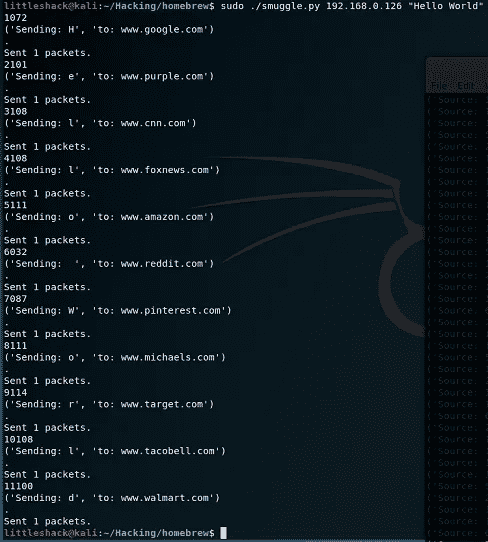
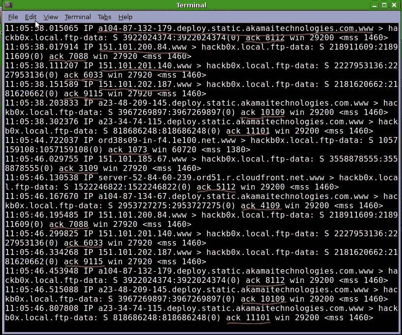
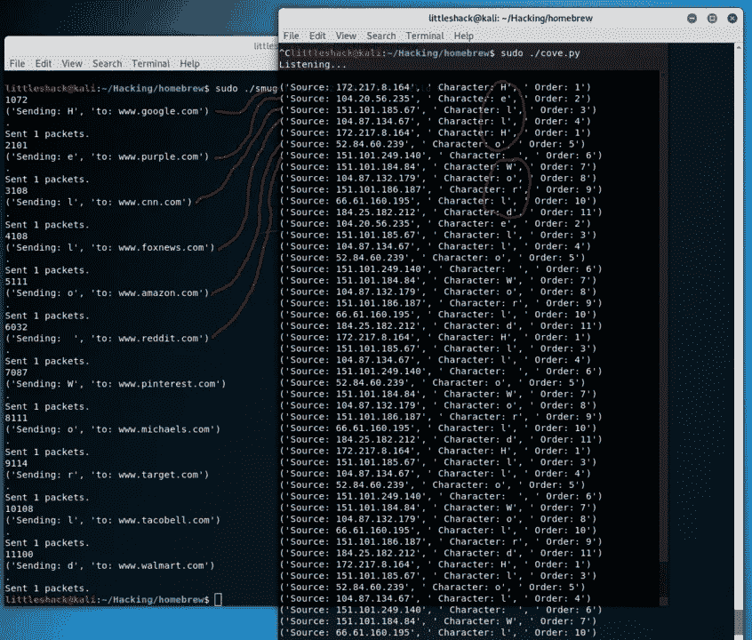

# 走私者和海湾:使用 Scapy 进行数据泄漏的概念验证。

> 原文：<https://medium.com/swlh/smuggler-and-cove-a-poc-for-data-exfiltration-using-scapy-e44649feae6>

Bouncing packets for fun, not profit.

我一直对秘密渠道和数据走私的概念着迷。几年前，我想出了一个主意，我可以将数据从一个网络偷偷传输到互联网上的另一台机器，而不需要使用 TCP 包中的序列号直接与那台机器对话，并将包从第三方服务器反弹到伪造的源 IP 系统。我和一些朋友讨论过这个问题，甚至画了一张它如何工作的图表，并把它展示给我的一个有坚实网络背景的朋友，他说这个想法似乎是可行的。(谢谢凯尔！)

快进一年左右，在参加 GCIH 课程时，我了解到这个概念并不新鲜。(当然不是，事实证明我并没有那么有创意。)Covert_TCP 是个东西。谁知道呢？显然不是我。

无论如何，为了从实践的角度理解秘密渠道，并在假期有很多空闲时间，我决定看看我是否可以发送一些秘密数据。目标是通过将数据包从第三方机器上弹回而将消息发送到远程机器，这样接收端的所有传入数据包都不会看到原始系统。如果您能够设置接收系统从合法的可信服务器中嗅探数据，甚至从监视您的数据包的公司内部的机器中泄漏数据，这将是一种有趣的 C2 机器的方式。注意:如果您的网络设备被设置为丢弃所有包含不属于您的网络的源 IP 的传出数据包，这种方法很容易被数据渗透所击败。

**目标:**创建一个客户端，它可以将数据偷偷传送到互联网上的第三方系统，而无需直接与它对话，并在数据包中隐藏信息。这是通过伪造每个数据包的源 IP，并在每个 SYN 数据包的 ISN 中隐藏数据来实现的。(走私者)

**目标:**创建一个监听器，它可以接收来自世界各地不同服务器的数据，并将它们重新排序以形成消息/命令。(小海湾)

**高级目标:**依靠可信域内不存在的服务器，通过隐蔽通道建立双向通信。(稍后将详细介绍)

这些目标需要几样东西:

1.  一个无声的监听服务器。这个服务器监听来自外界的 SYN/ack，并且知道这些是走私者发送的消息的一部分。Cove 服务器将捕获这些数据包，并将它们重新组织成一条消息，或者更不可思议的是，一条命令？也许吧？由…改编
2.  一种新的“协议”。使用 SYN 包的 ISN，我们只有 4 个字节的数据要处理，这意味着我们必须创建一种全新的语言，以便客户端和服务器可以在这个有限的空间中进行通信。最初的想法是创建一种新的“走私 SYN ”,这是发送到 Cove 服务器的初始序列，然后告诉它醒来并注意——有数据包传入！监听这些数据包的美妙之处在于不需要打开套接字。服务器可以悄悄地嗅探来自野外的 ack，发回它们的 rst，并在没有“活动”的情况下形成数据。例如，第一个 ISN 可能是 4294967295，这将强制 SYN/ACK(因此 rst)为 0。(这将序列号包装回 0)。如果服务器看到 ACK 为 0，它知道是时候醒来注意了，有一个请求进来了。

无论这个“走私 SYN”是用什么方法发送的，这个想法都有希望是明确的。知道我们有 4294967294 个其他数字要处理，我们可以创建一个完整的代码集来表示从客户端到服务器的任何内容，如果我们愿意，还可以从服务器到客户端创建一个完全不同的代码集。我们甚至可以构建填充系统，其中预先确定的代码代表某些功能，就像从 LDAP 服务器向浏览器发送 404 或错误 49(无效凭证)。

Yeah, it’s MS Paint. Don’t judge me!

# ***开始***

所以我们在这里。这个概念很简单，但是我需要为自己建立一个概念验证，看看我是否能做到。我首先用 Perl 构建了一个脚本来生成原始包，它工作得很好，但是不像我希望的那样健壮。我也用 C 语言编写了一些基本的包，但这就像是我自己建造道路，只是为了在上面行驶。

经过一些研究，我了解了 Scapy，这是一个非常棒的 Python 包制作工具，它使制作包变得非常容易。Scapy 允许你像乐高积木一样或以一种感觉合乎逻辑的方式构建包。

拿你的第二层框架；您期望以太网层、IP 层、TCP 层和标准 TCP 通信的有效载荷。在 Scapy 中，您可以使用缺省值构建一个包，只需执行以下操作:

***>lyr _ two _ packet = Ether()/IP()/TCP()/load***

***>sendp(lyr _ two _ packet)****# # sendp()是针对第二层的！*

****>lyr _ three _ packet = IP()/TCP()/load****

****>send(lyr _ three _ packet)****# #注意这是 send()，不是 sendp()！**

**如果您不考虑以太层，Scapy 将在 send()中广播以太网。**

**这些函数的默认设置不会直接工作，但是结构会存在。更改数据包的属性非常简单:**

*****>lyr _ two _ packet[IP]。src = " 192 . 168 . 1 . 2 "*T27*或者*****

*****>lyr _ two _ packet【TCP】。seq=11111111*** 或者**

*****>【mytcp = TCP(sport = 20，dport=80，seq=11111111)*** 然后将那一层叠加在其他层上，如上。请注意,“seq”值是奇迹发生的地方。**

****

**A packet using show2(). MAC addresses have been removed to protect the innocent.**

**一旦构建了包，就可以使用 show()或 show2()查看它。我推荐 show2()，因为它将向您展示组装好的数据包、校验和等等。Protip:如果你组装你的数据包，然后改变一个属性，你可能需要强制 scapy 重新计算你的校验和。您可以通过删除校验和，然后再次调用数据包，强制其重建来实现这一点。**

*****>del lyr _ two _ packet[IP]。chk sum*****

*****>del lyr _ two _ packet【TCP】。chk sum*****

# **让我们建造**

**我们需要做的第一件事是想出一种方法，在尽可能小的空间里进行尽可能多的交流。由于我们在 SYN 包的 ISN 中只有 10 个字符要处理，(实际上只有 9 个，你会明白为什么)，我们需要想出一个简单的方法来构造原型。我不想在这上面花太多时间，所以我决定在一个 9 位数的空间中使用 6/3 的划分，前 6 位可以用于订购号，后 3 位用于字符本身。换句话说，我们可以传输多达 999，999 个单独的字符，然后再重新开始新的一批数据。最后 3 位数用于翻译我们要发送的字符，方法是将字符传递给 python 的 ord()函数。ord()只是把一个字符翻译成一个数字，chr()把一个数字翻译成一个字符(256 是允许的最大值。)**

*****im _ now _ a _ number = ord(im _ a _ character)*****

*****im _ now _ a _ character = chr(I _ was _ a _ number)*****

**我们最终得到的是这样的结果:**

****

**A custom sequence number**

**9115 或 000009115。把它分成 6/3 组，我们得到 000009 115。前 6 个数字是顺序，后 3 个是字符。在这种情况下，字母“s”是本次传输中发送的第 9 个字符。**

**我们不使用最左边的空格是因为它的上限是 4。如果您还记得，最大允许的 ISN 是 4294967295，所以我们不能在最左边的位置跳过 4。我们可以变得狡猾，如果我们愿意，可以将它用作“带符号”位，甚至是某种类型的 4 位开关！**

**接下来，我们需要一个我们想要退出的服务器列表。在这种情况下，我会从 web 服务器上反弹，因为它们很容易找到，我们知道它们会返回给我们。**

**当所有这些放在一起时，变速器看起来像这样:**

****

**Hiding characters in SYN packets!**

**太好了！我们刚刚在发往世界各地的 SYN 数据包的 ISN 中走私了一些数据。每个服务器捕获我们的 SYN，并用一个+1 递增的序列号进行 SYN/ACK。**

****

**tcpdump | grep ack**

**请注意，ack 的到来并不像预期的那样有序，这就是为什么我们需要一个排序系统。在这个例子中，你看不到的是来自这些服务器的重新传输。由于反弹，Cove machines 内核并不期待 SYN/ACK，而是发送一个 RST 或不回复——这取决于内核。你可以期待每台机器的多次重新传输，直到他们放弃。**

**现在我们需要建立一个更好的方法来捕捉和组织数据。**

**回到斯卡帕。**

# **用 Scapy 构建嗅探器**

**Scapy 有一个很好的函数，叫做 sniff()。它做你期望它做的事。该函数的一个很好的特性是“store”参数，当设置为 0 时，它不会在数据包到达时保存数据包，而是将它们流式传输到您传递给它的任何回调(prn 参数)值。**

**例如: ***sniff(iface="eth0 "，prn=p_catch，filter="tcp "，store=0)*****

**这将把每个 TCP 包发送到一个名为 p_catch 的函数，在那里你可以分解它，或者对它做任何你想做的事情。这对于编写您自己的 id 非常方便！在我的例子中，我捕捉数据包并断开它们的 ISN，这样我就可以捕捉到秘密消息。(请注意，您可以将过滤器更改为您想要监视的任何类型的数据包— tcp、icmp 等。完全移除过滤器会捕获所有东西。)**

**所以现在我们把所有的 TCP 包都发送给 p_catch。p_catch 是做什么的？它首先检查数据包是否有 TCP 层—***if(p . has layer(TCP)):*****

**接下来，它取出数据包的 ack 值。超级容易！**

*****>ack _ n = p . getlayer(TCP)。确认*****

**没错。真的就这么简单。Scapy 太棒了！**

**现在，我们从值中减去 1，分离出字符和顺序。请注意，通过将字符值放在最右边，我们可以很容易地从中减去 1，然后将其弹出，传递给 chr()并完成。**

**下面是完成后的样子:**

****

**现在我们只需重新排列信息，去掉 RTX，就大功告成了。在不知道来源的情况下成功发送到第三方系统的消息！**

**我认为传输速率在 300 到 600 波特之间。速度不快，但绝对隐秘。**

**如果你仔细想想，你已经可以用它做各种事情了，但更有趣的是双向交流。我现在将简要地讨论这个主题的一些想法，但需要更多的研究和更好的实验室环境来构建它，这是我目前无法获得的。**

# **建立双向沟通的理论**

**让我们假设你有一栋房子，你信任来自亚马逊的包裹。假设您有一个看门的保镖，它还可以过滤/阻止来自世界上不受信任的地方的任何包裹。我们知道这个保镖是防火墙。假设保镖通常会扔掉来自不可信来源的任何包裹，并且假设保镖只接受来自亚马逊的包裹，如果他们知道你首先向亚马逊发送了包裹，并且正在期待返回包裹。**

**如果你让房子里的一个人在预定的时间，比如下午 5 点，决定将一个包裹发送到亚马逊的校园，但发送到他们校园内不存在的一栋建筑，会怎么样？保镖检查外发包裹，看到的是“厕所部，亚马逊”，确认一下，就在路上发，等待亚马逊发回包裹。突然来了一个包裹，说是亚马逊厕所部门的，门卫让它进来。**

**就这样，一个带有伪造来源的包裹到达了目的地，被允许进屋。**

**目前，许多 C2 检测都是基于重复出现的时间(例如，通过反向外壳)，到达一些坏人的域并收集命令在被利用的机器上执行。坏人域名可以看到和阻止。如果一个重复出现的时间被发送到受信任公司范围内的受信任 IP 会怎样？“嗯，我们看到每 5 分钟就有一个随机的 ping 回应请求/回应回复进入 Google.com 的 IP 地址范围。那是怎么回事？”这种情况下的假设是不存在这样的服务器，但是域本身是可信的。攻击者利用这一点，伪造一个带有正确的预期校验和的数据包。TCP 通过发送带有随机序列号的 SYN/ACK 来防止此类攻击，发送方必须第三次重复该序列号以进行双向验证。ICMP 没有。ICMP 只依赖于通过校验和与回应请求相等的有效载荷——我想是*。这就是我的知识开始不足的地方，所以如果有人知道答案，请告诉我！***

***我的理解是，ICMP 回应请求与有效载荷一起发送，回应应答必须包含相同的有效载荷，但带有 0 标志，而不是 8。但是，这个有效载荷是通过适当的校验和检查的，还是由有效载荷本身检查的？这是在内核级完成的，还是由深度包检测防火墙完成的？如果防火墙通过校验和允许有效载荷，那么是否有可能用消息覆盖有效载荷的某些部分并保持校验和？***

***例如:\x00\x00\x00\x00 变成\xde\xad\xbe\xef？***

***如果上述情况属实，那么双向通信就建立起来了，而发送方却不为人所知。***

***如果你有这个问题的答案，或者我在某些方面有所偏差，请告诉我你的想法。赞赏评论！***

***黑客快乐！***