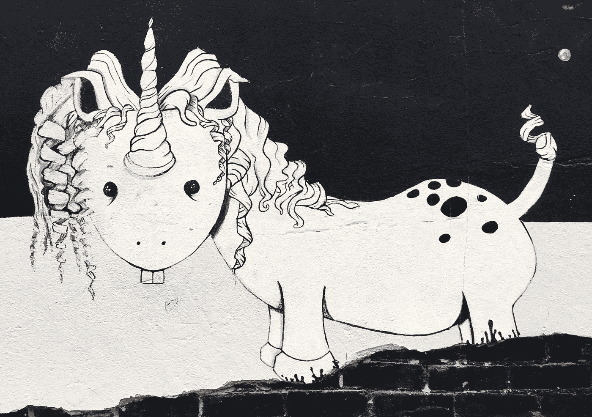

# 所以你想要一只独角兽

> 原文：<https://medium.com/swlh/so-you-want-a-unicorn-f5172e774b17>

## 对创业成功的追求

在 20 世纪 60 年代，每个人都想要言论自由和平等。在 70 年代，每个人都想要一台电视。在 80 年代，每个人都想要大学文凭。今天，似乎每个人都想创业。

我觉得很棒。人类发展的一大进步。想一想当价值链中的每个人都真正理解了整个价值链和每个决策的影响时会有什么影响。想象一下，如果每个人都加入一种他们真正热爱的元素，这个世界会变成什么样子。想象一下，当人们只做他们喜欢和关心的事情时，世界会变成什么样子。

毫无疑问，这个世界会变得更加美好。

## 失望之谷

但是创业并不像听起来那么容易。失败比成功多。勇气和毅力往往是比天赋和创造力更有价值的技能。

大多数人认为创业就像生活中的任何变化一样，是一个线性的过程，就像通往高楼顶端的楼梯。向上只有一条路，一步一个脚印。

然而现实是，这更像是爬山，向前一步，向后两步。向前两步，向后一步…你爬得越高，获得的资源就越少——包括珍贵的氧气——这使得最后几步比你以前做过的任何事情都更难。

当你慢慢上山时，你会看到其他创业公司过去失败的残余散落在下面的失望之谷。你意识到你在学校所学的一切都没有为这次危险的旅程做好准备，只有疯子才会开始这样的冒险。

你开始怀疑自己和自己的能力。你甚至开始怀疑自己是否能成功。当你看着那些走在你前面的人，你能发现他们的错误，然而你感到无力改变你的命运。

> 创业成功和情绪掌握是直接相关的。

## 创业失败的*真正*原因

造成这种情况的原因有很多，下面列举几个最常见的原因:

*   没有根植于激情的清晰愿景。
*   开始太大了。
*   试着自己做。
*   不是在寻求帮助。
*   求助却不听劝。
*   认为钱是你所有问题的答案。
*   缩放太快。扩展太快。

然而，大多数初创公司没有成功或成为独角兽的最重要和最主要的原因是一些更为根本且经常被忽视的东西。

*情商。*

不要与抑制或管理你的情绪混淆，而是要对你的情绪和它的指导保持*智能*。在每天与我打交道的人群中，我只见过一个我认为有情商的人。

我见过的大多数人都认为情商是控制自己情绪和对各种情况的情绪反应的能力。他们带着情商作为他们周围的盔甲，隐藏下面的不完美，保护他们内心的柔软和脆弱，害怕人们会伤害他们。然而，情商高的人不会向别人隐藏自己的弱点，他们会公开分享自己的伤口，并相信别人不会滥用它。

情商高的人会对自己的情绪做出反应。他们倾听它所传递的信息。他们将情感触发视为向导和灯塔，向他们展示限制他们的信念在哪里阻止他们打破头顶的玻璃天花板。

他们不会试图逃避或避免痛苦的情绪，他们会直面痛苦，并承认自己的耻辱。他们也从中吸取教训，化痛苦为智慧。

一旦他们将痛苦转化为智慧，他们就会掸掉身上的灰尘，站起来再次尝试，正如**在他的歌曲*《振作起来》*中优美地解释的那样。**

# **振作起来**

***我发现没有什么是不可能的
因为当我的下巴着地的时候
我爬起来，掸掉身上的灰尘，重新开始***

***如果你失败了，不要失去信心
感谢一次愉快的旅行
振作起来，掸掉身上的灰尘，重新开始***

**像灵魂一样工作，直到赢得一天的战斗你可能会生病和疲惫，但你会成为一个男人，我的儿子，难道你不记得那些不得不跌倒再爬起来的名人吗？他们爬起来，掸掉身上的灰尘，重新开始**

****词曲作者:**多萝茜·费尔兹/杰罗姆·科恩**

***拾自己作词环球音乐出版集团，夏皮罗·伯恩斯坦&公司***

**任何创业公司都可以从中吸取的关键信息不是避免情感痛苦，而是邀请它进来并从中吸取教训。你试图避免的这些痛苦情绪是阻止你前进的障碍。**

# **如何识别情商**

**情商就像一个明亮美丽的红苹果。它可能外表光鲜，但它的内在才是最重要的。以下是评估情商时需要注意的一些最明显的事情:**

## **1.情商高的人反应灵敏。**

**判断一个人情商成熟程度的第一个标志是他们的反应能力。**

**当人们没有回应时——无论是回答 WhatsApp 的消息还是被问一个直接的问题——这表明他们不愿意面对困难的局面。情商高的人不会回避困难，他们会带着同情直面困难。**

## **2.情商欢迎反馈。**

**另一个需要注意的迹象是密切关注人们对反馈的反应。他们会通过指责来捍卫自己的观点或项目吗？还是他们敞开心扉，不带任何评判地欢迎你的观点？**

**当人们情商高的时候，他们不会把表扬看成好的，把批评看成坏的。相反，他们认为两者都是反馈。它只是简单地倾听人们的想法或他们对你的看法，并试图去纠正。**

**当你将反馈视为批评时，这意味着你认为自己的观点是正确的，其他的都是错误的。情商高的人专注于理解他人的观点，并想方设法将他们的观点融入你的观点中，从而一起创作出一幅比你单枪匹马所能完成的更美丽的画作。**

## **3.情绪聪明的人承认他们的错误。**

**每个人都会犯错。情商高的人和情商低的人之间的区别在于，一个不太成熟的人会试图隐藏自己的错误。一个更成熟的人会承认错误，他们会说“对不起”,并因为错误而改变自己的行为。**

**即使当另一个人错了，一个情感成熟的人也会承认他们在冲突中的角色，意识到一个巴掌拍不响。有加害者才有受害者。一个不能离开另一个而存在。那么对方真的那么坏吗？还是你在扮演受害者来让自己好看？**

**当你不愿意承认你犯了一个错误时，你就是在否定另一个人，否定你们两个人的学习和成长。**

## **4.情商高的人，从心开始。**

**在创业之旅中，艰难的对话肯定会出现。这一点你可以得到保证。你不可能永远是好人，但你可以永远怀有善意，并试图找到一个对双方都有利的解决方案。**

**有时候你会被推到极限之外，有时候你不得不说不。有时候你需要说一些别人不想听的话。这是必然的。**

**一个情绪化的聪明人不害怕告诉人们他们不想听的话，但他们总是从内心开始。他们开始对话，试图解决和理解。如果对方不愿意过来，或者不愿意参与谈话，你对此无能为力。但给出反馈总比保持沉默，让怨恨在心里滋长要好。**

> **不好的反馈总比没有反馈好。**

**有一些方法可以更温和地给出反馈，但有时你必须打开伤口才能愈合。不给别人机会去看他们的伤口，远比为了让他们痊愈而伤害他们一点点更残忍。**

## **5.情绪化的聪明人接受拒绝作为旅程的一部分。**

**如果有一个项目可以区分情绪聪明的人和不太情绪化的人，那就是他们处理失败和拒绝的能力。**

**创业要想成功，最重要的是，你需要能够从失败中恢复过来。你需要愿意接受拒绝，然后再试一次。**

**有时候你会摔个嘴啃泥，让全世界都看到，然后站起来承认你的耻辱。**

**创业成功不是避免失败，而是毅力和承诺。一个不太聪明的人在面对羞耻时会放弃，不愿意承认它并从中学习。**

# **对自己的情绪保持理智**

**作为初创公司的创始人，你会发现在关键的突破时刻，情绪会沸腾到表面，就像一扇锁着的门背后藏着一笔财富。强烈的情绪是一个信号，表明有什么东西阻碍你达到你需要关注的目标。当你选择忽略它时，一个更大的机会会出现，导致更强烈的情绪反应，直到你最终听进去。**

**对自己的情绪保持理智并不是为了避免痛苦和失败，而是要*意识到*自己的感受(不仅仅是好或坏)*理解*它带给你的信息，以及*通过做出不同的选择，放下*局限的信念。**

**创业成功就是你能够突破自己的玻璃天花板。**