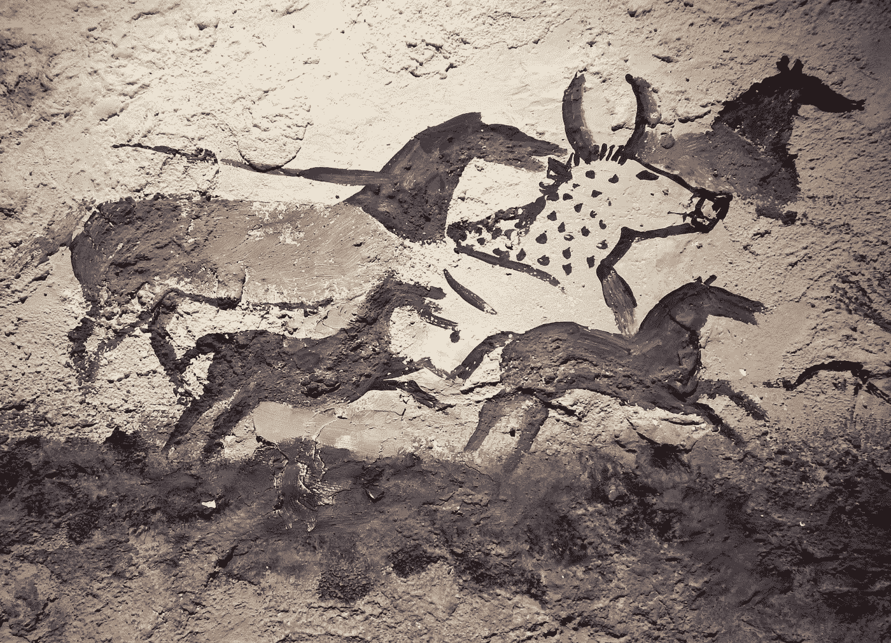

# 所以你想成为一名艺术家？饿死你内心的批评家。

> 原文：<https://medium.com/swlh/so-you-want-to-be-an-artist-starve-your-inner-critic-a95e103bf858>

Photo Credit: subarcticmike

我有一个内在的批评家。我想每个人都是这样，但是对于那些有创造力的人来说，对于那些想要分享他们的作品，并让作品以积极的方式影响他人的人来说，这一点尤为突出。

它是这样工作的:几乎每次我为一篇文章、一个故事或一篇日志获得一个新的想法时，这个想法似乎都被否决了，不是被我周围的任何人，而是被一个响亮的声音否决了…