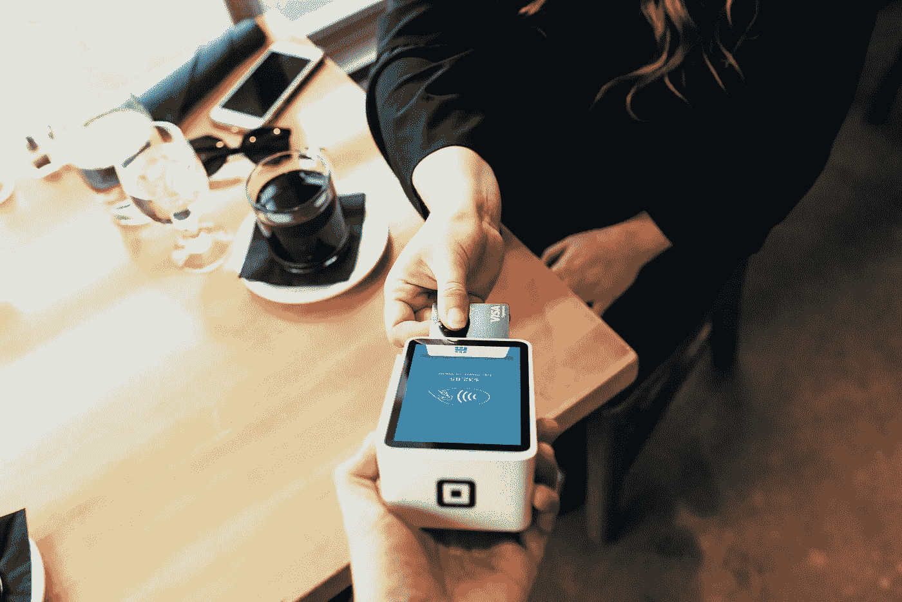

# 社会影响——替代信贷数据的真实案例

> 原文：<https://medium.com/swlh/social-impact-the-real-case-for-alternative-credit-data-5d453fda154>

Photo by [Blake Wisz](https://unsplash.com/@blakewisz?utm_source=unsplash&utm_medium=referral&utm_content=creditCopyText) on [Unsplash](https://unsplash.com/search/photos/credit?utm_source=unsplash&utm_medium=referral&utm_content=creditCopyText)

我们的财务状况取决于能否获得信贷。在过去的十年里，随着移动和金融技术的兴起，我们做生意的方式发生了巨大的变化。

在数字时代，人们对确定我们信誉的标准提出了新的问题。随着技术工具的变化，消费者行为也发生了转变。