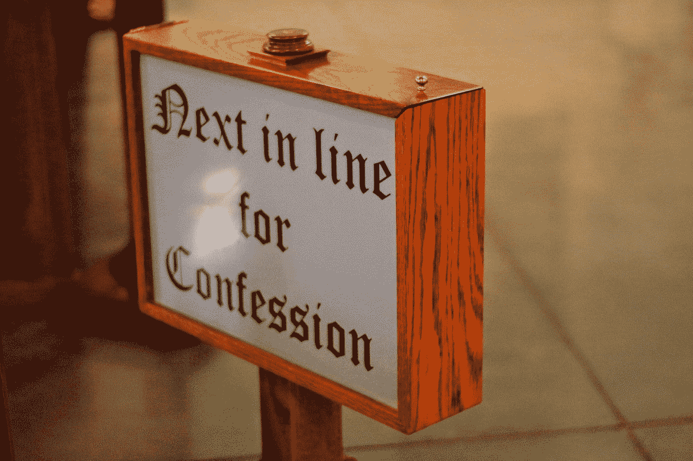

# 社交媒体和我们以其名义犯下的罪恶

> 原文：<https://medium.com/swlh/social-media-and-the-sins-we-commit-in-its-name-d73e70910dca>

Photo by [Shalone Cason](https://unsplash.com/@shalone86?utm_source=medium&utm_medium=referral) on [Unsplash](https://unsplash.com?utm_source=medium&utm_medium=referral)

## “在那里，骄傲、贪婪和嫉妒是人们知道和留意的舌头，绝望的巴别塔”——**[**【神曲】**](https://www.goodreads.com/work/quotes/809248)**

**暴食。贪婪。懒惰。愤怒。羡慕。骄傲。欲望。七宗罪。我们已经向我们的牧师忏悔了他们，成为他们凌驾于他人之上的力量的受害者，并且看到了他们无数的…**