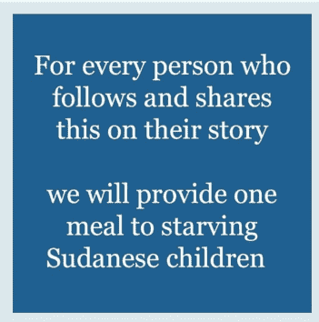

# 社交媒体重新定义了草根运动

> 原文：<https://medium.com/swlh/social-media-redefines-grassroots-movements-3968163a9b8d>

在过去的两到三周里，我在 Instagram 上的故事都是一样的:蓝色。

人们已经把他们的个人资料图片换成了特定的蓝色，并重新发布了同样的文字图片，承诺每次关注和分享都会为苏丹儿童提供一顿饭。

the post that was circulating on Instagram stories

这种现象被称为苏丹餐项目。这是一个我认为是一种新的…