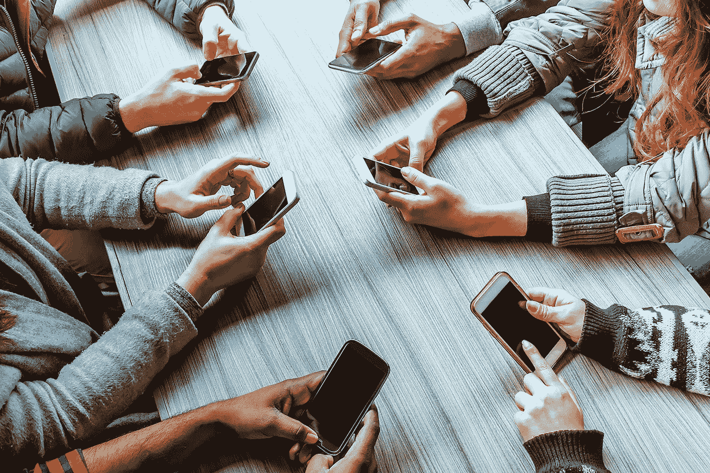

# 社交媒体:为什么我们要让它接管我们的生活？

> 原文：<https://medium.com/swlh/social-media-why-are-we-letting-it-take-over-our-lives-d9da878fd446>

社交媒体成瘾是真实的，它对我们的影响比我们意识到的要大。

对我来说，从我九岁开始。我创建了我的第一个脸书账户，以便和我的一个要搬到另一个州的最亲密的朋友保持联系。从那以后，开始是用我爸爸的家庭办公电脑一周登录几次脸书，现在已经…