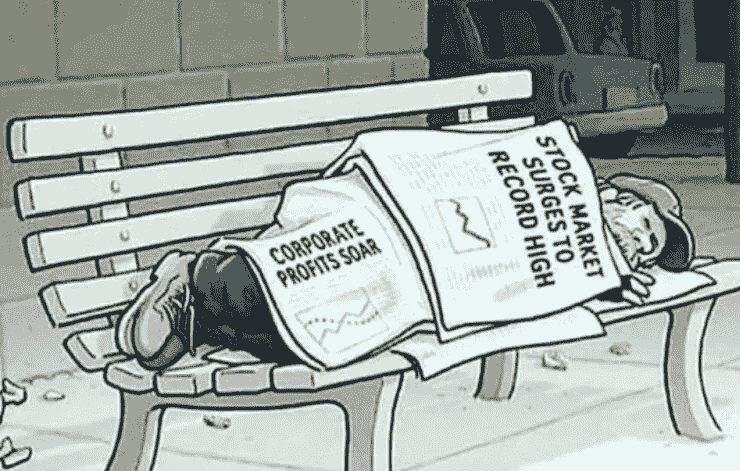

# 社会主义是富人的

> 原文：<https://medium.com/swlh/socialism-is-for-rich-people-1106d428bf53>

很明显，我们将不得不以某种方式修改我们的经济体系。医疗保健、教育、停滞不前的工资、贫困等问题都给人们带来了前所未有的债务，这些问题往往被强调为这种修订应该开始的领域。许多人已经放弃，并感到被我们现有的经济体系出卖了。尽管如此，提出的解决方案经常被怀疑，也许是不公平的，因为…