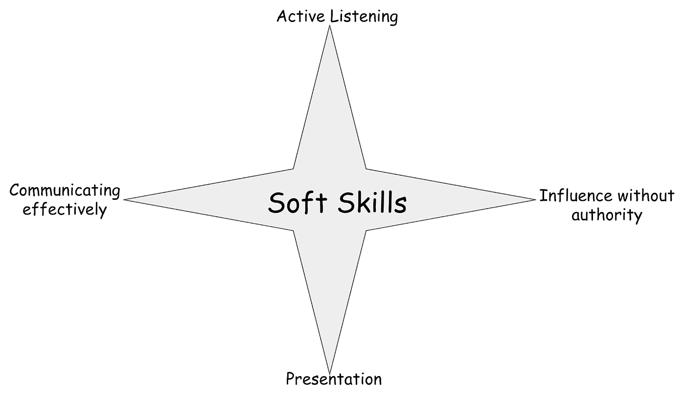

# 软技能——对产品经理的硬性要求

> 原文：<https://medium.com/swlh/soft-skills-a-hard-requirement-for-product-managers-c42cb0c5fe00>

面对现实吧，作为一个产品经理，你什么都不用做，你要把事情做好！

即使你自己想出了解决问题的方法，而没有和其他相关的人讨论，你也不是在解决问题——你是在把你的个人观点作为解决方法。在大多数情况下，这可能不是正确的解决方案。一个伟大的产品经理首先会发现…