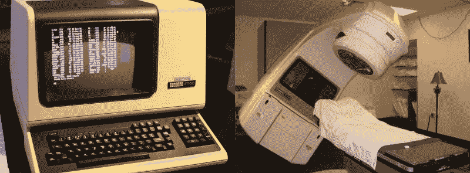

# 软件架构:Therac-25 杀手辐射机

> 原文：<https://medium.com/swlh/software-architecture-therac-25-the-killer-radiation-machine-8a05e0705d5b>

Therac-25

每天在课堂上，我都坚持告诉我的学生，软件必须被测试，他们在拿人们的生命开玩笑。当我做这个评论时，他们认为我是在开玩笑
，因为我们正在开发使用简单的 Restful API 执行小计算的 Web 服务。因此，测试对他们来说只是额外的工作，他们并不认为这是基本的…