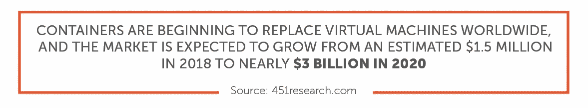
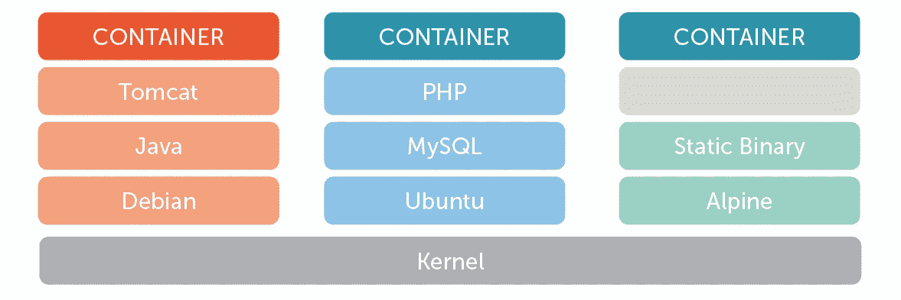
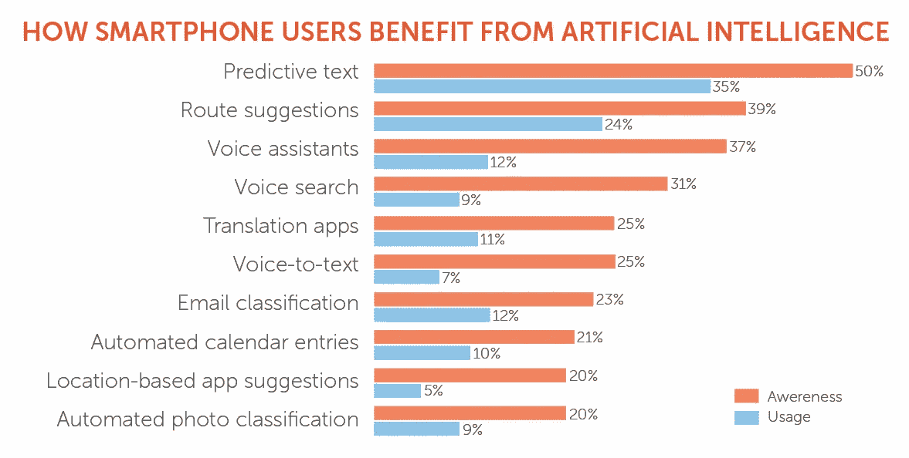

# 2019 年的软件开发:下一件大事

> 原文：<https://medium.com/swlh/software-development-in-2019-the-next-big-things-21d51720c3a8>

“如果它没坏，就不要修理它”可能是不与时俱进的农业设备或机器的恰当格言。但是对于软件开发来说，打破常规是常态。最优秀的程序员、开发人员和黑客不断分解应用程序，以完善他们的代码库，逐行寻找解决方案，使应用程序运行得更高效、更智能。

但是，要真正改变开发，让应用程序发挥最大潜力，就需要采用新的开发工具。这可能包括需要适应新的工作流程或学习新的编程语言。然而，站在软件开发的最前沿会带来巨大的好处。拥抱最新技术意味着新编译的应用程序使用针对现代和未来平台优化的工具，使您的应用程序为下一件大事做好准备。

幸运的是，软件开发的新趋势指向了使软件开发人员的生活变得稍微容易一点的解决方案。从人工智能辅助的自动化到简单的跨平台兼容性，这些工具不仅仅加快了过程:它们已经准备好将你的应用带到下一个级别。

**让我们来看看 2019 年软件开发的下一件大事:**

# 多平台用户界面开发

今天的开发人员经常被要求完成生产一个产品所需工作量的三倍。一家公司可能有一个用于 iOS 的杀手级应用程序，但要实现真正的全球覆盖，该应用程序需要针对 Android 和网络进行移植或重新编译。重新编写一个应用程序以在不同的平台上工作需要大量的时间和资源，这使得开发人员不再构建新功能或消除错误，以便重做他们已经完成的工作。

即使使用工具来简化跨平台开发，移植平台上的用户体验也往往是二流的。不使用原生库和 API 构建的应用程序通常显得格格不入，缺乏原生应用程序的触感。这一点在滚动、文本呈现和按钮或对话框等常见用户界面元素中显而易见。

幸运的是，下一代多平台开发工具正在使“构建一次，到处运行”的概念成为现实。[谷歌的骚动](https://flutter.io/)和[微软的 Xamarin](https://visualstudio.microsoft.com/xamarin/) 开发环境使得使用原生 UI 库、API 和特定于操作系统的功能的应用程序的创建能够跨越 Android、iOS 和 Windows。开发人员可以轻松地使他们的应用程序看起来像是为每个平台而构建的，因为他们使用的是本机代码，而不是简单的重新打包或移植。

多平台 UI 开发工具不仅仅是省时的工具，它们是面向未来的。谷歌的 Flutter 已经成为他们的下一代操作系统 Fuchsia 的首选开发平台。构建 Flutter 将使开发者能够为 Fuchsia 准备好一系列已经部署在 Android 和 iOS 上的应用，当 Fuchsia 准备好上市时，它可能会获得完整的应用库。

> 另请阅读:[2023 年的移动应用:Flutter 会成为 Android 应用开发的新亮点吗？](https://www.ciklum.com/blog/mobile-apps-in-2023-will-flutter-become-the-new-black-for-android-app-development/)

# 集装箱化

虚拟化技术已经存在了几十年，使用户能够在虚拟环境中运行操作系统、服务器、软件和存储。这项技术广受欢迎，像 [VMWare](https://www.vmware.com/) 这样的平台被部署在整个企业中，以帮助 IT 部门更充分地利用现有硬件来扩展、自动化和削减不必要的资源。

但是虚拟化经常面临一个重大的缺点:它消耗的大量资源。运行虚拟软件或硬件通常需要大量的硬盘空间、处理能力和 RAM，需要在高端机器上运行虚拟化软件来处理所需的能力。虚拟化平台试图通过构建定制的精简软件映像来解决这一问题，这些映像删除了消耗资源的不必要功能，但不可避免地需要虚拟化整个操作系统才能使其应用程序正常工作。

集装箱化技术正在改变这个等式。容器不需要整个虚拟机在虚拟操作系统上运行应用程序，而是将应用程序的运行时、系统工具、系统库和设置打包，以便在单主机操作系统上运行和共享资源。结果是一个应用程序可以跨多个平台移植，而且资源消耗少得多。

推动容器化的领先公司之一是 Docker，它为 Windows 和 Linux 开发打包软件工具。通过 Docker 或其他容器化软件，轻量级应用程序可以跨服务器和数据中心部署，以帮助组织以更低的成本增加规模。

# 人工智能驱动的定制软件开发

人工智能长期以来一直是计算领域的圣杯。通过模拟人脑的软件解决方案，[人工智能应用](https://www.ciklum.com/our-expertise/rd/)可以处理日益增加的复杂性，并将自然语言等现实世界的信息转化为可操作的数据。

在过去的十年里，人工智能已经迈出了进入主流的大步，因为主要组织已经开始在他们的产品中采用机器学习等工具。为了让人工智能更加普及，谷歌等公司正在[打造自己的人工智能芯片](https://www.theverge.com/2018/7/26/17616140/google-edge-tpu-on-device-ai-machine-learning-devkit)，以使设备上的人工智能处理更快、更安全。但在很大程度上，人工智能仍然是一个工具，后来被添加到开发过程中。因为它相对来说还处于起步阶段，所以很难用人工智能基础来构建应用程序，因为这种技术还不可用。

今天，这种情况正在改变。像微软认知服务这样的工具包使开发人员能够通过几行简单的代码将人工智能纳入他们的应用程序。开发人员可以从他们开始构建应用程序的那一刻起就实现人工智能功能，而不是在生产线上添加人工智能功能，从而产生一个从一开始就考虑人工智能的应用程序。如果没有牢牢植根于人工智能基础的发展，像[聊天机器人](https://www.ciklum.com/our-expertise/chatbot-development/)和自动驾驶汽车技术这样的事情根本不可能发生。

> 另请阅读: [Ciklum R & D 团队为基辅办公室开发了一个公交时刻表聊天机器人](https://www.ciklum.com/blog/ciklum-rd-team-builds-a-bus-schedule-chatbot-for-kyiv-office/)

从一开始就使用 AI 进行开发也可以[改进开发过程本身](https://jaxenter.com/ai-change-development-processes-148462.html)。人工智能增强的软件开发工具可以使用机器学习来加快整个过程，使用数据和模式部分来自动调试代码，改善交付进度，甚至通过自动代码生成和自动测试来创建更快的 MVP。

# 更多第三方 API

如果你想把一个新产品推向市场，每一分钟都很重要:你花在开发上的时间越多，你的竞争对手就有越多的时间先发布他们的解决方案。任何能让你的应用程序创建得更快的东西——以你的用户期望的质量水平——都可以帮助你的产品被更多的人使用，释放资源，让你的开发人员进入他们的下一个大任务。

第三方 API 在软件开发的早期就已经存在——但是今天，它们比以往任何时候都发挥着更大的作用。例如，你的开发人员不必构建自己的地图软件，只需插入[谷歌地图 API](https://developers.google.com/maps/documentation/) 就可以让网络上最流行的地图界面直接在你的应用程序中工作。

从[处理内容](https://www.filestack.com/)到[在社交媒体上分享图片](https://developer.twitter.com/en/docs/tweets/data-dictionary/overview/tweet-object.html)，API 让开发者不必投入资源去构建已经构建好的解决方案。毕竟，API 通常是由专门从事特定类型软件的公司创建的——既然已经发明了，为什么还要重新发明轮子呢？

因为 API 可以处理如此多的应用程序功能，软件开发的未来不会像选择正确的 API 组合那样致力于从头构建解决方案。有了高度功能化的 API，开发人员将被解放出来实现他们应用程序的全部愿景，而不会被束缚于编程基本任务。

# 区块链

比特币不仅仅是一个流行词——它是一个几乎在一夜之间建立起来的整个金融市场。这种流行的加密货币及其竞争对手的财富吸引了全世界的注意力，这在一定程度上要归功于其底层的区块链技术。区块链因其私密性、透明性和安全性而备受赞誉，虽然仍处于起步阶段，但它为未来的软件开发项目提供了大量可能性。

**据 Gartner 称，到 2022 年，将有超过 10 亿人在区块链上存储自己的一些数据，但他们可能不会意识到这一点。**

难怪区块链发展，根据 Upwork 的说法[，也是 2018 年需求增长最快的技能之一。在接下来的几十年里，许多人相信人工智能和区块链技术将会合作创造出比现在更加精确、智能和安全的应用程序和数据。区块链已经在金融和法律领域得到部署，为新的金融科技解决方案提供动力，并构建下一代智能合同。](http://www.upwork.com/blog/2018/05/fastest-growing-skills-upwork-q1-2018/)

但对于未来的应用程序，区块链分类账可以确保任何类型的安全记录都可以无限期地生成和跟踪。从医疗记录到小额支付，区块链有可能改变数字数据不被视为与纸币等物理信息相同的方式。一旦数据被写入区块链，它就变得不可改变并且不能被更改，这使得数据比有形对象更加安全和准确。

**更简单、更快速、更智能的工作流程**

2019 年的软件开发趋势描绘了一幅简化的开发人员工作流程图。编码本身仍然需要惊人的天赋和奉献精神。然而，由于强大的 API，帮助应用程序跨多个平台工作并取代繁重工作的工具使开发人员能够专注于他们的核心产品。

> **需要开发一款功能齐全、引人注目的应用吗？我们的** [**软件开发工程师**](https://www.ciklum.com/our-expertise/application-development/) **将挑选最新的技术堆栈来解决您的特定任务，只需** [**给我们一行**](https://www.ciklum.com/contact-us/) **与您的项目的描述。**

对最新的技术趋势感兴趣？访问 Ciklum 博客，先睹为快，了解塑造现代数字景观的话题

## 这篇文章发表在 [The Startup](https://medium.com/swlh) 上，这是 Medium 最大的创业刊物，拥有+409，714 名读者。

## 在这里订阅接收[我们的头条新闻](http://growthsupply.com/the-startup-newsletter/)。

