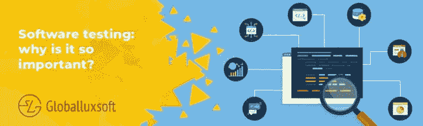

# 软件测试:为什么它如此重要？

> 原文：<https://medium.com/swlh/software-testing-why-is-it-so-important-175d37cd2b90>

软件测试是当今程序员和商业的新趋势。

我们也为这个话题专门写了很多文章:回顾了[自动化](/globalluxsoft/automated-testing-and-qa-basics-pros-and-cons-3b941df542dd)和[单元](/globalluxsoft/unit-testing-leave-no-chance-for-bugs-in-your-app-9eb00dd47f0d)测试，它们的优缺点，讨论了[你的创业公司是否需要软件测试](/globalluxsoft/does-your-startup-need-software-testing-73d7c084d81e)。

然而，尽管如此受欢迎，许多人仍然认为软件测试是对时间的巨大浪费，是软件开发过程中不必要的“附加物”。

要求开发团队取消或减少测试时间的主要动机是节省成本和时间。然而，这种方法肯定会产生相反的效果。在本文中，我们想要证明软件测试是节省大量成本的方法，并且对商业极其有用。

**软件测试是**研究软件以识别错误并确定软件的实际和预期行为之间的对应关系的过程，在以某种方式选择的一组测试的基础上进行。从广义上讲，软件测试是一种软件质量控制技术，它包括测试设计、测试执行和对结果的分析。

测试标准通常如下:

*   功能性；
*   易于开发；
*   易于安装；
*   文件和支持的质量；
*   性能；
*   等等

主要目的是表明产品已经准备好投放市场，开发者声明的所有功能都工作稳定。开发人员自己需要进行测试，以确保产品准备就绪，并让客户看到他们支付了什么。

# 测试 vs 好的开发者？

几乎找不到一个完美地编写代码的开发人员。这不是开发商花园里的石头，只是事实。人是容易犯错误的，在软件开发的各个阶段，人的错误都会导致违反软件的正常运行。一个人不可能把所有事情都记在记忆里，所以修正是很正常的事情。此外，即使是最有资格的开发人员也可能看不到 bug，因为他/她已经观察这些代码很长时间了。

以世界上最大的科技公司为例:谷歌、脸书、摇滚明星、索尼等。他们从世界各地雇佣最聪明的开发人员。然而，即使是这样酷的程序员也会写出不安全的代码。

因此，我们回答所有认为自己的代码完美无瑕的人:你怎么知道你的代码完美运行？你测试过吗？你能现在检查一下，说它工作得很好吗？

根据 Tricentis 的全球软件诡计分析 [Software Fail Watch](https://www.tricentis.com/resources/software-fail-watch-5th-edition/) ，2017 年，公司因软件故障损失 1.7 万亿美元。

高质量的软件测试可以大大减少在实现阶段对软件质量的有根据的要求的数量，减少涉及系统的改进、修正和维护的资源。因此，软件维护成本降低了 15-20 %,系统开发商的声誉也在不断提高。

相反，如果没有进行合格的软件测试，那么维护成本可能会增加到开发和实现总成本的 80–85 %,潜在的客户数量也会减少。

# 安全业务

黑客和其他入侵者可以利用一些漏洞。如果您的软件处理付款，质量保证会导致您或您的客户的大量直接成本。此外，您应该始终意识到泄露机密数据或窃取客户基础的可能性。

# 省钱

纠正错误总是比预防错误更难。此外，它要贵得多。如果没有及时检测到它们，修复它们将会困难得多。主要是因为它已经创建了一个新的影响链，而且它们可以很容易地影响另一个功能或者隐藏很多不同的缺陷。

开发人员需要大量时间来识别问题的原因，并对代码进行所有必要的修改。我们都知道在软件开发中时间意味着金钱，所以最好从一开始就预防那些问题。

这就是为什么敏捷模型的迭代方法完全符合众所周知的测试人员“尽快甚至更频繁地测试”的概念事实上，软件开发的每一个重要阶段都应该以测试结束。

# 名誉保护

有很多缺陷的发布产品肯定不会让使用它的用户满意。你应该永远记住，第一印象真的很难改变。

因此，在未来，证明问题已经解决并且他们可以再次使用它可能是非常具有挑战性的。第一印象真的很难改变。

此外，软件问题的公布会立即导致公司资产价值的下降。

# 控制过程

软件测试可以看作是控制技术的方法之一。软件开发的过程应该一直被监控，你应该衡量它是否违背了既定的需求。

所有项目参与者都对有效的测试感兴趣。它允许您节省开发成本和错误修复，平衡项目风险，提高产品质量，使开发人员免于不必要的任务…一般来说，如果项目有正确的测试，那么发现的缺陷总数通常只会更低！

产品看起来怎么样并不重要，因为质量的核心在于大量的工作。在大多数情况下，软件测试工程师通过检查每件事都运行良好，给人们享受产品的机会。永远不要忽视软件开发周期的这个阶段。省了你不少钱和神经:)

你在软件测试方面的经验如何？我们将感谢你在下面的评论中的想法！如果你喜欢这篇文章，请与你的朋友和同事分享。

## 这篇文章发表在 [The Startup](https://medium.com/swlh) 上，这是 Medium 最大的创业刊物，拥有+444，678 名读者。

## 订阅接收[我们的头条新闻](https://growthsupply.com/the-startup-newsletter/)。

