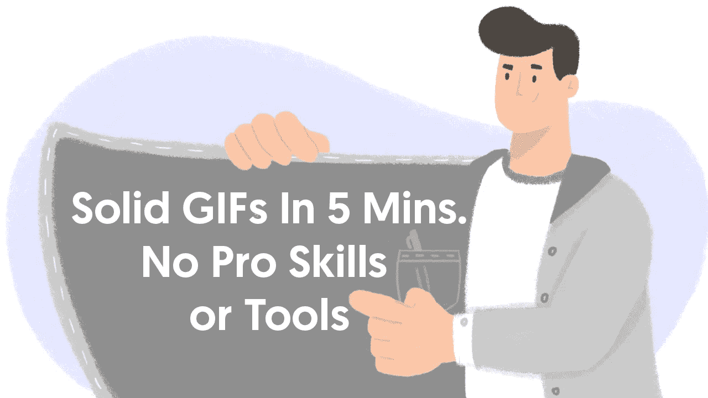
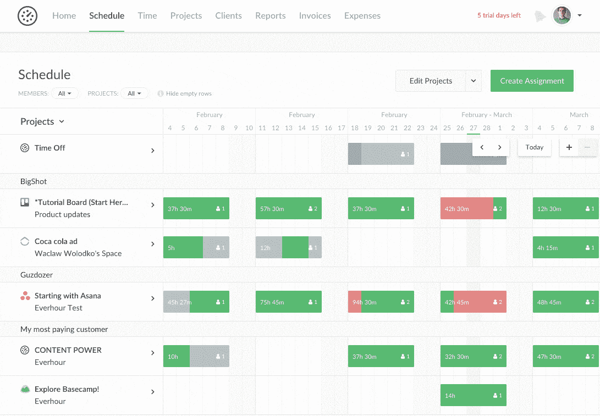
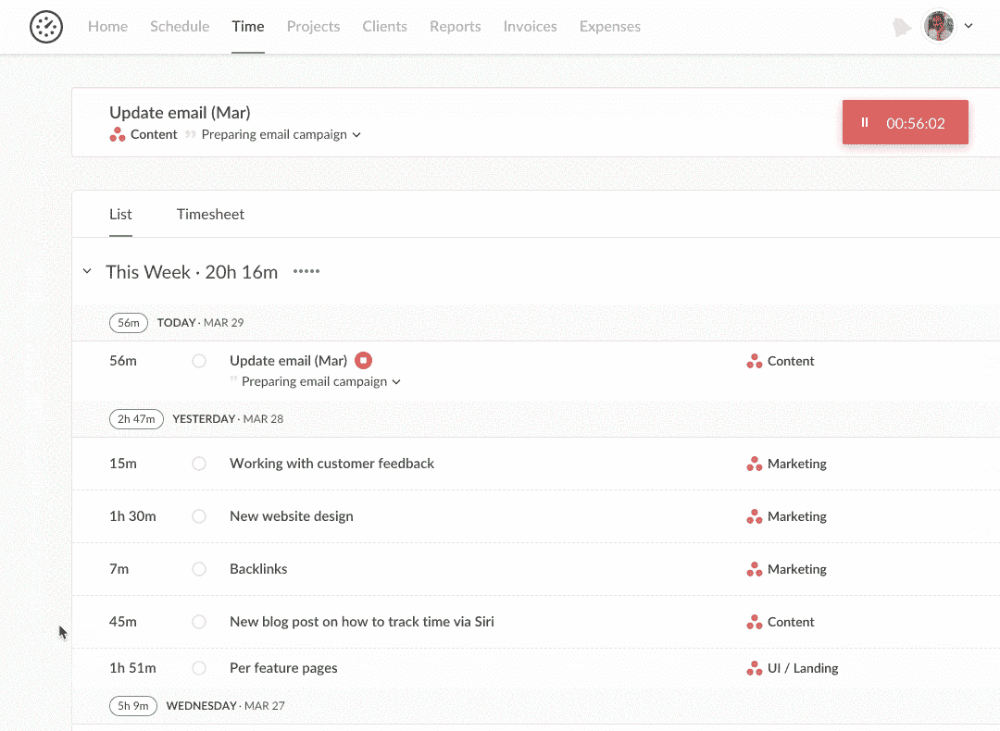
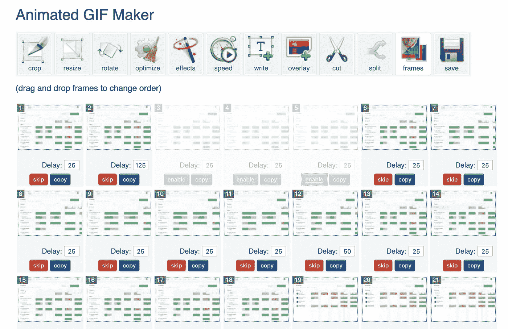

# 非设计师在 5 分钟内制作的立体动画 gif

> 原文：<https://medium.com/swlh/solid-animated-gifs-made-by-non-designer-in-under-5-minutes-ef8ffa061368>

## 在这篇文章中，我将给出一些如何快速制作高质量 GIF 文件的技巧，并解释为什么这很有用。

gif 是一种非常好的讲故事的方式。

在 [Everhour](https://everhour.com) 中，我们练习向所有客户发送月度摘要电子邮件，在邮件中我们简要描述了过去一个月产品中的变化/改进。

标题+ gif 图片+每个功能最多两句话。而简短(10 秒以下)和直截了当的 GIF 是我们的主要焦点。为什么？

人们都很忙。每天都有数百封电子邮件落入他们的收件箱，他们根本没有足够的时间进行长时间阅读。尽管他们当然想知道真相。

我们珍惜他们的时间，准备一封可以快速浏览的电子邮件，同时帮助客户即时了解新内容。

如果有必要，他们可以稍后访问我们的博客，深入探讨细节。但是关于什么东西在哪里被改变了以及它看起来如何的细节将被立即捕捉到。

我给你举个例子。我们最近稍微改变了我们的资源规划器:增加了放大/缩小网格的能力，改变了我们切换分组的方式，等等。如果我们用文字来描述它，它会给我们带来很多句子和截图。Gif 效果好很多。一个人可以直观地看到一些东西是如何工作的，控制在哪里，等等。

再比如。我们需要交付添加在时间页面上的新信息工具提示，它显示时间条目是如何创建的，在什么时间，等等。Gif 在这里也能很好地工作。

我们团队中负责此类更新邮件的人是客户成功，而不是设计师。对他来说，录制一段视频，然后通过 Adobe After Effects 或类似的专业工具进行处理太困难和耗时了。

相反，我们使用免费工具，如 [Recordit](http://recordit.co/) 或 [LiceCAP](https://www.cockos.com/licecap/) 。对了，第一个从质量上来说好很多。

一切都是在浏览器窗口中完成的，我们将该窗口的大小预先调整为 1080x790。有时我们也可以通过 Inspector 做一些修饰性的改变。由于视网膜的最终质量，我们只使用 Mac。

录制后，还有两个问题:长度和大小。正如我已经提到的，理想情况下，GIF 应该小于 10 秒，大小为 200-400 kb。为什么要向客户端显示你如何在整个屏幕上移动光标，或者在加载时等待？

为此，我们使用[https://ezgif.com/](https://ezgif.com/)

它帮助我们优化录制的 GIF，尤其是删除不必要的帧，从而减少文件大小和时间。

基本就是这样。制作像附件这样的 Gif 文件通常需要不到 5 分钟的时间。我觉得质量很好。

如果你喜欢这篇文章，👏即使是 50 次——我真的会很感激，这对我有很大的不同。

## 这篇文章发表在[《创业](https://medium.com/swlh)》上，这是 Medium 最大的创业刊物，有+442，678 人关注。

## 订阅接收[我们的头条新闻](https://growthsupply.com/the-startup-newsletter/)。

