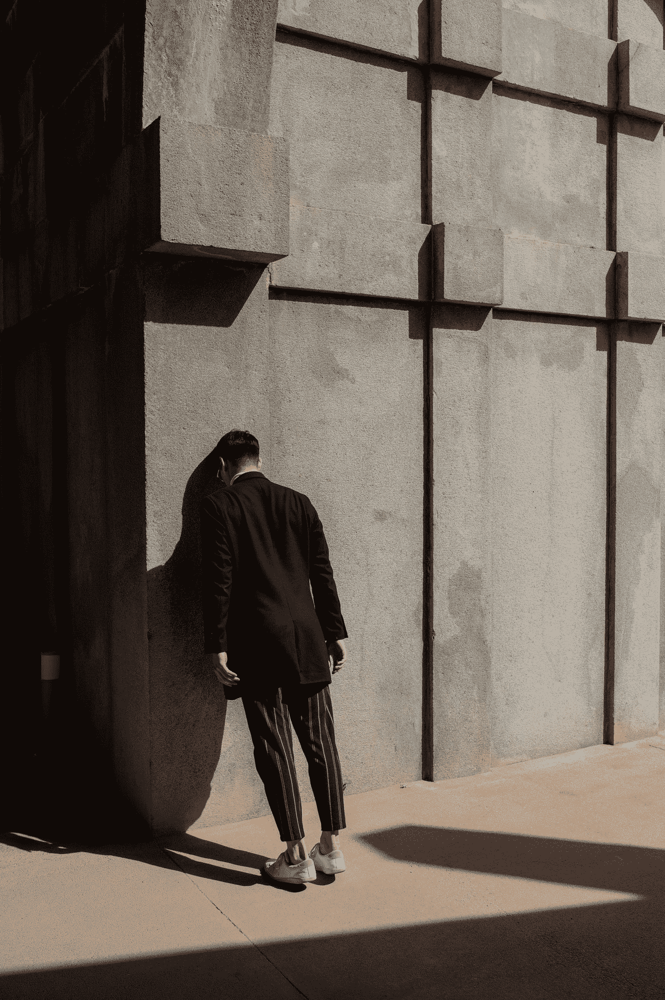

# 有些日子我感觉完全迷失了

> 原文：<https://medium.com/swlh/some-days-i-feel-so-completely-lost-41ffd4a42498>

Photo by [Daniel Mingook Kim](https://unsplash.com/@danielmingookkim?utm_source=medium&utm_medium=referral) on [Unsplash](https://unsplash.com?utm_source=medium&utm_medium=referral)

事情发生在今天；那种不舒服和不安的感觉；就像我身体的某个重要部分漂进了一池原始果冻，而我的身体茫然地凝视着，啜饮着拿铁咖啡。

这种不安感觉的根源往往是经济上的；其结果是坏运气和对生活的偏好相结合——选择介于邪恶…