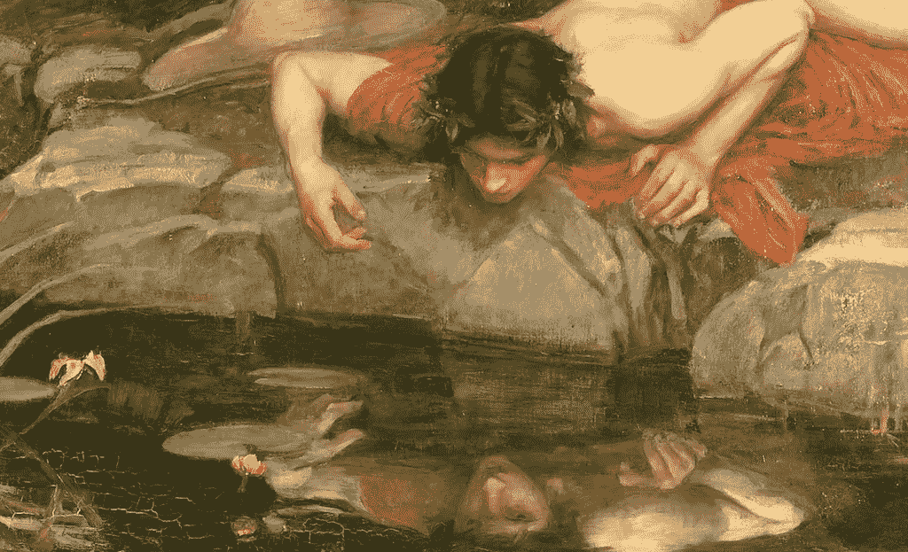

# 关于反思的一些思考

> 原文：<https://medium.com/swlh/some-reflections-on-reflection-f688d1423cdc>

昨天，我和我的朋友在公园谈论反思在多大程度上对个人改变是足够的或必要的。我的朋友来自巴西，拥有丰富的文化和文学知识，她有办法为我澄清一些事情。她告诉我，在巴西，他们有一个术语叫做“uma boa consciencia do mal”，大致意思是“对邪恶的良知”。她在这里解释得更清楚…