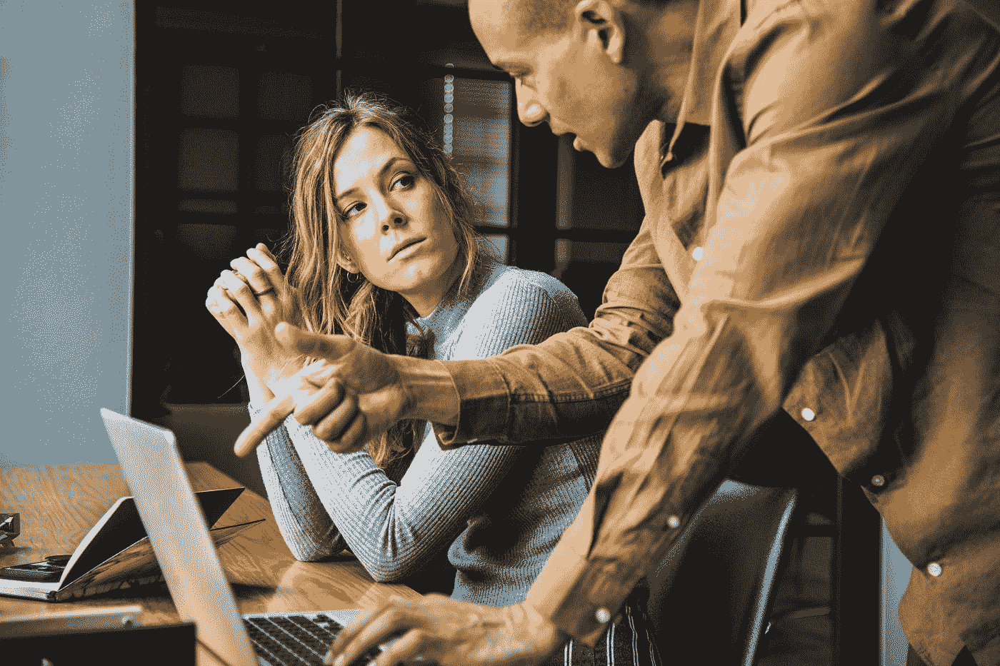

# 关于充分利用听力的一些建议

> 原文：<https://medium.com/swlh/some-tips-on-listening-better-29c50300d0c5>

Photo by [rawpixel](https://unsplash.com/@rawpixel?utm_source=medium&utm_medium=referral) on [Unsplash](https://unsplash.com?utm_source=medium&utm_medium=referral)

倾听他人可能是你能掌握的最有价值的技能，也是最容易提高的技能之一。

听非常重要，因为你可以学到比说更多的东西。这听起来显而易见，但这并不能阻止人们试图主导对话和会议。