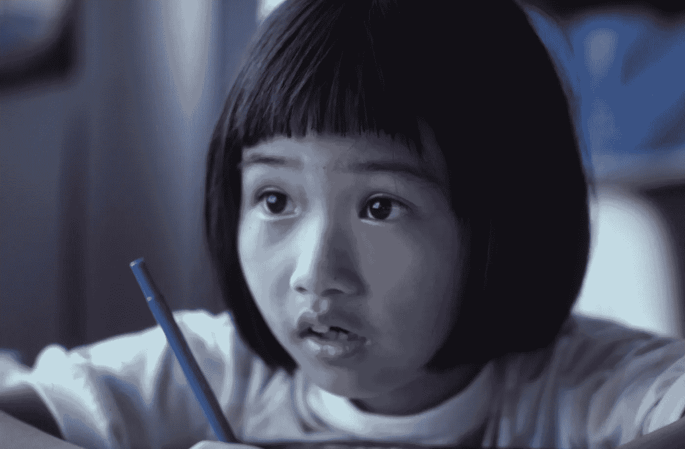

# 有人应该做些什么来实现优秀的教育

> 原文：<https://medium.com/swlh/someone-should-do-something-to-enable-excellent-education-97d6908de7aa>

Photo by [Les Anderson](https://unsplash.com/@lesanderson?utm_source=unsplash&utm_medium=referral&utm_content=creditCopyText) on [Unsplash](https://unsplash.com/search/photos/asian-school?utm_source=unsplash&utm_medium=referral&utm_content=creditCopyText)

## “教育是你可以用来改变世界的最强大的武器。”纳尔逊·曼德拉

> 你是否有过这样的印象:有人应该为气候变化做点什么(T2 )?
> 
> 为什么**没有人**做**一些事情**来解决漂浮塑料岛的问题