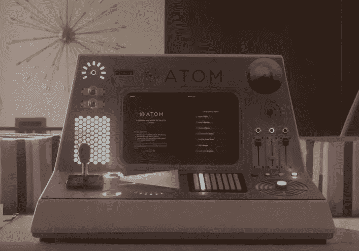

# 我们的编程语言发生了什么，为什么它是好的

> 原文：<https://medium.com/swlh/something-is-happening-to-our-programming-languages-and-i-like-it-a66447beade>

是时候启动 IBM PC，继续玩我的 Fortran text-RPG 游戏了，但是现在是 2005 年了，evanescence 在我的 Windows Media Player 上已经达到了无与伦比的 emo 水平，因为在我最新的 C++程序中，我使用分号的次数超过了圣经。刚刚到底发生了什么？我进化了吗？不，编程和计算机高级。我只是跟着。