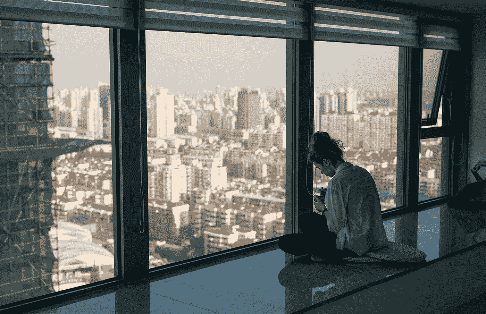

# 有些事情需要改变

> 原文：<https://medium.com/swlh/something-needs-to-change-6810908ef8a4>

## 如何利用生活编辑

Photo by [Igor Rand](https://unsplash.com/@igorrand?utm_source=unsplash&utm_medium=referral&utm_content=creditCopyText) on [Unsplash](https://unsplash.com/?utm_source=unsplash&utm_medium=referral&utm_content=creditCopyText)

在过去的几周里，我的生活感觉有些不对劲。实际上，这是一种保守的说法。一切都感觉有点不对劲。

我一直睡懒觉，吃垃圾食品，我的关节因为整天坐在办公桌前而疼痛，无论我多么努力，我都无法停止浏览社交媒体。结果是…