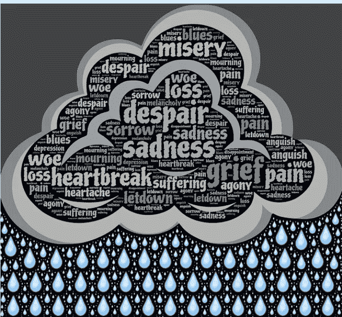

# 我有些不对劲:悲伤告诉我们的谎言

> 原文：<https://medium.com/swlh/somethings-wrong-with-me-lies-grief-tells-us-93efbf8765f0>

有时候，当我走进病人的房间，在他们说一句话之前，我就能感受到他们的情绪。今天早上就是其中之一。悲伤弥漫在空气中，当我一走进我的病人的房间，就能从她的脸上看出来。好像她有一个可耻的秘密，她一直只告诉我，她很快就和我分享了对她的女儿、丈夫和兄弟反复出现的内疚和悲伤的感觉…