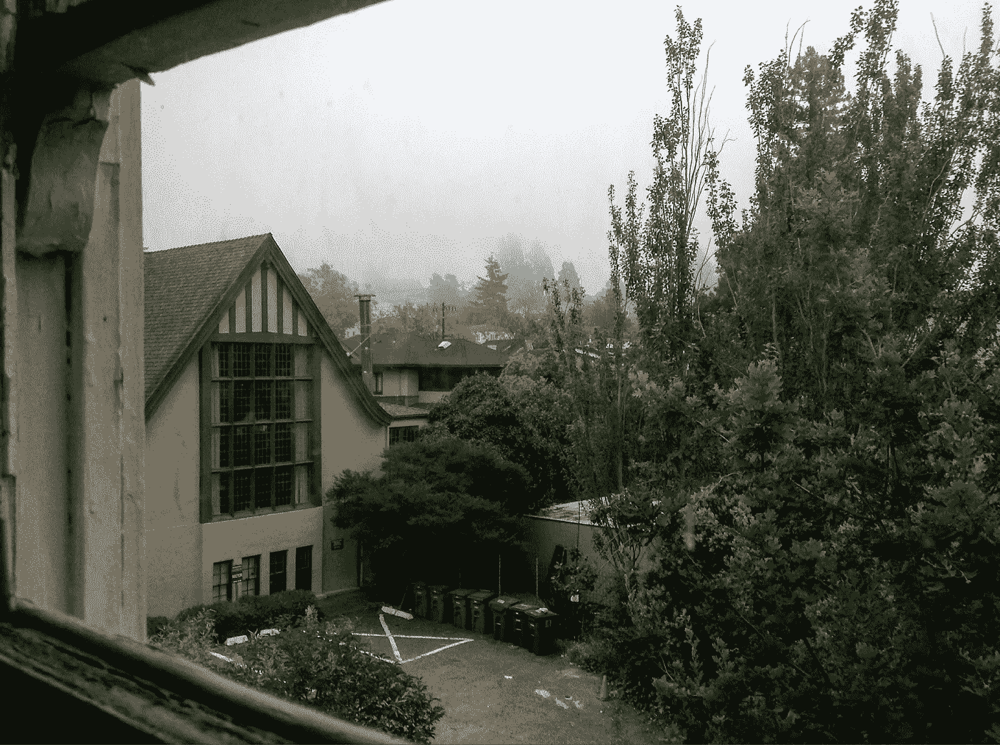

# 有时候我需要帮助。

> 原文：<https://medium.com/swlh/sometimes-i-have-to-be-helped-675e482e40b9>

“the view from my living room as the fog rolled in”, the author, 2019

在那些与有完全自杀风险的人一起工作的人中有一个常见的比喻，“不要放弃。获得帮助。”是的。求你了。当你感觉自己滑向抑郁时，不要放弃。寻求帮助。

然而，可悲的是，当一个人无法寻求帮助时，就有可能会陷入自杀未遂的境地。几个月前我去过那里。