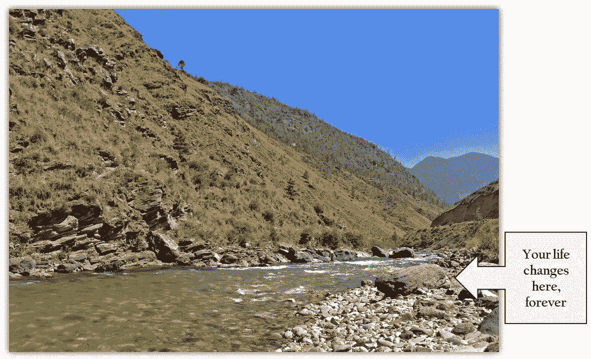

# 有时山顶上有启示:一个创业起源的故事

> 原文：<https://medium.com/swlh/sometimes-there-is-enlightenment-on-a-mountaintop-a-start-up-origin-story-beff06398d43>

在无云的喜马拉雅山天空下呆了三个小时，坐在那块花岗岩巨石上，帕罗楚河的河水在我周围潺潺流过，这是一种催眠。唯一分散注意力的是偶尔出现的朱鹭，弯曲的红喙在河边的鹅卵石上觅食。