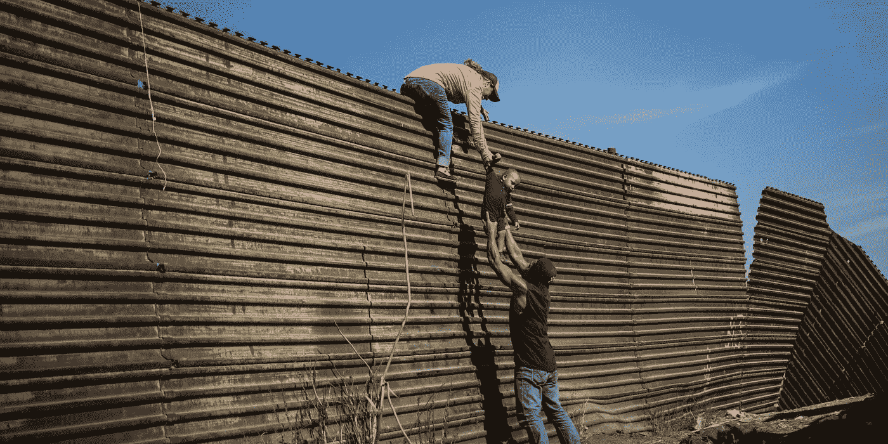

# 在边境的某个地方，很高的地方...

> 原文：<https://medium.com/swlh/somewhere-over-the-border-way-up-high-fecf7d3f9dcf>

A group of Central American migrants climbing the border fence between Mexico and the United States, near El Chaparral border crossing, in Tijuana, Mexico, on November 25\. Agence France-Presse/Pedro Pardo via Getty Images

> …是他们敢于追求的简单梦想。

2019 年4 月 30 日，一名来自危地马拉的 16 岁孤身移民男孩在美国羁押期间死亡。他是继危地马拉 7 岁女孩贾克林·卡尔·马奎恩和 8 岁男孩费利佩·戈麦斯·阿隆佐之后第三个死亡的孩子。(npr.org)