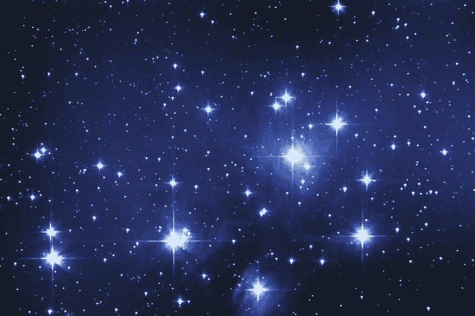

# 儿子，你的星象没有错。

> 原文：<https://medium.com/swlh/son-there-is-no-fault-in-your-stars-d46af3dfd25>

从孩子的学校开车到我们家，感觉像是经历了永恒的地狱之旅。我还不如开车在叙利亚的街道上躲避手榴弹和狙击手。

我的大儿子一走进汽车，就会无缘无故地把他弟弟当成出气筒。第三次世界大战将在后座爆炸，因为我拼命试图不要撞毁汽车。