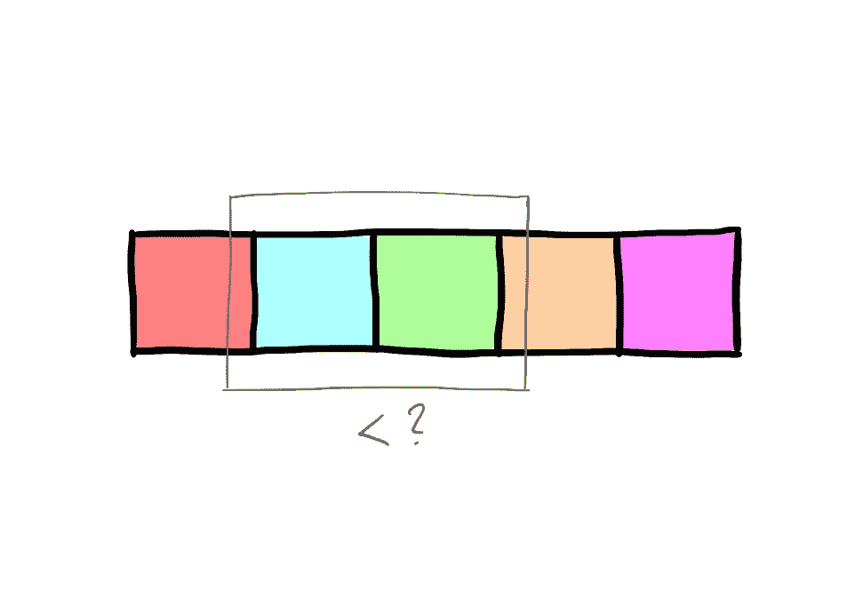

# 排序算法:使用 Swift 实现冒泡排序

> 原文：<https://medium.com/swlh/sorting-algorithms-implementing-bubble-sort-using-swift-f21aafeb3fb0>

在前一篇文章的[中，我们分析了合并排序，并使用数组扩展实现了它。我们将继续研究排序算法，这一次是要检查冒泡排序。](/swlh/sorting-algorithms-implementing-merge-sort-using-swift-a1236a0be2b4)

**XCode 游乐场文件与实现在** [**这个链接**](https://github.com/JimmyMAndersson/SortingAlgorithms) **上有。**

# 什么是冒泡排序？