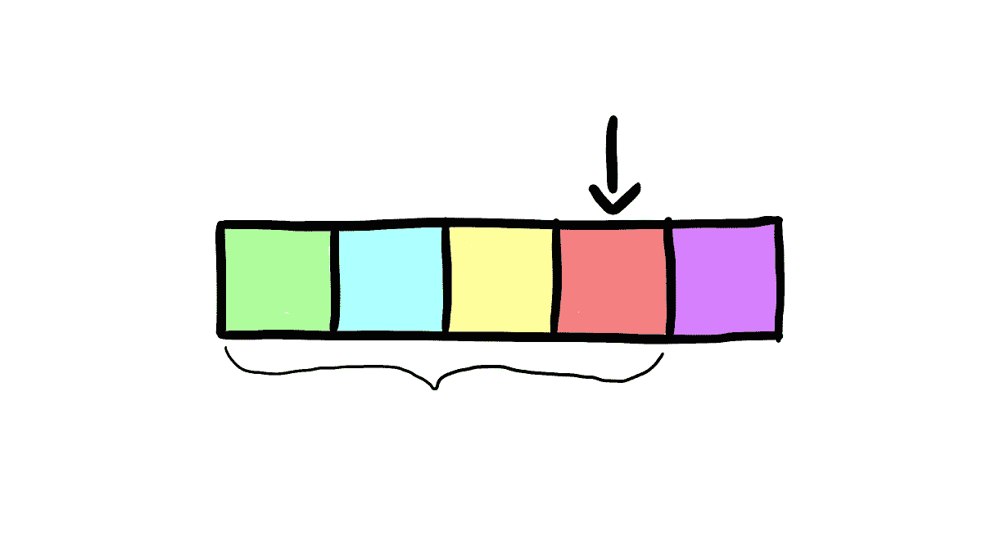

# 排序算法:使用 Swift 实现插入排序

> 原文：<https://medium.com/swlh/sorting-algorithms-implementing-insertion-sort-using-swift-759d02aa443f>

在上一篇文章中，我们分析并实现了冒泡排序。在今天的文章中，我们将了解一种最著名的排序算法——插入排序，并了解它是如何工作的。

**XCode 游乐场文件与实现可在** [**这个链接**](https://github.com/JimmyMAndersson/SortingAlgorithms) **上获得。**

# 什么是插入排序？