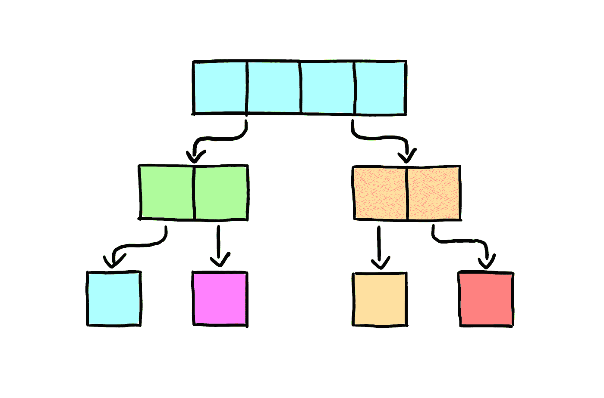

# 排序算法:使用 Swift 实现合并排序

> 原文：<https://medium.com/swlh/sorting-algorithms-implementing-merge-sort-using-swift-a1236a0be2b4>

在上一篇文章中，我们研究了堆排序，这是一种基于称为堆的树数据结构的排序算法。今天，我们将进一步深入排序算法的世界，我们来看看合并排序，这是一种在 *O* (n*log(n))时间内运行的排序算法，但作为一种折衷，它需要 *O* (n)空间。

**XCode Playground 文件及实现可从** [**链接**](https://github.com/JimmyMAndersson/SortingAlgorithms) **获得。**

