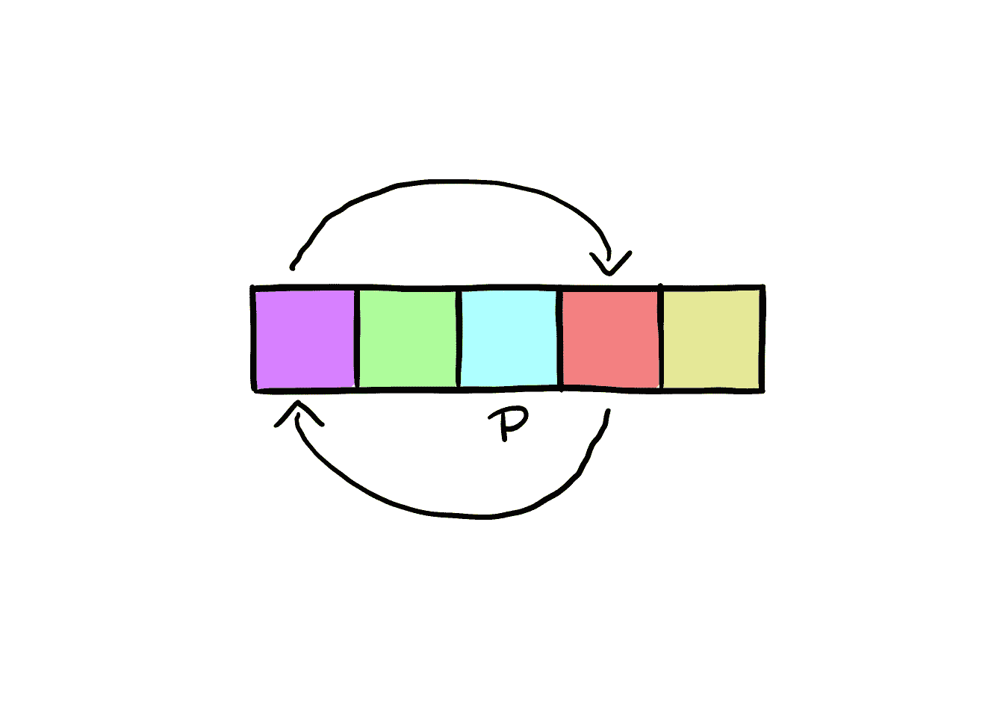
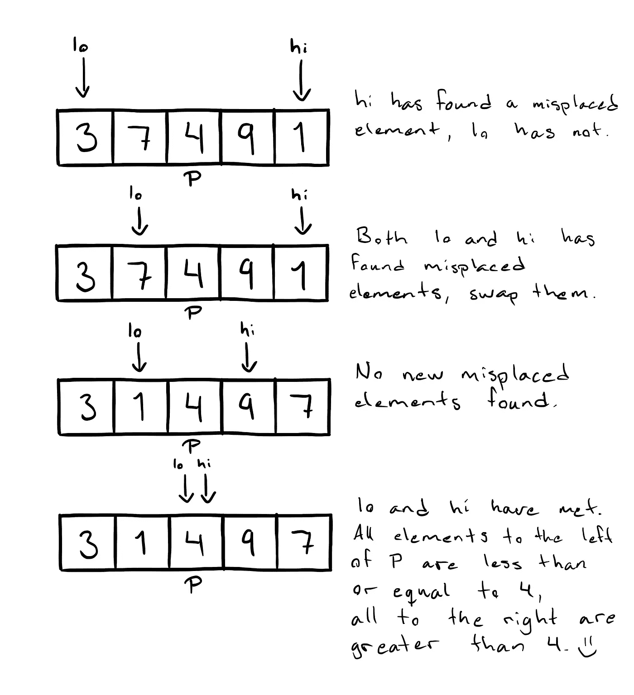

# 排序算法:使用 Swift 实现快速排序

> 原文：<https://medium.com/swlh/sorting-algorithms-implementing-quick-sort-using-swift-457a4dbb1bba>

在前面的文章中，我们分析了一些非常简单的排序算法。今天，我们来看一个稍微复杂一点的排序算法，叫做快速排序。抓紧了，因为这将是一次深潜。

**XCode 游乐场文件与实现可在** [**这个链接**](https://github.com/JimmyMAndersson/SortingAlgorithms) **上获得。**



# 什么是快速排序？

快速排序是一种基于所谓的“分治”技术的排序算法。这个想法很像堆排序，排序两个较小的数组比排序一个较大的数组要容易得多。为了实现这一点，快速排序使用了所谓的 pivot 元素(我将很快解释什么是 pivot 元素)。因为这是一个有点复杂的算法，所以让我们对我们想要做的事情有一个高层次的概述:

*   根据定义，如果数组的大小小于两个元素，将对其进行排序。因此，我们将把它定义为我们的基本情况，并从函数中返回。
*   如果我们的数组有 2 个或更多的元素，我们将查找一个枢纽元素。理想情况下，pivot 元素应该是所有值的中间值。在普通人的语言中，这意味着数组应该包含同样多的小于或等于 pivot 元素的值，就像它包含大于该元素的值一样。
*   由于 pivot 元素在理想情况下位于数组的中间，我们开始比较数组前半部分的值和后半部分的值。如果我们发现前半部分中的任何值大于我们的 pivot 元素，我们就将它们换成后半部分中恰好小于或等于 pivot 元素的值。然后，它将进行两次递归调用，将数组分成两部分，并对这两部分执行相同的操作。
*   请注意，因为我们的 pivot 元素可能不正好位于数组的中间，所以当它定义数组的两个“部分”时，我们的实现需要有一点灵活性。这种灵活性将赋予我们这样的属性，即前半部分中放错位置的元素在后半部分中总是有相应的放错位置的元素可以交换。

这可能看起来很可怕，但是看一下这个草图，看看如何进行一轮交换(P 标记 pivot 元素，lo 和 hi 标记当前正在进行可能的交换比较的元素):



# 快速排序的复杂度是多少？

我们将多次检查整个数组中的每个元素，以便能够进行排序。然而，由于分治策略，我们只需遍历所有元素 log(n)次，因此该算法的运行时间复杂度总计为 *O* (n*log(n))。**提醒一句:**这种复杂性假设 pivot 元素实际上是一个位于数组中间附近的元素。如果我们不能选择一个好的 pivot 元素，我们可能会把数组分成两半，一个包含一个元素，另一个包含其余的值。这会导致一个 *O* (n)的复杂度，差很多。

# 让我们深入研究代码

让我们首先定义一个数组类型的扩展和一个公共包装函数，任何想要执行排序的人都可以调用它:

```
extension Array where Element: Comparable {

  public mutating func quickSort() {
    quickSort(&self[...])
  }

}
```

包装很简单。这将是一个就地排序，我们将使用`ArraySlice`类来确保我们总是使用已经分配的内存，即使我们在逻辑上将数组分成几个不同的部分。接下来，我们来看一下`.quickSort(_:)`方法:

```
private func quickSort(_ array: inout ArraySlice<Element>) {
  if array.count < 2 {
    return
  } sortPivot(in: &array)
  let pivot = partition(&array) quickSort(&array[array.startIndex..<pivot])
  quickSort(&array[pivot + 1..<array.endIndex])
}
```

这是我们定义基本案例的地方。如果数组的元素少于 2 个，那么可以认为它已经被排序了，我们可以从这个调用中返回。如果没有，我们搜索出我们的 pivot 元素，进行上面讨论过的必要的交换，并进行两次递归调用，每次调用数组的新的一半。这种方法其实并不那么有趣，因为其中并没有什么逻辑可言。让我们来看看`.sortPivot(in:)`的方法:

```
private func sortPivot(in array: inout ArraySlice<Element>) {
  let startPoint = array.startIndex
  let midPoint = (array.startIndex + array.endIndex) / 2
  let endPoint = array.endIndex - 1

  if array[startPoint] > array[midPoint] {
    array.swapAt(startPoint, midPoint)
  }
  if array[midPoint] > array[endPoint] {
    array.swapAt(midPoint, endPoint)
  }
  if array[startPoint] > array[midPoint] {
    array.swapAt(startPoint, midPoint)
  }
}
```

这个方法可能看起来比实际更复杂。为了找到一个接近中值的枢纽元素，我们选择数组的第一个、最后一个和中间的元素。当数组已经接近排序时，选取这些元素还可以使算法执行得更好。然后我们将它们相互比较，并交换位置，使它们满足条件
array[start point]≤array[midPoint]≤array[endPoint]。
在这个操作之后，我们的 pivot 元素将位于数组的中间，我们可以执行交换操作。看看`.partition(_:)`的实现:

```
private func partition(_ array: inout ArraySlice<Element>) -> ArraySlice<Element>.Index {

  let midPoint = (array.startIndex + array.endIndex) / 2
  array.swapAt(midPoint, array.startIndex)
  let pivot = array[array.startIndex] var lower = array.startIndex
  var upper = array.endIndex - 1 repeat {
    while lower < array.endIndex - 1 && array[lower] <= pivot {
      lower += 1
    }
    while array[upper] > pivot {
      upper -= 1
    } if lower < upper {
      array.swapAt(lower, upper)
    }
  } while lower < upper array.swapAt(array.startIndex, upper)
  return upper
}
```

现在，这可能需要通读几遍才能真正掌握，因为这里有一些条件和约束并不完全明显。让我们浏览一下代码:

在`.sortPivot(in:)`方法完成其工作后，我们计算我们的 pivot 元素所在的索引。然后，我们用第一个元素交换 pivot 元素，以避免它妨碍我们将要执行的其余交换。
下一步是创建两个索引变量来跟踪哪些元素需要交换。`lower`变量将沿着数组向上走，寻找任何大于我们的 pivot 元素的值，`upper`变量将向后遍历数组，寻找小于或等于我们的 pivot 元素的元素。一旦他们找到这样的元素，他们就停下来，互相交换元素。一旦变量交叉或相遇(`lower >= upper`，我们知道我们已经交换了所有需要交换的元素，我们也知道`upper`变量指向了我们的枢纽元素应该在的地方。我们交换 pivot 元素的位置，然后返回它结束位置的索引，这样我们就可以用它来划分递归调用的数组。

这是一个完整的快速排序。正如我在开始时所说，这是一个复杂的算法，可能需要读一些才能真正理解它是如何工作的(我知道对我来说是这样)。只要坚持下去，并使用本文顶部链接的操场文件，很快这些碎片就会就位！

***这次就这样了！如果您有问题，请随时发表评论，并关注以获得关于未来文章的通知。***

***要了解更多关于 iOS 开发的知识，请查看我以前的文章:***

[](/swlh/sorting-algorithms-implementing-insertion-sort-using-swift-759d02aa443f) [## 排序算法:使用 Swift 实现插入排序

### 插入排序是如何工作的？它有什么优点和缺点，我们如何实现它？

medium.com](/swlh/sorting-algorithms-implementing-insertion-sort-using-swift-759d02aa443f) [](/swlh/sorting-algorithms-implementing-bubble-sort-using-swift-f21aafeb3fb0) [## 排序算法:使用 Swift 实现冒泡排序

### 什么是冒泡排序，我们如何在自己的项目中实现它？

medium.com](/swlh/sorting-algorithms-implementing-bubble-sort-using-swift-f21aafeb3fb0) [](https://medium.com/swlh)

## 这篇文章发表在 [The Startup](https://medium.com/swlh) 上，这是 Medium 最大的创业刊物，拥有+431，678 名读者。

## 在这里订阅接收[我们的头条新闻](https://growthsupply.com/the-startup-newsletter/)。

[](https://medium.com/swlh)