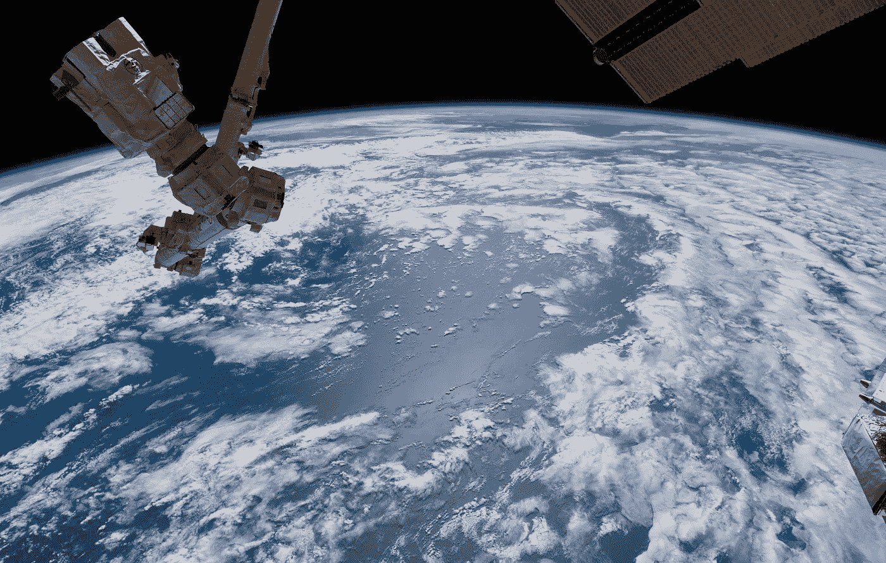

# 地球的空间

> 原文：<https://medium.com/swlh/space-for-earth-f77afa71d723>

## 太空探索系列的第一篇文章介绍了我们为什么探索并解决了这个问题:当我们在地球上有许多重要问题要解决时，我们为什么要在太空探索上花费资源？

Waterworld ©Alex Gerst / ESA (ESA Horizons mission)

非常热烈地欢迎我的新系列太空文章。这个新系列: ***空间探索*** 将…