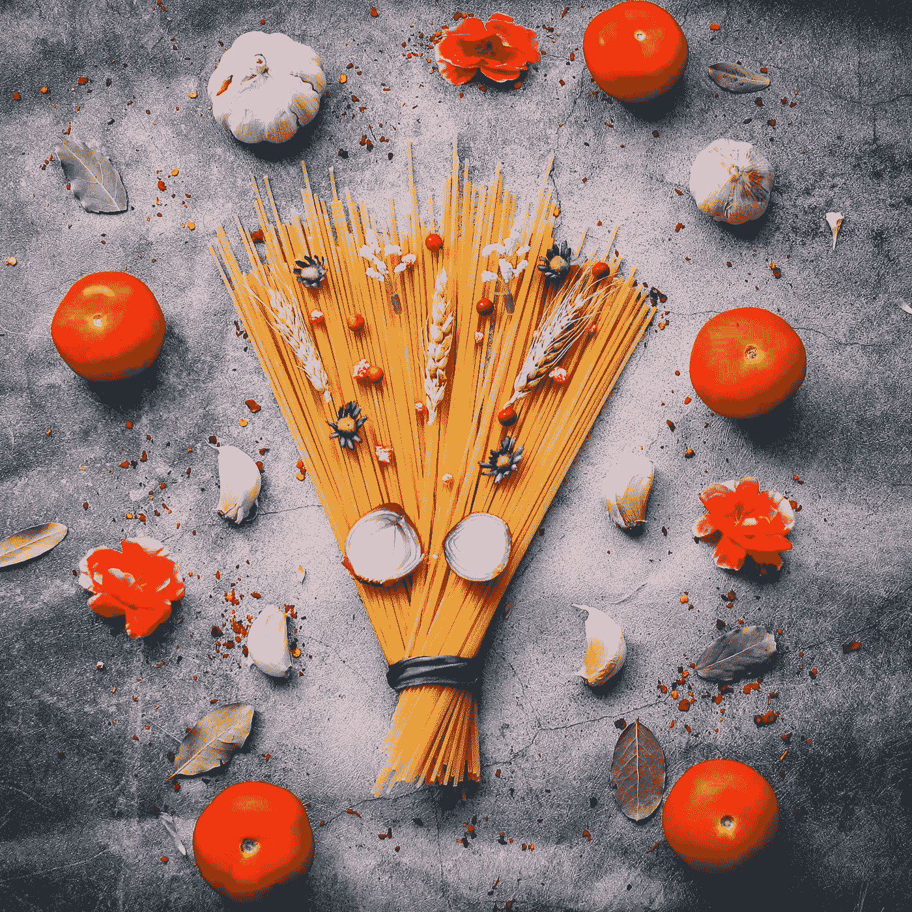

# 意大利面条、儿童和角落办公室——谁是有影响力的人物？答案可能会让你大吃一惊。

> 原文：<https://medium.com/swlh/spaghetti-children-and-corner-office-who-are-the-influence-figures-the-answer-may-surprise-you-546169622696>

最好的影响是没有权威的

Photo by [Deva Darshan](https://unsplash.com/photos/F0ot6ma5Fdo?utm_source=unsplash&utm_medium=referral&utm_content=creditCopyText) on [Unsplash](https://unsplash.com/search/photos/spaghetti?utm_source=unsplash&utm_medium=referral&utm_content=creditCopyText)

我和一个朋友在餐桌上。他漫不经心地插话说:“当你第一次说你在写东西的时候，我以为你会写食物。”我向后拱了拱头。是的，像许多来自印度次大陆的人一样，我也有关于食物的生动对话。他…