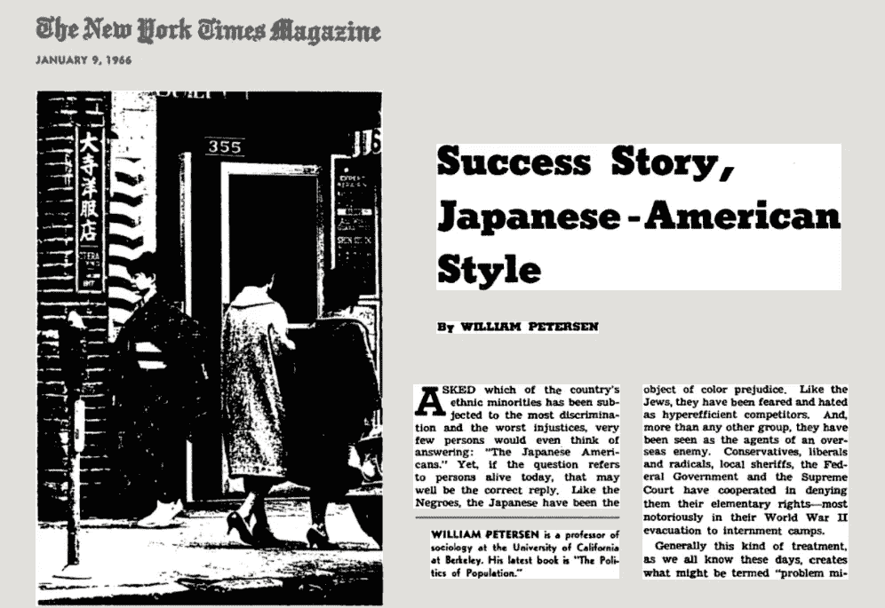
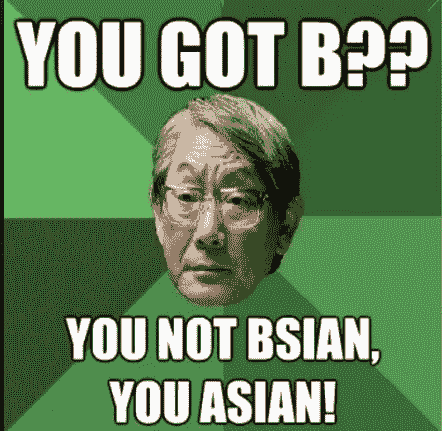
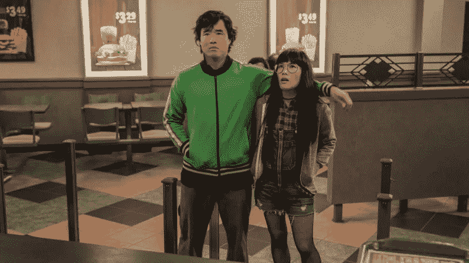

# 通过讲述我们的故事来打破典型的少数民族神话

> 原文：<https://medium.com/swlh/speaking-the-model-minority-myth-out-of-existence-by-telling-our-stories-3c90308d1c84>

## 揭露和回收我们的故事的力量

Photo by [Quân Nguyễn](https://unsplash.com/@quanlightwriter?utm_source=medium&utm_medium=referral) on [Unsplash](https://unsplash.com?utm_source=medium&utm_medium=referral)

几年前，我在加州大学洛杉矶分校的一位教授在列出论文题目时转向我，以一种谦逊的态度说，“你可以写关于模范少数族裔的刻板印象！”我知道他在和我说话，因为他在和我进行眼神交流，而我是房间里唯一的亚裔美国人。这一刻感觉很不真实——持续了几秒钟，直到他继续讨论我们期末论文的指导方针。**我记得我当时没有生气，原谅他是另一个在不同时代长大的老人——在那个时代** [**微攻击**](/the-nonprofit-revolution/mmacro-sick-of-your-microaggressions-b946decface6) **可以作为赞美。**

The term “model minority” first debuted in 1966 in the New York Times Magazine to compare racial differences between Japanese Americans and African Americans. [The model minority stereotype — which perpetuates the image of Asian Americans as being industrious, law-abiding, and high-achieving — grew in popularity during the Civil Rights movement as a way to shift the blame for injustice and inequality in the black community.](https://www.washingtonpost.com/outlook/2018/12/11/harvard-university-myth-model-minority/?utm_term=.59962c61a535) Ironically, within a century prior, “Yellow Peril” anti-Asian sentiments dominated depictions of Asian-Americans — fueling the Chinese Exclusion Act of 1882 and the internment of Japanese Americans from 1942–1945.

**这篇文章的目的不是让我的教授大吃一惊，而是要说明模范少数群体的刻板印象是如何塑造了我对自己的看法。**

首先，虽然我讨厌刻板印象，但我很难挑战它。在很多方面，我体现了这种刻板印象:我是中国人，我说中文。八年级的时候，我参加了九年级的数学考试。我整个童年都在上钢琴课。

The Asian Dad Meme reminds me of certain aspects of my childhood

我曾经在一次高中英语课的课外作业中得了 A+,甚至不知道这是可能的。

在加州大学伯克利分校读本科时，我加入了一个名为[“戏剧饭”](https://en.wikipedia.org/wiki/Theatre_Rice)的戏剧团体，做傻事，找乐子。在一起表演小品、即兴表演和短剧时，我们也试图通过在舞台上的表演来挑战对亚裔美国人的看法。然而，我仍然带着这种痛苦的负罪感生活着，我的存在延续了我们想要打破的刻板印象。

有时候，我会想:*拜托，这种刻板印象有那么糟糕吗？接受同龄人的教育是一件幸事，让我不再无知。我现在明白了这种刻板印象是如何草率地将完全不同的人群——祖先来自地球上最大、人口最多的大陆的人群——混为一谈，并促使他们顺从我们的主流文化。我认识到这种刻板印象是如何允许对亚裔美国人的个人和社区的需求视而不见的，他们有着截然不同的说法，认为他们都过得很好。例如，我想到了我在加州长滩遇到的柬埔寨青年，他们从幸存于种族灭绝的父母和家庭成员那里继承了几代人的创伤，并作为难民来到美国。我也看到模范少数民族的刻板印象是如何伤害黑人、土著人和拉丁裔人的。通过将亚裔美国人的刻板印象与他们对立起来，他们被置于荒谬的标准之下，每当他们不像“模范少数族裔”那样获得优等成绩时，他们就会受到惩罚——就好像结构性不平等、压迫和种族主义已被写入历史。*

**最终，我认为我已经考虑了这种刻板印象的每个方面，并将它作为一种过时的想法埋在我的脑海里，这种想法将逐渐过时**——这种预感在每一部由亚裔美国演员主演的新电影上映时都得到证实，展示了不同的叙事:*明天更好的运气(2002 年)、大病人(2017 年)、Gook (2017 年)、疯狂富裕的亚洲人(2018 年)、搜索(2018 年)、永远是我的可能(2019 年)*等。

Randall Park and Ali Wong in Always Be My Maybe (2019) telling the story of relatable people, in which Asian American actors play people and not ”Asian” characters. For example, “Asian” characters might include: the kung-fu fighting guy who speaks choppy English but kicks lots of ass, the nerdy guy with nerd glasses, or the exotic sexy lady who doesn’t have any lines.

我的结论是，典型的少数民族刻板印象伤害了不同的种族和民族群体，却有利于主流文化。

但是，我从来没有想过它如何模糊了我自己的叙述。

*我的叙述是什么？*

这些年来，我从去台湾看望我的祖父母或听家人讲述过去隐藏的故事中了解到，我们的背景是一个与战争、损失、悲伤、分离、不稳定和克服困难的韧性交织在一起的背景。

我的祖母在金门长大，那是台湾海峡中中国海岸外的一个小岛，当时由台湾管辖。她家种花生，她是村子里少数几个上过中学的女孩之一。

我爷爷在中国河南省的农村长大。一九四六年，当蒋介石将军领导的国民党和毛泽东领导的中国共产党之间爆发内战时，我爷爷参加了国民党参战。他当时 16 岁。他不知道，为民族主义者而战，他将再也见不到他的家人。当共产党接管首都北京时，国民党逃离了中国。

*我爷爷被派到金门，因为那里是中国和台湾之间的战略要地。在那里，在他的业余时间，他通过在我奶奶所在的中学教歌唱课认识了我奶奶。到 1954 年共产党开始轰炸金门以巩固其在台湾海峡的地位时，我的祖母和祖父已经一起建立了一个家庭。他们的女儿和儿子，我的妈妈和叔叔，是听着从中国向金门和台湾海峡其他岛屿发射炸弹的声音长大的。*

我还没听完我爸爸的故事。我所知道的是，我的父母都出生在战争中，并和他们的家人一起，从零开始建设未来。我的父母和他们的兄弟姐妹在美国寻求光明的未来。他们教给我的堂兄弟和我的价值观是稳定、安全、保障和财务成功— ***，而教育是达到这些目的的手段。***

在我 31 岁的时候，我有一个“啊哈”的时刻，我意识到教育是达到目的的一种手段，因为我的祖父母和父母的教养不稳定。感觉就像是我被一些显而易见的模糊的东西绊倒了。我不明白为什么事情过了这么久才有意义。尽管如此，我感到自由。还有一个更大的故事解释了我为什么是现在这个样子！我不仅仅是一个刻板的优等生的数学复制品！我是一个人，我也有一个故事！

**就像任何刻板印象的影响一样，模范少数群体刻板印象已经把我对自我的感知简化成一个平面的一维比喻，掩盖了我背景的更大背景。事实上，不去挑战它，我已经让自己被写得不存在了。**

但是有希望！甚至像我这样完全符合刻板印象的人，也能在多年后三十多岁的时候找到打破刻板印象的自由。

这需要揭示和回收我们的故事。