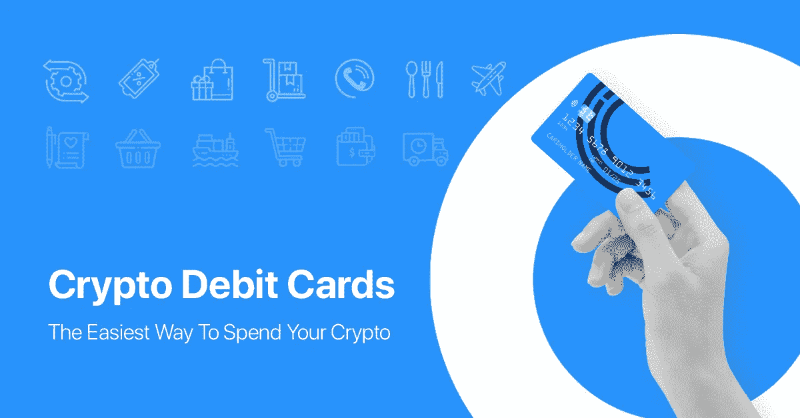
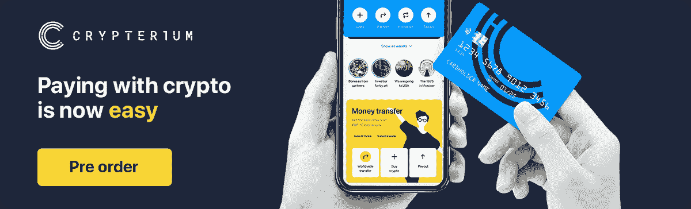

# 消费密码:预付借记卡是最好的解决方案吗？

> 原文：<https://medium.com/swlh/spending-crypto-are-prepaid-debit-cards-the-best-solution-for-crypto-holders-1aec75d5b620>

悲观的加密市场并没有吓跑人们。在不到 12 个月的时间里，用户数量翻了一番。随着加密持有者的数量与日俱增，一个问题变得越来越重要:如何使用加密货币？

我们都同意这件事。对于加密货币市场来说，去年并不是一个好年景。我们都看到了总市值是如何在短短 12 个月内从 2018 年 1 月的 8280 多亿美元增长到大约 1300 亿美元的。吓人？也许吧。但不足以阻止加密的采用。

剑桥替代金融中心最近的一项研究显示，尽管市场状况不佳，但 2018 年加密货币用户总数增长了惊人的 94%。一线希望，嗯？

更具体地说，截至 2017 年底，加密货币用户数量接近 1800 万，而去年 12 月，这一数字为 3500 万。值得注意的是，这些数字仅代表散户投资者、消费者和寻找替代投资或支付方式的爱好者。这项研究没有考虑企业。

# 加密的采用正在上升，但这意味着什么呢？

无论是因为即将到来的【2020 年比特币减半还是仅仅为了尝试一些新的东西，进入加密领域的人数每天都在继续增加。现在，如果这些人对灾难性的市场表现视而不见，很可能他们打算长期留在秘密空间。但是……他们有合适的工具来这样做吗？

如今，进入密码市场不再是一件难事。你可以下载 [Crypterium 应用](https://itunes.apple.com/US/app/id1360632912&hl=en_US)并直接从你的银行账户购买数字资产，或者从数百个提供法定加密网关的加密货币交易所中选择一个。

另一个选择是在你附近找一个[加密货币 ATM](https://coinatmradar.com/countries/) 。令人惊讶的是，DataLight 最近的一项研究显示，仅去年一年，加密 ATM 的数量就增加到 4000 多台，分布在大约 75 个国家。这相当于每天安装 5 台新的加密自动取款机。

毫无疑问，现在进入 crypto 比以前容易多了。但是怎么花呢？人们如何在不离开加密空间的情况下使用他们的数字资产？

# 加密借记卡:消费加密，保持加密

哦……你来了——站在星巴克排队。你点的是老样子:三倍大杯半甜脱脂焦糖玛奇朵。如果你和大多数加密人员一样，你可能会一遍又一遍地问自己同一个问题:“有没有一种简单的方法来使用我的数字资产购买高价咖啡？”

不久前，答案还是一个简单明了的“不”。您必须将您的加密货币兑换回菲亚特，将其提取到银行账户，并最终获得您的咖啡(当然是冷咖啡)。

如今，有一种更好的方式，它被称为加密借记卡，这是加密实施的最新发展之一，使您能够在旅途中任何地方在线或离线购买数字资产。

# 使用加密借记卡的主要原因

## 容易得到

不管你现在身在何处，也不管你的护照上写了什么，你只需点击几下鼠标，就可以订购一张加密借记卡。与传统的支付卡不同，加密模拟卡的访问方式没有那么复杂。密码卡就是一个很好的例子。完成我们的超快速 KYC 流程后，您可以在一眨眼的时间内申请加密借记卡。

## 全球认可

加密借记卡就像你可能拥有的任何其他传统银行卡一样。它们由塑料制成(虽然你也有虚拟版本)，由金融机构发行，你可以用它们来提取现金，是的，它们在全球范围内被广泛接受。

例如，[密码卡持有者](https://preorder.crypterium.com/)可以访问全球超过 4200 万台终端，以及网上商店。这就是我们所说的“自由”…此外，密码持有者只能交换所需的数量。他们总是以市场上最具竞争力的利率进行交易，这些利率是由[SX 加密中心](/@crypterium/integration-with-kraken-the-beginning-of-crypterium-sx-4ca6aed0c58)自动生成的，这是一个与世界顶级加密货币交易所集成的强大的投标匹配工具。

## 快速提款

当然可以。加密借记卡是在旅途中使用加密卡的绝佳选择。但是让我们面对现实吧。有时候只有现金才能完成任务。有了 Crypterium 卡，你不需要等待电汇。你走到自动取款机前[取出你需要的所有东西](https://preorder.crypterium.com/tariffs/index.html)，没有扭曲的过程或询问的问题。此外，高卡限额确保您永远不会面临不舒服的情况。

## 触手可及的全面控制

通常，加密借记卡可以通过应用程序轻松控制。检查您的余额，管理您的个人识别码，历史记录，一切都可以在几秒钟内从手机上完成。

数字化正把我们带向一个新时代。在这个时代，金钱不再被视为印在纸上的著名总统的头像，而是数字和字母的组合。这从根本上改变了我们使用金钱的方式。加密借记卡，如 [Crypterium 卡](https://preorder.crypterium.com/)，在全球加密货币采用的竞赛中发挥了重要作用，允许人们像美元或欧元一样轻松地将数字资产用于日常支出。

## 关于[地穴](https://medium.com/u/3c3059b00067?source=post_page-----1aec75d5b620--------------------------------)

根据毕马威和 H2Ventures 的说法，Crypterium 是最有前途的金融科技公司之一。我们正在打造一款移动应用，以满足数字资产时代的银行需求。

我们的目标很明确:有了 Crypterium，无论你用传统货币做什么，你都可以用数字资产来做。这个想法得到了 TechCrunch 联合创始人 Keith Teare 和超过 40 万注册用户的支持，而且这个数字还在与日俱增。

该团队由前 Visa 中欧和东欧总经理 [Steven Parker](https://medium.com/u/d5786b203ba6?source=post_page-----1aec75d5b620--------------------------------) 和来自全球金融机构的高管领导，如复兴保险、伦敦衍生品交易所、美国运通等。

加入我们的[电报新闻频道](https://t.me/crypterium_en)或其他社交媒体，了解最新动态！

[网站](http://crypterium.com/) ๏ [电报](https://t.me/crypterium) ๏ [脸书](https://www.facebook.com/pg/crypterium.org) ๏ [推特](https://twitter.com/crypterium)๏[Reddit](https://www.reddit.com/r/crypterium_com/)๏[YouTube](https://www.youtube.com/channel/UChl-t3ilQK9mKj0jgXCdaxA)๏[LinkedIn](https://www.linkedin.com/company/crypterium/)

## 这篇文章发表在 [The Startup](https://medium.com/swlh) 上，这是 Medium 最大的创业刊物，拥有+438，678 读者。

## 在这里订阅接收[我们的头条新闻](https://growthsupply.com/the-startup-newsletter/)。

