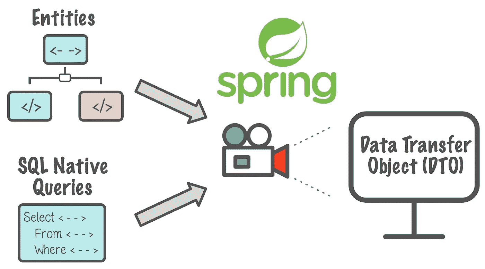

# 对本地查询的 Spring 数据 JPA 投影支持

> 原文：<https://medium.com/swlh/spring-data-jpa-projection-support-for-native-queries-a13cd88ec166>

在这篇博客中，我想谈谈如何使用 Spring Data JPA 投影，同时构建执行复杂原生 SQL 查询的**微服务**。Vlad Mihalcea 的博客对此进行了简要的讨论，并介绍了使用 JPA EntityManager 的预测。在这里，我主要关注在使用 Spring Data JPA 执行原生 SQL 查询时使用投影。使用 SpEL 投影嵌套对象和计算值。