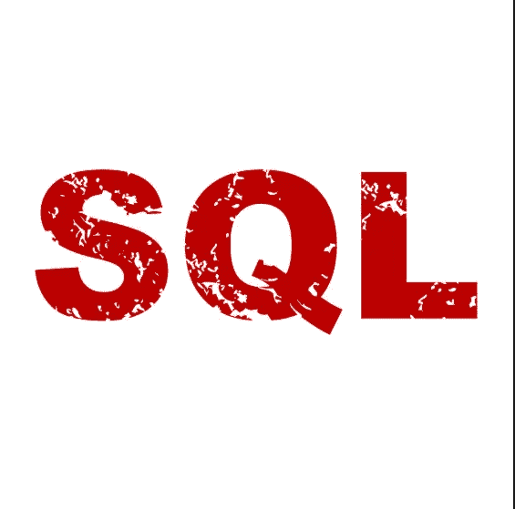

# 用于数据分析的 SQL

> 原文：<https://medium.com/swlh/sql-for-data-analysis-eea94dc5a763>

SQL ( *结构化查询语言*)发音为“sequel”，用于修改和访问来自称为数据库的存储区域的数据或信息。下面是 SQL 可以做的一些事情；

*   SQL 可以对数据库执行查询
*   SQL 可以从数据库中检索数据
*   SQL 可以在数据库中插入记录
*   SQL 可以更新数据库中的记录