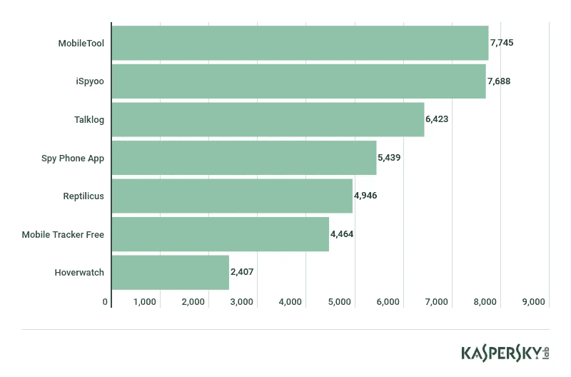

# 警告:你的伴侣或前任可能正在跟踪你的智能手机

> 原文：<https://medium.com/swlh/stalkerware-warning-your-partner-or-ex-may-be-tracking-your-smartphone-76569baec384>

没有什么比在前任的智能手机上藏一点间谍软件更能表明我对你没感觉了。

The most detected stalkerware applications based on the number of unique users of Kaspersky Lab for Android mobile products

已故喜剧演员莫特·索尔有一句名言:“仅仅因为你偏执，并不意味着他们不会抓住你。”。这一警告似乎特别适用于现在和以前的同居伴侣和恋人。