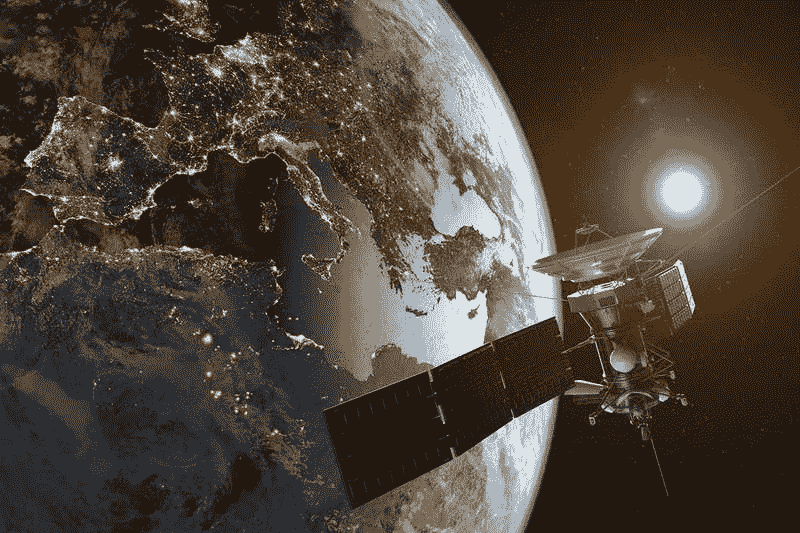

# Starlink，太空中的互联网

> 原文：<https://medium.com/swlh/starlink-the-internet-in-space-6b8dd2100d14>

A satellite in orbit above Europe.

对于我们大多数人来说，在太空中拥有一个由数千颗卫星组成的网络似乎是不必要的，那么为什么一些公司要投资数十亿美元来创建一个呢？引领这场运动的不是别人，正是埃隆·马斯克的公司 ***SpaceX*** 。美国联邦通信委员会(FCC)批准 SpaceX 等公司建立一个庞大的低层卫星网络，用于数据通信…