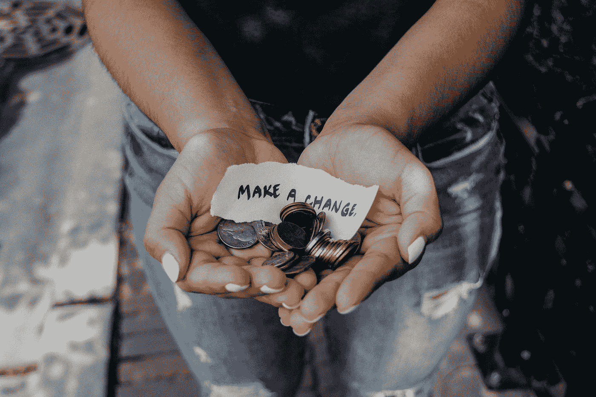

# 如果你真的想改变，那就开始写金钱日记吧

> 原文：<https://medium.com/swlh/start-a-money-diary-if-youre-serious-about-making-changes-238229c2239c>

## 准备好面对现实

Photo by [Kat Yukawa](https://unsplash.com/@katyukawa?utm_source=medium&utm_medium=referral) on [Unsplash](https://unsplash.com?utm_source=medium&utm_medium=referral)

阅读一本书是一种深刻的体验，尤其是如果你把从中得到的教训付诸实践的话。

最近，我读完了林赛·斯坦贝里的《29 本理财日记:你想知道的关于你财务状况的一切……以及其他人的《T1》。