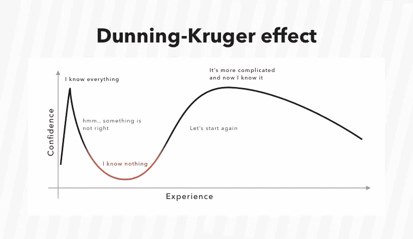

# 初创企业:对初创企业的邓宁-克鲁格效应

> 原文：<https://medium.com/swlh/start-and-up-dunning-kruger-effect-on-startups-19c0aa921688>

**“创业”**已经成为我们的常用词。每个人都知道它的意思，但这个词在很长一段时间内没有官方定义。通常，当我们谈论一家初创公司时，我们通常会想到一家有创新想法和扩大规模意愿的年轻公司。在大多数情况下，这些公司都有一些投资者愿意帮助它们成长。天使投资人总是追逐未来的“独角兽”——估值超过 10 亿美元的公司。这是一家梦想中的公司，因为投资者可以用相对微不足道的财务贡献获得有价值的可转换票据或股票。根据最新的统计，一个 startupper 的画像是这样的:创始人平均为男性(82.8%)，大学学历(84.8%)，目前 38 岁。

互联网技术已经成为新企业的沃土。这是因为互联网以最小的资金投入开启了无限的可能性。抓住这些机会，许多人开始在自己公寓的厨房里创建新公司。你所需要的只是一台笔记本电脑、一个头脑和一杯咖啡/茶。然而，事情还有另外一面。一个可怕的统计数据显示，初创公司的失败率在第一年高达 98%。

10 年来，我一直在不同的岗位上与创业公司合作。首先，我是一名营销人员，帮助创建品牌和品牌推广策略。后来我在销售和市场部门工作。我的主要目标是改善销售流程。在过去的 2.5 年里，我一直在 [Dashdevs](http://www.dashdevs.com) 公司担任客户专员和产品负责人。我们为世界各地的各种企业创造高科技产品。一旦我试图计算我合作过的创业公司的数量。这个数字目前已经超过 80。创业公司的老板通常会谈论成功和辉煌的未来。在大多数情况下，我需要阻止他们并强调风险区域。从根本上说，我一直是作为一个人与 startup leader 合作，而不是与一家公司或品牌合作。这就是真正的品牌核心和所有问题的根源。

# 创业公司为什么会失败？

500 Startups 的联合创始人戴夫·麦克卢尔曾经说过:

> ***“一个‘创业公司’就是一个迷茫的公司——1。它的产品是什么。2.谁是它的顾客。3.怎么赚钱。”***

这一表述完全符合统计数据:42%的此类产品不符合市场需求，29%的初创公司资金短缺，23%的团队不合适，14%的公司忽视了客户的需求。这些问题的源头，都是因为领导者混淆现实的幻想造成的。但是让我们仔细看看失败的过程。

# 为什么创业者看不到他们将会失败？

你有没有遇到过一个对自己的技能超级自信的人，但对你来说，这个人显然会失败？我们可以在日常生活中随时观察到这些情况(在工作中，在朋友中，在家里)。一般来说，人们不擅长评估自己在某方面的技能和表现。这是一场糟糕的游戏，会导致一个轻率的人崩溃和经济损失。

通常，成功创业的主要障碍是创业者的自我欺骗。这种行为被称为邓宁-克鲁格效应。这学期我第一次遇到是在不久前，当时我正在学习教练科学。我们讨论了人们做出的决定以及这种行为的原因。一切的关键是心理扭曲。虚幻优越感的认知偏差来自于能力低下的人无法认识到自己能力的不足。换句话说，人们高估了自己的技能，他们喜欢这种错觉。一切都可能掩盖一个表情:

> “表现差的人——我们在某些事情上都表现差——看不到他们思维中的缺陷或他们缺乏的答案。我们认为自己处于最佳状态的时候，有时也是我们最糟糕的时候。”

但是创业公司会怎么样呢？一旦一个企业家决定开始自己的事业——一切都变得简单明了。产品或服务经过完美的审查。新人认为他/她了解市场，预见了所有的风险和问题。一个 startupper 是自信的，充满力量的。通常，人类思维的选择性感知有助于只看到个人企业家精神的正面例子。因此，这些不切实际的计划在开始时看起来是如此的不切实际。在这个阶段，肾上腺素分泌非常高。然后一个朝气蓬勃的人遇到了现实，开始明白被误认为是知识的完美幻觉会把人引向歧途。有时候这样一类人被称为自信的傻逼。在这里，我需要承认，有些人正长期停留在曲线的顶峰。他们不接受对其活动的任何合理批评。当现实找到一个起点后，他/她会以极快的速度失去信心。在这个阶段，许多创业公司失败了，再也没有回到正轨。当这个人处于曲线的底部时，觉醒就来了。企业家开始意识到自己的无能，并试图克服它。

# 催款-克鲁格效应会造成哪些损失？

对于被催款-克鲁格效应困住的人，我首先想到的是时间的损失。人们被自己的幻想蒙蔽了双眼，否定了现实。思维敏捷清晰的竞争对手可能会抓住这个想法并使其成功。这就是为什么一些商业想法会成为市场上的第一个，而且其中一些是最好的。我在工作生活经历中遇到过这种情况。一开始，我们一直在构建一个具有大量特性的应用程序。最初的版本计划在 9 个月内完成，包括全部功能。在此期间，竞争对手提交了功能较少的应用程序，并在短时间内成为市场的领导者。

此外，一个暴躁的领导会毁掉人际关系和职业生涯。邓宁-克鲁格效应给创业者带来了翅膀，创业者变成了自己企业的布道者。福音传道者可以说服其他人辞掉全职工作，免费工作(或股权)或投资他们的钱。我见过这样的人，他们意识到自己行为的可怕后果后。盲点出现后，它们被撕成了碎片。

我明白这只是一个人的经历，它不可能是积极的或消极的。事情就是这样。在过去的两年里，我和不同的创业公司一起工作，有着不同的工作优先级。但是他们都有一个共同点——他们可以在开始时激励同事。我能在会议上看到这些闪亮的眼睛。他们发光是因为他们不能把握事物的实际状态。邓宁-克鲁格效应具有传染性。

# 为什么被邓宁-克鲁格效应套住的人认不出来？

当你从外部或回顾性地看待情况时，一切似乎都很容易理解。识别其他公司的邓宁-克鲁格效应非常容易。然而，人类自己却无法认识到这一点。对此有一个解释:

1.  主要是邓宁-克鲁格效应是由**正面经历**(一个人本身、密友或知名人士)引起的。这个人在过去已经建立了一个成功的公司，或者是某人成功团队的一部分。
2.  有些人认为他们可以无害地**从一个市场/公司/产品**中获取成功经验，带到另一个市场/公司/产品，并征服世界。他们没有意识到总会有知识上的空白需要填补。
3.  另一个因素是 T4 完全缺乏经验。因此，人可以充满梦想和幻想。在这种情况下，图上的一条曲线可以极度上升，然后极度下降。当你不明白自己在说什么的时候，一切皆有可能。
4.  有时人们认为复制某人的成功可以帮助他们获胜。尽管如此，你永远也不会知道为取得这一成功所做的一切。在大多数情况下，适用的经验转移并不适用于所有公司。
5.  **缺乏自我批评**。你多久认为自己在某方面是最棒的？
6.  人们普遍认为**领导者不会失败**。

由于这些原因，人们无法认识到他们自身能力的缺乏(在某些情况下甚至是行为的不恰当)。处于邓宁-克鲁格曲线顶端的另一个结果是无法正确识别他人的能力和知识基础。这种人不接受这样一个事实，即有人能更好地了解一些事情，并有一个更清晰的画面。这就是为什么他们对真正的建议和强者视而不见。另一个真实的故事是客户端有 12 个人的创业公司。他们有一个对品牌、市场和开发流程有自己见解的领导者。其中一名员工(管理层)开始意识到品牌发展的流程走错了方向。他们需要雇用知道该做什么的专业人员，并需要评估市场定位。领导的反应真是气炸了。他变得针对个人，并开始散布这个人的流言蜚语。花了 3 周时间，才让这个见解独到的人退出了这家创业公司。

催款——克鲁格能深深影响自尊心弱的人，让他们在每个对手身上看到敌人。

# 我们如何检验我们没有受到邓宁-克鲁格效应的影响？

我列出了一系列问题，可以帮助领导者自我测试。你需要对自己诚实的回答每一个问题。邓宁-克鲁格效应问卷:

1.  **你在这个特定市场呆了多久？*a)****5 年以上；****b)****1-5 年；* ***c)*** *不到一年。*
2.  你如何评估自己在这个市场的竞争力水平？ ***a)*** *一个不需要任何帮助的亲；* ***b)*** *有经验，但需要建议；* ***c)*** *新人。*
3.  你自己创业过吗？ ***a)*** *是的，由我自己；* ***b)*** *是的，有伴侣；* ***c)*** *编号*
4.  你曾经经历过创业失败吗？****a)****是的，我曾经是这个团队的一部分；* ***b)*** *是的，那是我自己的事；* ***c)*** *不，我没有*。*
5.  *你的团队中有多少人愿意倾听？ ***一)*** *无一，他们没有足够的经验；* ***b)*** *如果有人想分享，我愿意听取意见；* ***c)*** *还有几个谋士。**
6.  ***你在市场调查上花了多少时间？*一)*** *不到一个月；****b)****1-3 个月；* ***c)*** *超过 3 个月**
7.  *你了解你的竞争对手或替代产品吗？ ***a)*** *我没有任何竞争对手；* ***b)*** *我认识他们；* ***c)*** *我对竞争对手进行分析并跟踪每一个竞争对手的步骤。**
8.  ***为什么你觉得你的团队一定要粘着你？ *a)*** *我有一个开创性的想法，他们必须听我的；* ***b)*** *我能带领他们走向成功；* ***c)*** *我们一起可以让它实现。**
9.  *你如何定义自己在公司的角色？ *a)* *主要视觉者(高层理解)；****b)****主要决策者；****c)****工蜂。**
10.  *没有你，你的公司还能继续工作吗？****a)****否；****b)****是的，几个月；****c)****是的，长达一年甚至更久。***

# **结果:**

*   **如果你的大部分都是**答非所问**，那么你就处于催款-克鲁格效应影响的风险区。你需要尽快列出你一直忽视的真正的弱点。**
*   **如果你有大多数的 B 答案，你需要在你的环境中召集你信任的最有经验的团队成员来评估你的业务。可能有一系列你没有意识到的陷阱。**
*   **拥有**C-答案**的人大多处于邓宁-克鲁格效应的安全区，但你可能处于冒名顶替效应的风险区。这是催款——克鲁格效应的相反状态——你不知道自己有多酷。**

**这份问卷的目的是让你思考现实，以及你如何看待现实。**

# **什么是邓宁-克鲁格效应的维护检查？**

**因为每个问题都有解决方法，所以你可以采取一些行动来避免催款-克鲁格效应*(或者让它不那么痛苦)*:**

1.  **只是**承认有你不知道的事情**的事实，时刻准备提升自己。**
2.  ****制定切实可行的计划，并在过程中衡量结果。通常对前期的回顾可以帮助你在早期阶段确定自己的无能区域。****
3.  ****雇人求平衡**。一个伟大的团队应该由拥有不同互补技能的人组成。**
4.  ****尽可能多和比你聪明的人交往**。(接受有比你聪明的人的事实。**
5.  ****开业前试水**。不要害怕重新开始。**
6.  **做好**市场调研**并定期更新数据。直升机视角很棒，但你需要继续关注更多新闻。**
7.  **将你的时间和精力集中在你拥有最大竞争优势的领域。**
8.  **询问对你表现的反馈，并准备接受。**

**需要说的是，商业伙伴可以成为守护天使，将你从邓宁-克鲁格效应的绝望沙漠中拯救出来。他们可以是智慧的声音，阻止你采取错误的步骤，展示硬币的另一面。顺便说一下，问题“你认识你的商业伙伴多久了？”以及“你躲过了多少次危机？”对投资者来说至关重要。他们不信任没有经历过失败的人。商业伙伴之间的平等合作、支持和真诚可以帮助企业家在最困难的时候生存下来。**

**企业领导人对公司的未来和他雇佣的员工负有责任。站在坚实的基础上思考伟大的想法是至关重要的。而且，发现自己陷入了邓宁-克鲁格效应陷阱也很正常。我们需要这一点，因为“经常失败，你才能更快成功”。所有伟大的领袖都经历过。他们成功是因为正确的自我评估和团队。这两个输入帮助他们找到了最疯狂的想法和现实之间的平衡。**

> **"成功是从一次失败走向另一次失败而不丧失热情."**
> 
> **温斯顿·丘吉尔**

**从这个角度来看，不要害怕邓宁-克鲁格效应，但要做好战胜它的准备。开始行动，取得成功！**

****

## **这篇文章发表在[《创业](https://medium.com/swlh)》上，这是 Medium 最大的创业刊物，有+424，678 人关注。**

## **订阅接收[我们的头条新闻](https://growthsupply.com/the-startup-newsletter/)。**

****