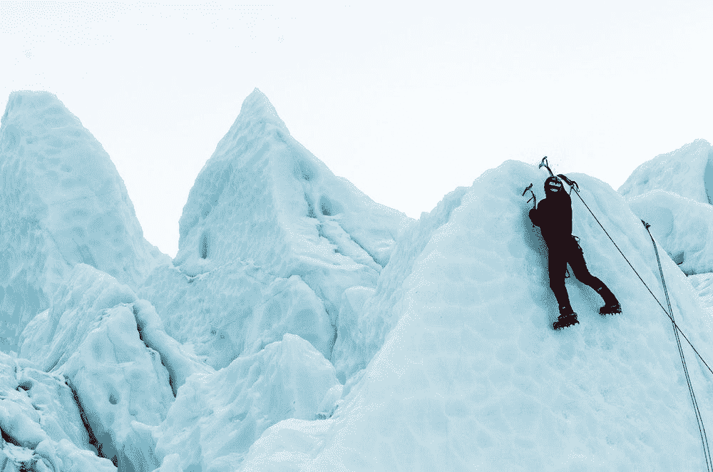

# 从你现在的地方开始

> 原文：<https://medium.com/swlh/start-where-you-are-b3bd23880de0>

## 个人发展很难，但还是要做

Photo by [Robert Baker](https://unsplash.com/photos/ug5t9ibJBbc?utm_source=unsplash&utm_medium=referral&utm_content=creditCopyText) on [Unsplash](https://unsplash.com/search/photos/hard?utm_source=unsplash&utm_medium=referral&utm_content=creditCopyText)

## 学习区

个人发展很难，因为它需要改变。这需要深刻的自省，并找到那些为了成为我们想要成为的人而需要变得更好的事情。

人类渴望确定性，而我们养成的习惯构成了我们的…