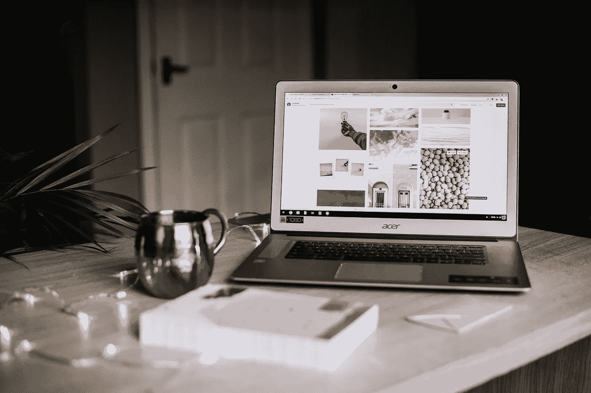

# 开博客:为什么和怎样

> 原文：<https://medium.com/swlh/starting-a-blog-the-whys-and-hows-987074cfb864>

Photo by [Anete Lūsiņa](https://unsplash.com/@anete_lusina?utm_source=unsplash&utm_medium=referral&utm_content=creditCopyText) on [Unsplash](https://unsplash.com/search/photos/blog?utm_source=unsplash&utm_medium=referral&utm_content=creditCopyText)

如果你是一个初学写作的人，甚至是一个想开始社区建设的经验丰富的作家，这里有一些为什么和如何开始你自己的博客的原因。

各地的作家都在使用博客来宣传他们的作品。你肯定知道一些。我是说，你现在正在读一本！

如果你是博客世界的新手——阅读博客，更不用说考虑开始…