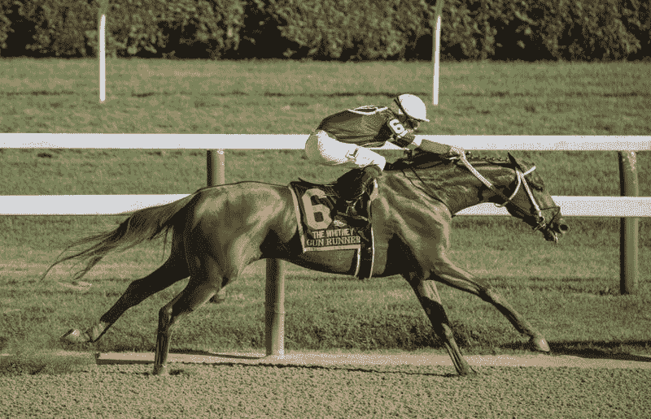
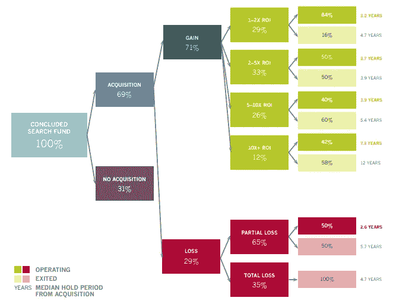

# 白手起家还是通过收购创业？

> 原文：<https://medium.com/swlh/starting-from-scratch-or-entrepreneurship-through-acquisition-c3c74d1bce66>

在我之前的故事《单位经济学》中。成长是创业公司的终极目标吗？很多人问我关于*搜索基金*的问题，为此，我决定写这篇帖子，旨在介绍一下*风险投资*(**VC**)**&*搜索基金* ( **SF** )，或者所谓的通过收购创业的一些令人好奇的异同。**

**首先，有必要简单介绍一下这种商业模式，这种模式现在已经非常流行了。**

**SF 是企业家从对私募股权投资感兴趣的投资者那里筹集资金的工具。最重要的是，它们为有前途的经理人通过收购成为企业家提供了资本渠道。**

****

**Figure 1: Search Fund Cycle. Source: [Stanford´s Search Fund Study](https://uploads.strikinglycdn.com/files/13e91f62-968f-4fe3-926e-3b4613b5513c/2018stanfordreserach.%20searchfundorg.pdf).**

**该模型的历史投资回报率为 6.9 倍，内部收益率为 33.7%。这种**盈利能力**在这些年里保持稳定，因为投资者非常严格地选择首席执行官，并保持最初的投资理念(尽管许多人试图根据他们的个人兴趣调整模型)。**

****标准检索员**30 岁，有 5-10 年相关工作经验。绝大多数来自投资银行或管理咨询行业，他们往往在从顶级 MBA 毕业后一年内就开始了融资过程。**

1.  ****骑师比喻****

****

**Figure 2: Horse Race. Source: Unplash.**

**奥基的比喻是:(一)企业家(骑师)技术高超，才华横溢，但作为首席执行官却缺乏经验;(二)投资者(教练)有运营和寻找资金的经验，他们负责引导企业家;(三)公司(马)是赛马中最重要的资产。**

**就像假设 CEO 已经通过了 SF 模型的标准过滤器一样，大部分的重要性在于寻找和收购完美的公司(马)。**

**相反，在 **VC** 上下文**、**中，最重要的项目是*创始人团队(骑师)*因为所有的价值都要被创造出来，而创意/项目(马)什么价值都没有。甚至在早期阶段，比如在兰扎德拉，我们说“我们支持创始人，而不是公司”。**

****2。投资论文****

**搜索基金的特点**投资论文**是维持这些数字不可或缺的。尽管 CEO 很年轻，但他们的目标都是降低投资者的投资风险:**

*   **经常性收入**
*   **简单的 B2B 商业模式**
*   **100 万€和 500 万€之间的 EBITDA(EBITDA 利润率> 15%)**
*   **低资本支出密集型**
*   **客户多样化**
*   **增长潜力**
*   **高转换成本**

**虽然搜索基金的投资理念是标准的，而且非常清晰，但资助初创公司的标准在商业天使和风投之间可能会有所不同。为此，我将介绍 [Rob Johnson](https://www.iese.edu/es/claustro-investigacion/claustro/rob-johnson/) 教授的投资准则:**

****a)可行:****

*   **[TAM](/hyde-park-angels/is-your-business-a-venture-1a314316ce67) :必须定义客户，并且总的潜在市场必须足够大，才能实现预期的增长。**
*   **竞争优势:必须确定市场中的参与者，企业家必须证明为什么他的公司比他们更好。**

****b)可行:****

*   **团队成员应该具备运营公司的技能和经验。**
*   **[充足的上市时间](/gabor/the-4-scenarios-of-startup-timing-26bc66d4be8b)。**

****c)可资助:****

*   **可扩展性。**
*   **退出的机会。**

****3。变体****

**与此同时，创业公司可以决定不选择自举方式筹集资金，并且有多种搜索基金:**

**-传统搜索基金。**

**-赞助搜索基金，创业者只从一个投资者那里筹集资金。通常是专门从事搜索基金的基金。**

**-自筹资金的搜索基金，由企业家支付搜索费用。这种模式是为那些有能力也想承担搜索阶段的搜索者准备的，他们可以进行一些利弊分析。**

****4。NDA(保密协议)****

**这一点和公司的成熟度有关。商业创意不值钱，最重要的是*创始人团队的执行力。*由于这个原因，**风投**不会签署 NDA，因为它们很费时间和成本。如果一个加速器/商业天使/风险资本每月收到 100 个项目，可能需要一个像大型私募股权公司这样的 NDA 部门。要求获得 NDA 表明你缺乏风险投资知识。**

**另一方面， **SF** 的目标公司维度更大。这些公司都是中小企业，年收入在 1000 万€到 3000 万€之间。此外，这些公司通常由严格保密的商业家族所有。**

**对于搜索者来说，能够与企业主签署 NDA 是一个很好的里程碑。他们利用与企业主会面的次数、签署的 NDA 和 loi，向投资者进行月度报告。**

****5。估值倍数****

**另一个显著的区别是市场为这些不同类型的商业模式支付的退出倍数。 **SF** 的竞争优势是目标公司不在 **PE** 或 **VC** 的雷达上，在这个范围内的潜在买家较少。事实上，在搜索者联系他们之前，所有者甚至没有想过要卖掉他们的公司。由于这些公司的增长率较低，买方的竞争也较少，因此 EBITDA 倍数较低，平均为 4 倍。**

****风投公司**不使用 EBITDA 倍数，因为初创公司是快速增长的企业，它们被用来将资金进行再投资，以快速增长和扩大规模，从而在未来实现其理想的市场地位。出于这个原因，在风险投资中，人们通常会将交易与另一个倍数进行比较，比如下图所示的 x 倍收入。**

****

**Figure 3: Tech Exit Transaction Multiples Europe 2018\. Source: Avolta Partners.**

****6。帽台&控制****

**从下图中可以看出，在搜索阶段成功筹集资金的搜索者中，有 69%能够收购一家公司。**

****

**Figure 4: Percentage of funds in each phase of the search cycle. Source: [Stanford´s Search Fund Study](https://uploads.strikinglycdn.com/files/13e91f62-968f-4fe3-926e-3b4613b5513c/2018stanfordreserach.%20searchfundorg.pdf).**

**因为他们不投资任何€，搜索者如何从被收购公司获得股份？简单来说，搜索者在完成与投资者商定的一些里程碑后获得股权。通常在收购中获得 8%，在担任公司首席执行官一段时间(平均 5 年)后获得 8%，如果退出允许投资者获得预先安排的盈利(平均 30% IRR)，则获得最后 8%。最后，在最好的情况下，搜索者将获得一家公司 24 %的股份。**

**否则，一个创业公司可能的稀释场景可能是种子轮从 10%到 20%，A 轮从 20%到 30%，B 轮大约 33%，所以我们可以说，平均而言，B 轮之后的企业家也拥有 24%的公司股份。**

****7。风险&财富****

**如果我们假设，在新的管理团队运营 5 年后，一家通过收购而被收购的普通公司可能价值 2000 万€，那么首席执行官在可能的退出中的净回报可能是 480 万€。另一方面，正如 dealroom.co 所言，乙级联赛后创业公司的平均估值为 1 亿€。从一个白手起家的创业者身上获得的潜在财富要大 5 倍。**

**当然，风险要大得多。虽然 90 %的初创公司都失败了([阅读](/swlh/why-90-of-startups-fail-and-what-to-do-about-it-b0af17b65059)更多)，但在搜索基金方面，这几乎是相反的数字。如果你对通过创业致富感兴趣，你应该看看保罗·格拉厄姆(Y Combinator 联合创始人)的这篇[帖子](http://paulgraham.com/wealth.html)。**

****8。生态系统的成熟度****

**风险投资行业起源于 20 世纪 50 年代，伴随着 20 世纪 80 年代的繁荣，搜索基金模式是由斯坦福大学商学院教授 H. Irving Grousbeck 于 1984 年创建的，但几年后它并没有变得非常流行。**

**2018 年，西班牙在 2018 年的创业资金是 5.98 亿€(这个数字不包括来自 Letgo 430 和€Flyware 8500 万的融资，因为他们位于美国)，虽然我们不知道 2018 年西班牙搜索基金的数字，但我们可以尝试计算出大概的数字。**

*   **2 家公司收购* 1260 万€(2016-17 年平均购买价格)= 2520 万€**
*   **10 个资助的搜索阶段* 45 万€(2016 年至 2017 年的平均资本筹集)= 450 万€**

**因此，大约有 3000 万€，占 2018 年西班牙初创公司总资金的 5%。**

**与此同时，创业公司生态系统已经出现了一些专业机构来支持创业公司，如加速器、孵化器、风险建设者、商业天使、种子和风险基金。在美国，专门支持搜索基金的基金有 [Pacific Lake Partners](http://goo.gl/yZNeEy) 、 [Relay Investments](http://goo.gl/a5IAFl) 、 [Anacapa Partners](http://goo.gl/0GJScm) 等。甚至是一个位于波士顿的搜索基金加速器。很可能今年第一个西班牙基金将被募集来投资搜索基金。**

**获得的主要个人结论:**

*   **在 **SF** 最有价值的资产是公司(马)，联合创始人团队(骑师)在 **VC** 。**
*   **两种模型都允许不同的变体。**
*   **虽然搜索基金的投资主题是非常量化和标准的，但初创公司的投资主题更具定性，并且通常与基金、商业天使等不同。**
*   **向风投要一个 NDA 显示出对这个领域缺乏了解，而在 T21 签署一个 NDA 是一个伟大的里程碑。**
*   **不同的倍数用于比较交易。中小企业的交易通过 EBITDA x 进行比较，初创企业的交易可以通过收入 x 进行比较。**
*   **就股权所有权而言，搜索者的最佳情景类似于一位后 B 轮创业者。**
*   **白手起家更富有，但风险更大。**
*   **搜索基金占 2018 年西班牙创业公司融资总额的 5%。**

**如果你对西班牙的*搜索基金*、这里的很好奇，你可以下载我的最终论文学位，是基于对 2017 年运行的 18 家西班牙*搜索基金*的分析。**

**Lanzadera 是一家位于巴伦西亚的创业加速器和孵化器，每年支持 100 多名创业者。兰扎德拉有不同的项目，涵盖从 MVP 到成熟企业家的范围。**

*   **如果你想了解更多关于 Lanzadera 的信息，你可以发邮件给我**
*   **模仿商业案例👉[此处](/swlh/okywatch-business-case-7ddbdc2a6669)**
*   **单位经济学👉[此处](/swlh/unit-economics-is-growth-the-ultimate-goal-of-a-startup-b319df9c45f)**
*   **你想知道更多关于我们的计划和标准吗？👉[此处](/@jdetoro/cómo-asegurar-tu-entrada-en-lanzadera-47e9059a2581)**
*   **给我们的采访一些建议？👉[此处](/@jdetoro/claves-para-tener-éxito-en-las-entrevistas-de-lanzadera-6daeb46df414)**

**阅读我们的博客:[https://lanzadera.es/blog/](https://lanzadera.es/blog/)**