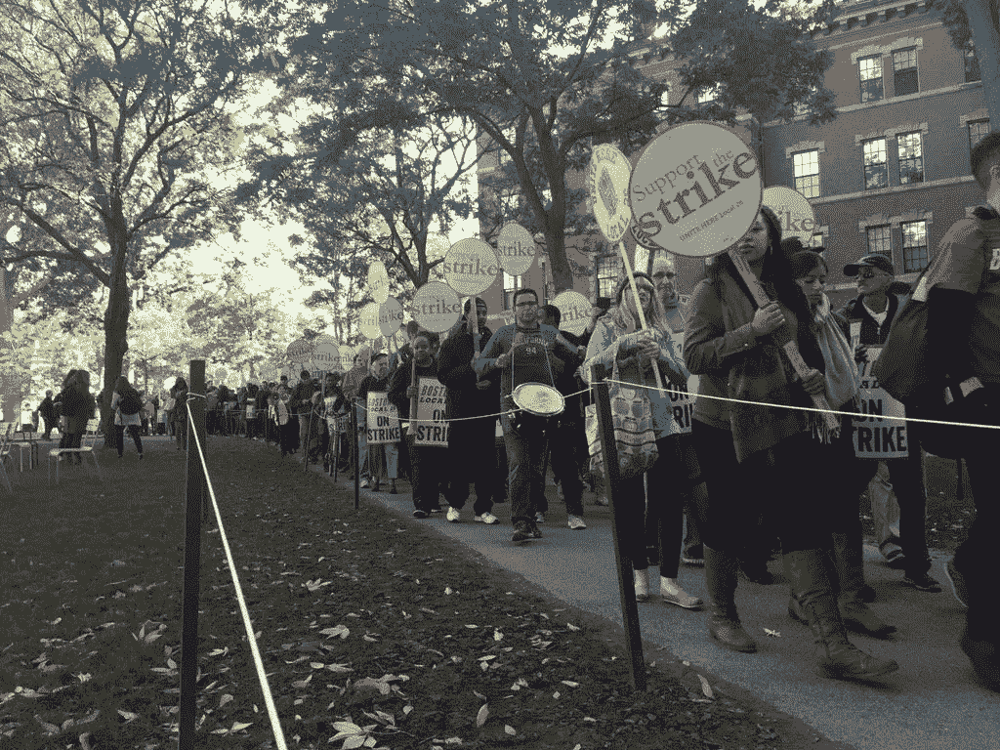

# 从劳工运动开始让我成为一名更好的记者

> 原文：<https://medium.com/swlh/starting-out-on-the-labor-beat-made-me-a-better-journalist-f3134b958ce6>

Harvard affiliates at a demonstration during the dining workers’ 2016 strike. — Brandon J. Dixon

# 劳工罢工还没有结束。盖住它可以教你一两件事。

什么是*地狱*劳动报道？

这是我在大学一年级一个学期的报纸面试后，当我在*《哈佛深红报》*的编辑给我第一个采访任务时，我想到的第一件事。然后，一秒钟后:*我真的想这么做吗？*

我隐约知道报道罢工意味着我在报道工作——工作是如何完成的，谁做的，他们得到了多少报酬。我知道工会参与其中，由于我就读的高中与工会有着令人担忧的谈判历史，我只听说过一些恐怖的故事，比如代表们砍那些敢于越过纠察线的人的轮胎，以及对棘手的申诉程序的沮丧咆哮。涌向谷歌并没有带来安慰:我的第一个搜索(“如何成为一名劳工运动的记者”)出现了一连串启示性的标题，似乎一致宣布劳工运动已死。撕开。

可以肯定的是，在我来到校园之前的几年里，哈佛的劳工运动已经蓬勃发展。前一年秋天，由一群隶属于哈佛工会的酒店工人领导的抗议和示威占据了新闻头条，代表约 700 名文员和技术工人的最大的校园工会正准备与哈佛进行最新一轮的合同谈判，谈判将在我刚刚适应这个角色时开始。但我是一个天真的新记者，关于劳动的一些事情并没有说*性感*，没有像招生或校园社会组织那样吸引我们报纸的大部分在线流量。

我曾想象自己追逐大学的高层管理人员，并在早间新闻节目中披露那些将被权威人士收集和消化的故事，而不是埋头苦读医疗保健协议，时不时地撰写一篇只在顽固的哈佛校园观察家中引起轰动的文章。

四年后，当我看到新闻行业的未来时(手指交叉)，很明显，被分配到这家报纸的员工中是我一生中最美好的事情。这使我成为一名更强的记者，磨砺了我的技能工具箱，并教会了我关于记者角色的宝贵经验。

这些课程中最重要的一课是谦逊。

人们很容易被新闻业的名人所吸引(看，马！人们在看我的东西！)尤其是像 Twitter 这样的社交媒体已经把写故事的人带到了新闻的前沿。

> “[川普密语者](https://www.vanityfair.com/news/2017/10/is-trump-whisperer-maggie-haberman-changing-the-new-york-times)”玛吉·哈伯曼迷人的个人资料和吉姆·阿科斯塔[与白宫](https://www.youtube.com/watch?v=4T-NMMmYGSY)争吵的片段，促成了一种既重视署名也重视其背后故事的文化。

我不会说这是一件好事或坏事，但对我来说很明显，作为一名初出茅庐的记者，我正在寻找增加我的 Twitter 粉丝或为自己打造品牌的方法，这种“流行文化”的报道方式让我受到了影响。

这是一种对优秀劳动报告的诅咒文化。

每当你写一篇报道时，劳工报道都会不断提醒你生命处于危险之中，无论多少简洁的 Twitter 回复都不会是解决新闻业旨在制造的不公正的灵丹妙药。在我开始工作的几个月里，我和无数哈佛员工交谈过，他们在工作需求、地区范围内不断减少的医疗福利和几十年来酝酿的[住房负担危机之间进退两难。如果我没能在工作中向哈佛、剑桥或工会领导层提出关键问题，这意味着他们的需求可能不会在下一轮合同谈判中得到解决。如果我把晚上的时间花在应对 Twitter 上的批评上，而不是在餐厅里巡视，与员工交谈，以发现他们在工作中最苦恼的事情，我可能会错过关于所谓歧视或危险工作条件的重要报道。](https://www.thecrimson.com/article/2018/3/8/cambridge-housing-explainer/)

我永远不会忘记一位消息人士含泪讲述他们在大学工作的季节性给家庭成员带来的特殊负担，他们中的一些人患有慢性健康问题，需要她全年都有现金缓冲，以备医疗紧急情况出现。在那次采访中，我发现了一些东西，我开始用衡量标准来衡量我的报道的价值和影响，而不仅仅是我的故事是否进入了 Crimson 网站上阅读量最高的前五名。

但是，要做好劳工新闻所需要的工作，就意味着要学习深度挖掘的艺术——随着记者转向处理越来越多的档案，在支离破碎的数据海洋中挖掘真相，这项技能将成为产生改变生活的有影响力的新闻的一部分。

在《the beat》的第二个学期(也是我大学二年级的秋天)，哈佛的餐饮工人宣布他们打算罢工，要求大学为工人设定 35，000 美元的基线工资，并全面提高医疗福利。这是一次历史性的罢工，标志着餐厅员工在学年中第一次罢工。在长达 22 天的时间里，他们作为代表他们的波士顿工会 UNITE Here Local 26 的纠察队员，愤怒地与哈佛的谈判人员讨价还价。

在那个学期开始的时候，我是唯一一个被派到《劳工报》的记者。但随着罢工迫在眉睫，并持续到繁忙寒冷的十月，更多的记者加入了报道队伍。尽管如此，当涉及到剖析堆积如山的合同提案、工资表、食品行业雇员的地区和国家数据，以及双方为支持其目标而发布的专家医疗保健分析时，我经常要做解析所有这些内容的艰难工作。

> 在那 22 天里，我学到了更多关于制作易于理解的新闻的本质——将一堆相互竞争的数据提炼为可读的内容——这可能比我被分配到该报一个“更性感”的年轻团队还要多。

我制作了[的解说](https://www.thecrimson.com/article/2016/9/22/huds-negotiations-primer/)，在推特上发布了来自该地区各地的关于引人注目的罢工的常见问题的回答，我真的觉得自己好像跟上了国家新闻媒体和当地专业附属机构的报道，如果不是超过的话。

对我个人来说，感觉自己真正掌握了与罢工相关的大量信息是值得的，它教会了我的编辑们，他们可以相信我(借用招聘广告上经常看到的一个短语) ***注重细节***——以至于第二年他们给了我一个高级职位，这个职位因向报道它的人扔晦涩难懂的报告而臭名昭著:跟踪[哈佛的投资部门](https://www.thecrimson.com/article/2017/5/24/HMC-rise-fall-commencement/)。

当时我并不知道，但这种打击赋予了我第三种技能，这种技能在行业之外还有实际应用。当我最终开始工作时，它教会了我该期待什么。

对加入工会和不加入工会的工人的报道让我看到了工人在劳动大军中面临的各种待遇。无论你最终从事哪个行业，这些宝贵的知识都将帮助你处理合同、健康福利和人力资源纠纷。对于在数字新闻网站寻找工作的记者来说，理解有组织的劳工关系重大。众所周知，整个数字领域的新闻编辑室都陷入了工会浪潮，旨在解决至少十年来的批评，即这些公司因不一致的工资和福利待遇而辜负了员工。

令人振奋的一点是:在我从事报道工作的四年里，宣告劳工运动死亡的头条新闻似乎已经逐渐消失了。CJR 写了一篇文章[强调了](https://www.cjr.org/analysis/when_longtime_labor_reporter_steven.php)劳工的新迭代报道了不断变化的劳动力需求，我甚至在 LinkedIn 上看到一个帖子，寻找一名[专门的劳工记者来报道科技行业对有组织劳工的清算](https://www.linkedin.com/jobs/view/1298496376/)。机会就在那里。他们有很多东西可以教你。