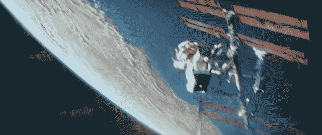

# 创业不是逃避激情的借口

> 原文：<https://medium.com/swlh/startup-is-not-an-excuse-to-run-away-from-your-passion-e4ef56fbe937>

作为联合创始人，我对自己做的错事。

几个月前，我在想我们的创业公司，独自一人躺在阳台上，在黑暗中，观察双子座流星雨期间偶尔从天而降的流星。午夜过后，我听到了周围城市的喧嚣，一如往常的喧嚣都停止了。就在今天晚上，我和我的联合创始人就营销活动进行了一场激烈的辩论。我们最近获得了种子资金，我需要我们的战略和运营有一个清晰的透明度；目前他们还没有。经过几个小时的激烈辩论，我决定把我的思想从*敏捷的生活方式*中解放出来，休息一小会儿，尽管我很清楚我现在的疲惫不是休息就能解决的。就在几个月前的那次休假期间，我意识到我在经营一家公司时做了一件非常错误的事情。短暂的休息让我有了新的视角。

# 实现

尽管我身心俱疲，但我不能好好休息一下。休假很困难。我的头脑不习惯这样。我努力训练自己不断学习——在一定程度上，当我有空闲时间的时候，我开始意识到有些事情大错特错了。有许多个周日下午，我希望自己能懒洋洋地躺在床上，看看外面的鸟儿和蓝天，听听雪警的音乐。我曾想啜饮咖啡和阅读丹·布朗的夜晚，我曾想怀旧地回忆我小时候看过的电影，如《通往特拉比西亚的桥》——并思考莱斯利的悲剧。但是在我内心深处的某个地方，内疚感会涌入，就像是我意志的一种有条件的程序化表达；提醒我我做错了什么。

*如果你有一点点空闲时间，那你就做错了*。有人会在我的脑海中低语，就像在禁海无月的夜晚海妖的歌声；让那个人完全接管我是第一个错误。

我现在想到的一件事是——后悔，尽管我知道这毫无意义。自从那天晚上在阳台上，我已经自我纠正了我的道路；我很平静，在新找到的工作与生活的平衡中经营我的创业公司。我把它写在这里，以便其他开始旅程的人可以知道，而不必经历我所经历的一切。如果我有时间机器，我会给年轻时的我写这封信。在为时已晚之前改正你的错误。如果你读到这封信。在撞上那座会让你的船沉没的冰山之前，你可以在一英里之外自我修正你的航向。

## 错误 1:建立公司而不建立自己。

创业是一段史诗般的旅程。它有时是悲伤的，令人不安的，不可预测的；但是很美好，也很有收获。你将听到的第一个建议是“这将是一份全职工作，没有周末假期”。虽然从一些角度来看这是真的，但从所有其他角度来看，这是完全错误的和错误的，意识到太晚会导致无数的情绪动荡，对你的生活造成严重破坏。就像我经历的那个，躺在露台上。

一个初创企业不可能消耗你一生的时间。句号。在最初的几个月里，你可能需要日日夜夜呆在办公室和野外。也许一年。但除此之外，如果你被要求始终如一地牺牲生活中的其他关键因素，比如家庭、友谊、健康和娱乐；如果创业公司还在永远贪婪地咀嚼你的整个生活；你需要小心翼翼，给你的引擎加满油，否则它很快就会令人难堪地停下来。

## 你可以经营一家全身心投入的创业公司，而不用全身心投入。道德上。

当你心情不好的时候，这个问题第一次显现出来。就像加速燃烧。增加流失率。财政赤字。当你情绪低落的时候，总有一天，你会反思你错过的所有事情。你一直推迟的那本书。落满灰尘的吉他放在角落里。你朋友不停要求合作一千遍的短片剧本，你没有。所有这些都会回来困扰你。

> 夺走你的创业；你不再是一个重要人物。

你技术娴熟，狡猾而有价值。但是你的生活会感到空虚。

## 我这么说是因为创业主要不在于你跌得多深或爬得多高，而在于你有多强能爬起来。

你需要重新振作起来。为此，你需要所有你需要的帮助。但首先，这种帮助必须来自内部。你需要自信、满足和乐观。

但是，当你的生活中没有其他东西给你信心或价值时，你怎么能乐观和满足呢？当你一直拖延和忽视你一生的召唤。你感到沮丧。你明白，如果公司从你手中被夺走，你就不再是一个重要人物。不是因为你不熟练，哪里都找不到工作，而是因为你为了一个无论你如何努力都无法实现的目标而推迟了你所有的激情。

## 你浪费的所有生命的沉没成本将你拉下；烧掉你仅存的自信、自尊和满足感。

> 你可能认为你总是可以回到绘图板，做 *Avada kedavra* ，发明一个枢轴，然后你们可以一起骑行到日落。但这是不可能的。没有自信，你就无法实现那个支点。你将在当地一家你几乎负担不起的酒吧过夜，而不是与团队会面讨论支点。

如果你需要这样做，你需要用你的灵魂所渴望的来填充它。摔倒了，需要有力气。如果你是宇航员，把它们想象成系在你身上的绳索。天气好的时候，你不需要它。但是当事情变糟时，你会需要它来维系你的生活。

坚持并回到你以前的荣耀。如果你需要这样做，你*首先需要成为一个没有创业的人。*不一定是生意或金钱；但可以是像你的爱好或热情这样简单的事情。那个让你的灵魂充满幸福的人。相信我。无论你认为你的旅程有多消耗精力，你都需要这些绳索。

## 错误 2:放弃写作。

我在大学的时候写了很多东西。尽管我热爱编程，但我也热爱写作。我的大学坐落在一个小山丘上，那里有作家梦寐以求的一切——黑暗幽深的树林、薄雾、群山、溪流和无限量的咖啡因。我正在写我的小说，这需要认真的研究。在我整个大学生活中，我记得自己每天都在研究、写作和编辑。我记得有好朋友会在周末来我们家，我们会做饭，爬上我们的树屋，讨论小说，在薄雾中啜饮我们的浓咖啡。在我作为一名计算机科学工程师毕业后，我被事物的潮流所吸引。我搬到了城市；最终成为一名有着远大抱负的初级工程师。我的办公室生活开始侵入我的私人生活，很快，几个月后，excel 表格中的一些专栏和一些文学代理之后，我的书躺在我布满灰尘的书架的下铺。梦想破灭了。我过去常常加班到很晚才回家，我记得把它润色后发给文学代理人，我过去常常用 excel 表格跟踪他们。但是，过了一段时间后，我记得自己被工作弄得筋疲力尽，放弃了我所相信的一切。但是这次经历是值得的，我从我的第一份工作中学到了很多。

几年后，我和我的朋友开始了创业之旅。那时我充满了年轻的自信，在肾上腺素的推动下，我把所有的时间都投入到创业中，忽略、推迟和放弃内心的呼唤。这家公司成了我的激情和痴迷——这是件好事——但问题是，它成了我唯一的激情。你需要明白，总有一天，钱会到来，压力会倍增，感觉良好的共同点会让位于令人不安的异议。许多事情会解决，但也有许多事情不会。而就像我一样，你会躺在露台上，远离所有的人类和他们所建造的东西；你会沉思和反思你的生活，仰望天空，精神疲惫，想想会发生什么——所有那些只写了一部分而没有发表的故事，所有那些你从未完成的画，所有那些从未离开过你的吉他的音乐。

## 所有可能发生的事情。所有你勉强避开的交替现实都在你现在所处的地方。

你没有找到平衡，而是放弃了灵魂的渴望，过着危险的生活。当你感到空虚的时候，它会在你心中下沉。你本可以在不影响目标的情况下做很多事情。你自己制造了一个没有时间的幻觉，你相信它。所有你推迟的事情现在都压在你身上。你不可能写完一整本书；但是你可以每周花一个小时来写，写一两页，然后继续写下去；或者你可以每周抽出半小时来学习和弹吉他。或者旅游。那会让你感觉很好。你可以让球继续滚动；但是你没有。你创造了自己的时间幻觉并相信它。在你的现实中，你有你自己的理由；你的大脑只是配合并适应你的故事。

就像莱昂纳多·迪卡普里奥[剧透预警！]在禁闭岛上，他相信自己是一名美国执法官，正在调查一名在岛上秘密精神病院中失踪的病人，但事实证明他真的就是那个病人；假装成法警是因为他无法面对现实，他杀死了他的妻子和三个孩子。

大脑是世界上最强大的超级计算机。它的力量足以改变你对现实的认知。所以当你认为在创业的时候没有时间做这些事情的时候，真的有时间。你只是不允许看到它。

在你周围，随着你的顿悟，这个城市将会停滞不前。

## 错误三。废弃的书籍。

我把自己的思维训练成在技术上具有竞争力，以至于当我过去考虑买书时，问题变成了这本书是否会对我的编程、营销或技术有所帮助。

> 然后，我记得烧我的逻辑门得出一个结论，是否购买卡尔萨根的宇宙或尼尔埃亚尔钩。

记得曾几何时，书对我来说是永恒的情感；但是现在，它们是逻辑约束，占用了我的时间。我积累了技术知识。我进入了算法和代码的如此深度，以至于当我再次出现时，我已经不是原来的我了。我精通多种编程语言、架构和技术，我的大脑已经适应了技术世界的高频运动。在每一次心跳中，世界上都有科学技术的突破，我有义务去了解它；或者不仅仅是被迫——上瘾。如果在某个地方有一台 fMRI 机器，我可以向你展示每当我获得一条知识，我的神经元就会在多巴胺释放期间燃放烟花。我沉迷于信息。我设计了自己的过滤器，创建了自己的时事通讯，建立了自己的知识新闻源——在这个信息超载的世界里，将信号与噪音分离开来。(我会在接下来的日子里写更多，这样你就可以用自己的知识管理系统创造平衡的生活。)而在那个地狱般的干草堆里，我永远也找不到时间看我心爱的惊险小说和经典名著。我的村上、我的丹·布朗、保罗·柯艾略和卡勒德·胡赛尼钻进了干草堆——再也找不到了。当太阳照耀的时候，我正在做干草，但是我没有管理仓库。再也没有感觉良好的戏剧了。不再有宇宙或时间简史。我被诅咒了，我却不知道。

## 错误 4:抛弃小战利品。

偶尔和老朋友通个长电话，和表兄妹出城是我很长一段时间避免的少数事情。现在我意识到，当我回首往事时，我看到的只是空虚。我所有的小表弟都长大了，他们不再是以前的他们了，他们记得我是一个鬼魂，在他们成长的过程中，我没有陪在他们身边。我错过了太多的生活。朋友。女朋友。所有这些对我来说都是我的小快乐——一种让我的生活充满小变化的方式。我无法让时间倒流来弥补。直到有人发明了一种有效的通量电容器，并设法穿过爱因斯坦-罗森桥，在桥的另一端完整无缺地出现。

## 课程:

说够了所有令人沮丧的错误。

## 每片乌云都有一线光明。

我现在已经纠正了所有这些，现在我用更多的参数来衡量我生命中的每一刻。我认识到我的错误，现在我已经在我的生活中创造了一条平衡的道路，它仍然对我的公司最有效。当你全押的时候，你必须明白的事实是，这变成了接力。不是比赛。你的团队里有人在为你奔走。如果他们跟不上你的步伐——如果他们在你工作的时候变得懒惰；如果他们在你面对的时候继续拖延，你所有的挣扎都会陷入困境。我的意思是，你个人将获得一个巨大的知识库和技能集，但你会感到筋疲力尽。你会觉得人生已经过去了很多——有一天，你会带着一种李伯大梦式的感觉醒来，开始后悔你无法改变的事情。我本可以给自己留一点点时间，而不是全身心投入。我听到人们一直在谈论它——在酒吧里，在下午 5:45 的通勤列车上，以及在博客里。你不会明白的，直到为时已晚。就像墨菲斯在《黑客帝国》中说的“知道道路和走在道路上是有区别的”。

## 我的一线希望。

即使我犯了所有这些错误，我也获得了特定的技能。我掌握它们就像尼欧掌握矩阵一样——通过理解秘方和复杂的公式。没有成长秘诀。没有*我如何在一周内掌握生产力*。生活没有欺骗的密码。没有银子弹。没有神奇的应用程序可以奇迹般地给你的生活带来生产力。很抱歉打断你，但你必须为自己做这件事。应用程序可能会成为一个非常脆弱的支持生态系统，但我可以看到，世界被生产率越来越高的人所接管，就像它是一种药物一样——往往无法理解它每时每刻都在我们面前——你的大脑。终极生产力应用。如果你掌握了如何与你的大脑对话，你可以让它为你做任何事。在我的旅程中，我学会了如何有效地做这件事。这可能需要时间和努力，但它会工作。我会在接下来的博客中开始写这些。

==============

## 这篇文章发表在[《创业](https://medium.com/swlh)》上，这是 Medium 最大的创业刊物，有+420，678 人关注。

## 在这里订阅接收[我们的头条新闻](https://growthsupply.com/the-startup-newsletter/)。

