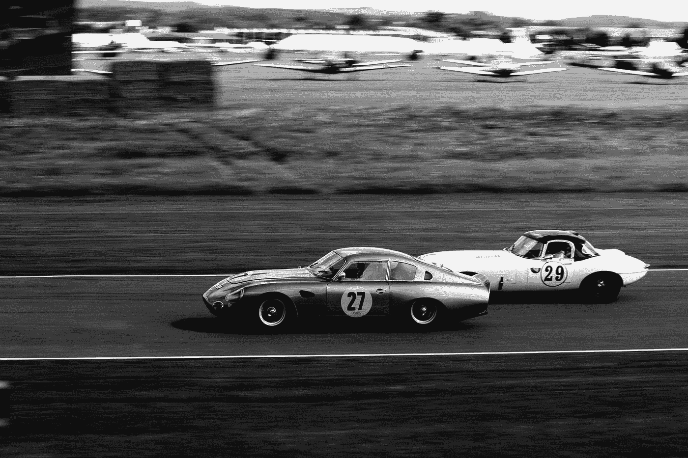

# 呆在你自己的车道上

> 原文：<https://medium.com/swlh/stay-in-your-own-lane-c3f64f922afe>

享受写作之旅

Photo by [Alex Holyoake](https://unsplash.com/@stairhopper?utm_source=medium&utm_medium=referral) on [Unsplash](https://unsplash.com?utm_source=medium&utm_medium=referral)

昨天我开车去了阿什维尔。我被困在两辆大卡车中间。GRrrrR！！我两边各有一个，持续了大约 3 个小时。

我意识到让我的目光 ***正好聚焦*** 在我自己的车道上是多么重要。如果我分神或者专注于*任何事情，而不是*留在我的车道上我可能会突然转向撞上一辆卡车，被撞，甚至死亡。