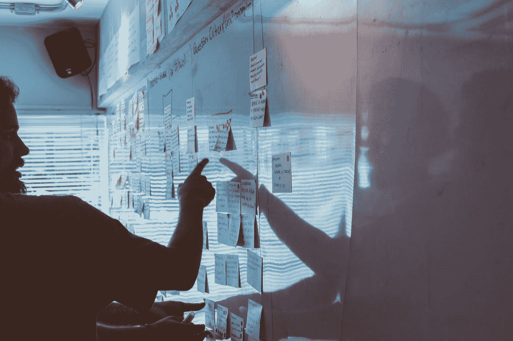

# 保持敏捷:进行冲刺

> 原文：<https://medium.com/swlh/staying-agile-running-a-sprint-ad4b3d9bb5f>

## 来自“软件工程食谱”系列——好的过程如何在保持敏捷的同时减少丢弃的代码

这篇文章来自“软件工程食谱”系列，旨在帮助成长中的工程团队保持有效性。今天我们将讨论在敏捷框架下运行 sprint。但是什么是敏捷呢？让我们看看尤尼科恩公司的人是怎么想的…

Photo by [Ferenc Horvath](https://unsplash.com/@designhorf?utm_source=medium&utm_medium=referral) on [Unsplash](https://unsplash.com?utm_source=medium&utm_medium=referral)

## **优利康公司的敏捷**

今天午饭后，当我们在电梯里相遇时，我正和简聊天。她说她的老板，产品副总裁，希望让流程更加敏捷，这样我们可以更好地合作，更有创造力。我的老板，工程副总裁也有类似的感觉。我想知道会发生什么。

上次我们尝试的时候，一名顾问进来，把一个由工程师、设计师和产品负责人组成的混合团队带到一个房间，让他们站成一圈，扔泡沫球。不知道为什么，但看起来很有趣。

除此之外，我认为我们已经非常敏捷了。我们有一个 backlog 来挑选特性，通常是按照优先级来组织的。一旦我们完成了一个功能，我们就将它合并到代码库中，并发布到公共网站上。我们通常会远离大的特性，因为它们需要重构或者大的重写。我想知道我们最终是否能找到他们。

等等，为什么每个人都这么慌张？不要告诉我一个功能又跳到了待办事项列表的首位！这是本周第三次了，而且今天才星期三。我想知道在 sprint 结束时我们会发布什么，如果我们发布任何东西的话！

Photo by [Patrick Perkins](https://unsplash.com/@pperkins?utm_source=medium&utm_medium=referral) on [Unsplash](https://unsplash.com?utm_source=medium&utm_medium=referral)

## **敏捷，其实是**

敏捷不代表“随机”，也不代表“混乱”。敏捷开发的目的是通过快速迭代，通常称为*冲刺*，并经常评估产品方向，以便公司可以尽早纠正并最大化其成功的可能性。

理想情况下，每个 sprint 都能为用户带来切实的好处，比如新的特性和稳定性的提高，尽管实际上有些特性需要多次 sprint 才能完成，而且在很长一段时间内都不会发布给公众。

当使用敏捷方法时，工程团队需要在混乱中找到秩序，确保对软件开发的首要问题给予适当的考虑，例如系统架构、数据完整性、安全性、可伸缩性、组件集成和可维护性。不这样做意味着构建和发布原型，而不是正确的软件，随着时间的推移，产生代码债务，直到系统作为一个整体变得不可维护。此外，随着代码质量下降，引入严重问题的可能性增加，最终损害最终用户。

秩序可以通过过程的引入来建立，但是这需要有意义和明智地制定，以避免过多地损害速度，从而抵消敏捷的好处。

在接下来的章节中，我们将看看跑一个 sprint 所涉及的不同活动，并提出一个规范它们的过程，这是在我最近工作过的团队和组织的真实应用中得到的启发。

Photo by [Felipe Furtado](https://unsplash.com/@furtado?utm_source=medium&utm_medium=referral) on [Unsplash](https://unsplash.com?utm_source=medium&utm_medium=referral)

## **准备开发**

为 sprint 准备实现计划的第一步是选择要处理的特性列表。这些特性通常来源于产品团队，并且是一个过程的结果，除了使这些特性“为开发做好准备”所需的步骤之外，我们在这里基本上不讨论这个过程。

为了使一个特性准备好进行开发，技术权威应该确定它的可行性和复杂性，并提供对其实现所涉及的工作的粗略估计。因此，我们需要确保在上述过程中，工程团队和产品团队之间有足够的协作，以产生这些信息。

从工程管理的角度来看，这意味着为这些活动分配正确的资源和正确的时间。在这里很难定义一个放之四海而皆准的公式，但一个明智的方法是从一个高级工程师每周 10-25%的时间部分参与开始，然后在此基础上进行调整。

高级工程师将与产品所有者和 UX 设计师密切合作，整理积压工作，并确保在功能达到“准备开发”阶段之前，在功能中提供足够的细节。就复杂性和时间估计而言，现阶段我们只需要一个粗略的指示，通常称为“t 恤尺寸估计”，来告诉我们一个故事是容易还是困难，尺寸是小、中还是大。

难度级别告知 sprint 分配流程需要参与其实现的工程师类型，而高层次的估计可以帮助我们确定如何安排故事。分配高级评估的简单准则如下:

*   **小型**:可以作为“错误修复和小型增强”工作队列的一部分来完成，不需要太多的技术规范或高级管理人员的投入。
*   **中等**:在实现之前需要技术规范，但是应该能够适应 sprint，可能只涉及一个小团队。
*   大尺寸:很可能需要多次冲刺才能完成。这是一个更大的项目，可能会受益于进一步的细分。

Photo by [Kelly Sikkema](https://unsplash.com/@kellysikkema?utm_source=medium&utm_medium=referral) on [Unsplash](https://unsplash.com?utm_source=medium&utm_medium=referral)

## **选择功能**

一旦故事“为开发做好了准备”，它们就可以由产品负责人进行优先级排序，而很少涉及到工程团队。然后，我们可以通过在 sprint 启动会议上从优先列表中进行选择，为 sprint 准备一个粗略的范围，该会议应该再次涉及工程和产品团队。

在 sprint 启动时，特性列表应该被认为是暂时的，直到技术规范和工作评估已经产生。同时，一些团队成员可以开始处理“bug 修复和小的增强”队列。

在我最近合作的团队中，规格和评估通常需要大约 1 周的时间来制作和批准，尽管这可能会因您的具体情况而异。有关评估和制作技术文档的帮助，请参见这些相关文章，也来自*软件工程指南*系列:

*   [技术文件](/swlh/technical-documentation-2096c96ecd5a)
*   [规划与估算](/swlh/planning-and-estimation-11e59ac1956b)

Photo by [Startaê Team](https://unsplash.com/@startaeteam?utm_source=medium&utm_medium=referral) on [Unsplash](https://unsplash.com?utm_source=medium&utm_medium=referral)

## **最终确定计划**

既然规格和评估已经准备好了，我们就可以最终确定 sprint 计划，并将其提交给产品团队进行最终批准。

最终确定计划时，我们需要将工程师分配到不同的工作队列中。值得为“错误修复和小的增强”设置一个队列，并为每个选择的特性设置一个队列。我们将这些工作队列称为 ***任务组*** 。

每个工作队应具备:

*   一个**技术负责人**，通常是为该特性编写技术规范的人，或者另一个对相关组件有很好理解的高级工程师。他们的工作是领导特性的开发，同时也是产品所有者在任何相关问题上的技术联系人。
*   一个**设计引导**。设计团队的联系人，他与技术负责人一起澄清与功能相关的设计，并确保在需要时 UI 资源可用。
*   零个或多个额外的工程师和零个或多个额外的设计师(UX 和/或用户界面)，这取决于复杂性和时间限制。

Photo by [Mimi Thian](https://unsplash.com/@mimithian?utm_source=medium&utm_medium=referral) on [Unsplash](https://unsplash.com?utm_source=medium&utm_medium=referral)

## **实现特性**

一旦任务组成立，计划最终确定，就可以开始开发各种功能。

在此阶段，有必要进行简短的每日同步，以确保实施按计划进行，并根据需要进行纠正。您可能会发现在 sprint 中运行一个包含所有特性的同步是有益的，或者将它们分成不同的级别:为每个任务组进行同步，然后在任务组领导和工程、设计和产品团队中更高级的利益相关者之间进行同步。这很大程度上取决于你当前的公司规模和文化，并且可以根据需要随时改变。

在某些情况下，由于技术或设计问题，可能需要暂停或完全停止特定功能的实现。

当这种情况发生时，工程、设计和产品团队可以一起调整 sprint 的范围，并选择可供开发的替代功能。为此目的，采用优先化的小增强的 backlog 并不少见，随着 sprint 的进行，基本上改变了“bug 修复和小增强”队列的范围。

此外，在实现阶段关注功能质量是值得的，如果可能的话，为每个特性指派一个质量工程(QE)专家来执行相关的质量工作，例如确保遵循测试驱动开发指南，以及运行手动测试。

Photo by [Andrik Langfield](https://unsplash.com/@andriklangfield?utm_source=medium&utm_medium=referral) on [Unsplash](https://unsplash.com?utm_source=medium&utm_medium=referral)

## **集成发布功能**

在实施阶段的最后，需要将开发的所有功能整合到一个发布包中。在这个阶段，代码的不同部分之间可能会出现冲突，这通常是由于底层组件的行为发生了变化，从而产生了意想不到的副作用。

为了在发布之前捕捉这些问题，在合并的代码基础上运行发布集成测试/修复(RIT)练习是有益的。在 RIT 期间，所有参与 sprint 开发的工程师都应该与 QE 团队合作，创建一个值得更广泛发布的可交付产品。

然后，QE 经理应该审查最终的构建，并决定是否接受发布，可能的话，在构建的同时提供一个已知问题的列表，由产品团队进一步接受或拒绝。

Photo by [Mimi Thian](https://unsplash.com/@mimithian?utm_source=medium&utm_medium=referral) on [Unsplash](https://unsplash.com?utm_source=medium&utm_medium=referral)

## **产品团队验收**

假设构建被 QE 经理接受，各种产品所有者应该检查它并通过确保他们所拥有的功能按预期实现来签字，并确认所报告的已知问题对于更大范围的发布是否是可接受的。

这一审查有三种可能的结果:

*   **关**:造的不错，可以做进一步的发布安排。
*   拒绝:这个版本不会公开发布。将在接下来的 sprint 中安排进一步的工作来纠正遇到的问题，无论是技术问题还是功能问题。
*   **修订**:构建需要修订。有一些问题，工程团队认为是足够小的，可以安全地尝试再次构建一个值得发布的版本。“安全地”在这里是一个重要的词:应该评估引入更多问题的风险，并决定修改构建是否有意义，或者干脆拒绝它。

Photo by [ROBIN WORRALL](https://unsplash.com/@robin_rednine?utm_source=medium&utm_medium=referral) on [Unsplash](https://unsplash.com?utm_source=medium&utm_medium=referral)

## **进一步测试和公开发布**

在一个构建被接受后，它可以直接提供给整个用户群(公众)，或者它可以通过由产品团队或组织的其他部分设置的进一步的接受阶段。

接下来的步骤超出了运行 sprint 的范围，到这个时候团队应该已经在为接下来的 sprint 做准备了。

Photo by [Hal Gatewood](https://unsplash.com/@halgatewood?utm_source=medium&utm_medium=referral) on [Unsplash](https://unsplash.com?utm_source=medium&utm_medium=referral)

## **关于“错误修复和小改进”的一句话**

我们前面看到，我们可以将小的增强作为一个单独队列的一部分，该队列也处理 bug 修复。让我们更深入地讨论一下这个队列中的 bug 修复方面，因为在 sprint 的开始阶段计划这方面的工作时，需要记住一些注意事项。

此队列中的错误通常是内部和外部报告的问题，已经由 QE 团队验证，并由产品团队优先修复。

然而，并不是所有的缺陷都是一样的。一些 bug 完全跳过了这个优先化步骤，一被报告就进入“bug 修复和小的增强”,如果必要的话，甚至在 sprint 中期。这些错误通常是高可见性或高严重性的问题，如安全问题、导致不可恢复的数据损坏或服务严重中断的操作，这些问题会严重影响最终用户。

在修复了这类错误之后，通常会放入一个“补丁”,与 sprint 的其他部分隔离，发布到产品中。这意味着有时要修复两次 bug:一次是在代表当前产品构建的代码基础上，另一次是在当前 sprint 的代码基础上。

还要注意，根据软件的性质，这个“补丁”可能需要更多的工作，而不仅仅是生产上的下降。例如，一个移动应用程序需要提交到 App Store / Google Play /等。，而定制的企业解决方案将需要与客户进一步协调。

这些场景值得考虑，以避免“错误修复和小的增强”队列人员不足，这将导致在报告关键或突发问题的情况下其他工作被延迟。

Photo by [bonneval sebastien](https://unsplash.com/@gentlestache?utm_source=medium&utm_medium=referral) on [Unsplash](https://unsplash.com?utm_source=medium&utm_medium=referral)

敏捷是一个非常有用和广泛使用的框架，用于生产对商业环境的变化反应非常迅速的软件，但是它会导致混乱和困惑。希望这篇文章提供了一些关于如何在工程学科中平衡这种方法所固有的不确定性的思考，并且将帮助您通过遵循良好的工程实践来建立一个最大限度地减少代码丢弃的过程。

你的团队是如何在敏捷框架内工作的？你还有什么其他的过程或建议想和大家分享吗？请在下面留下您的想法，我将很高兴就此话题展开进一步的讨论。

同时，祝你一路顺风，继续做好事！