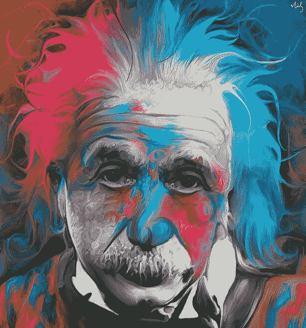

# 保持好奇

> 原文：<https://medium.com/swlh/staying-curious-7b54b6eeee5b>

…是生活的关键。

deviantart.com

> “我既不聪明，也没有特别的天赋。我只是非常非常好奇。”—阿尔伯特·爱因斯坦
> 
> “要好奇。不做判断”——沃尔特·惠特曼

我有 5 只非常好奇的猫。他们似乎在睡觉、吃饭、使用猫砂盒和拥抱之间有一种主要的情感。