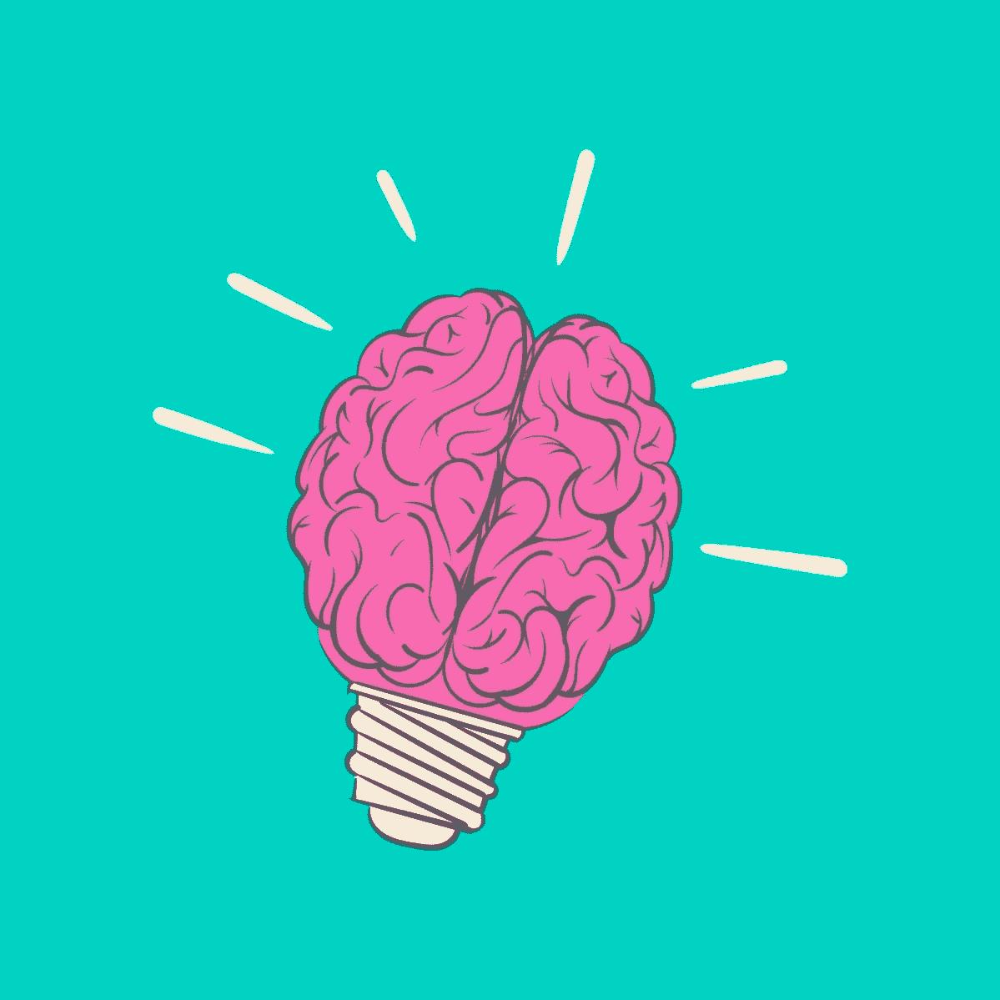

# 在数字时代保持人性(塑造下一代的一系列幸运提示)

> 原文：<https://medium.com/swlh/staying-human-in-the-digital-era-a-series-of-fortunate-tips-for-shaping-the-next-generation-fa92ce3ed175>

Image Credit: Rawpixel

全世界的网民们，现在是 2019 年，我们很多人每天都在谈论这个话题:对话式营销、行为科学、机器学习、流程自动化、生产力工具、聊天机器人、算法、人工智能、大数据、深度学习、加速数字化转型等等…