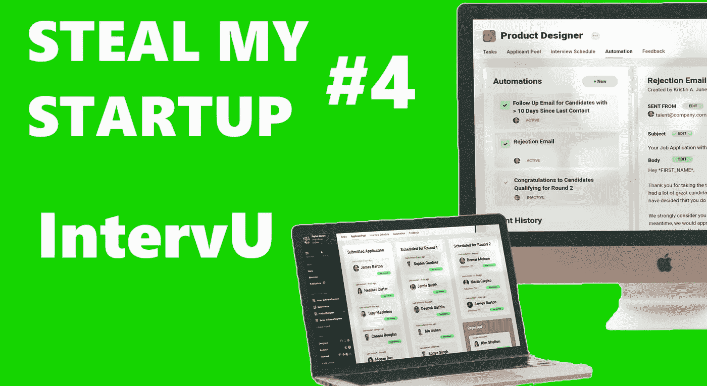
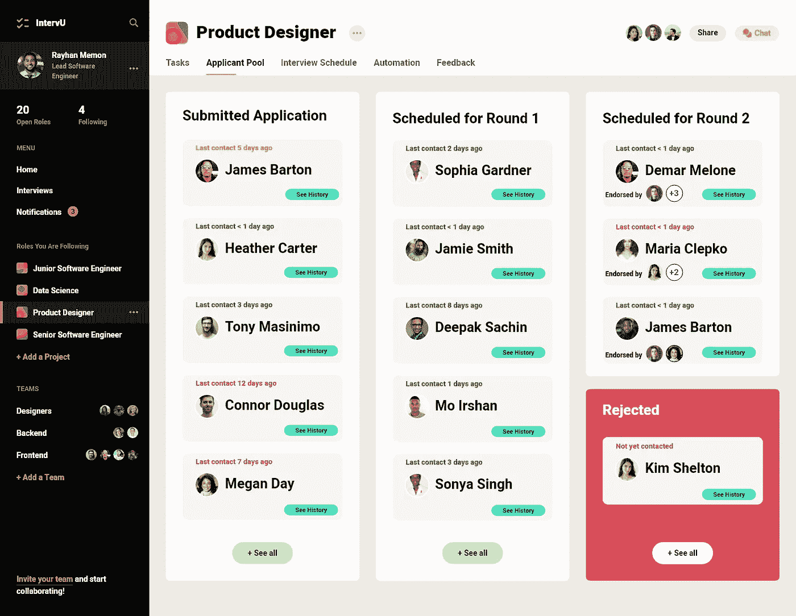
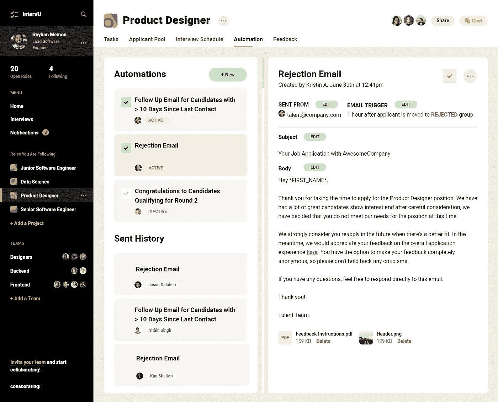
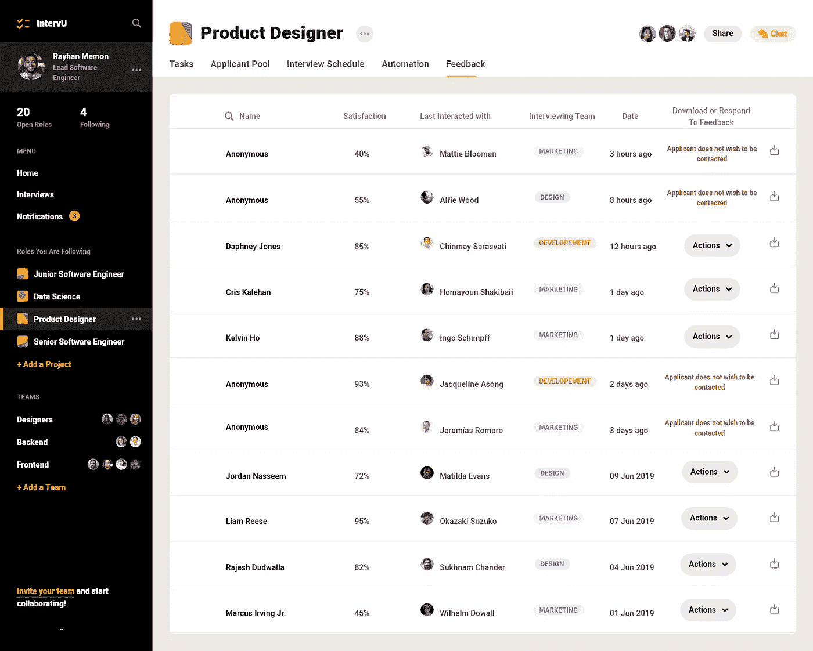

# 短信#4:如何结束糟糕的面试

> 原文：<https://medium.com/swlh/steal-my-startup-4-intervu-1e19d14ae970>

***【上看……】****注意，本文绝不代表全面的商业计划。相反，它是一个完整模型的基础，我给你完全的权力和所有权来构建它。说白了，如果你想“偷走我的创业”，请便。*

你在申请工作或参加面试时有过消极的经历吗？这段经历是否足以影响你对公司的看法？

很久以前，我参加了一家大型科技公司实习的最后一轮面试——那种“我们提供午餐和无限假期政策”的面试。我被告知，我将与我的两位潜在经理进行视频通话(如果我成功的话)，面试将分两部分进行。对于第 1 部分，我需要展示一个我过去参与的软件项目，并向他们展示我的代码。对于第二部分，我将面临一个挑战，并给我半个小时来解决它。

在整个第 1 部分中，我结结巴巴地介绍了我在夏天参与的一个简单的机器人项目。一位面试官在敲打键盘(我向你保证，他绝对没有做笔记)，而另一位则闭着眼睛把头靠在手掌上。我尽力保持冷静，最后问他们对我刚才介绍的内容是否有任何问题。他们说“不”,并向我告别，没有提到采访的第二部分。

尽管在那次面试后我对自己很严厉，但我对公司的批评更加严厉。“我们在员工中培养伟大的个人成长”我的屁股…他们甚至不在乎完成我的采访。我花了一年时间，与该公司的产品和几名员工进行了几次更积极的互动，才最终把自己作为局外人的经历一笔勾销。

从那以后的几年里，我开始同情地倾听朋友们抱怨他们在找工作时的负面经历，我开始发现，不专业行为的事件可能(而且确实)出现在申请过程的各个阶段。

候选人会被约去打电话或喝咖啡聊天。

应聘者在面试时待遇很差。

候选人被告知“下周会有回音”，但根本没有回音。

尽管一些企业的招聘做法会对申请人产生负面影响，但我们必须从企业自身的角度来看待这个问题，以便发现机会。

事实是，企业总是受到自身不良行为的负面影响。他们很少想打击候选人的积极性，他们当然也不希望因重复事件而导致媒体的负面报道。

这里有一个机会…

我们的假设:

*   负面的申请/面试经历会损害公司的声誉——公司会为此付出代价。
*   加强问责制将降低招聘过程中的负面事件发生率。
*   从有负面经历的求职者那里获得反馈并与之交谈，将会减少媒体/口碑对公司的负面影响。

***【上看……】****注意，本文绝不代表全面的商业计划。相反，它是一个完整模型的基础，我给你完全的权力和所有权来构建它。说白了，如果你想“偷走我的创业”，请便。*

## 电梯推销术💬

你的公司正在招聘。

一位聪明的年轻女性研究了你的使命、文化和可用的角色，并将你的公司放在她的候选名单的首位。她在接下来的一周里没有收到任何回复，因此决定通过 LinkedIn 联系你的人才体验专家，以了解更多信息。在这方面也没有回应，她认为她的申请被拒绝了，并开始扩大她的求职范围，仔细看看她最喜欢的第二和第三家公司。几天后，她的收件箱里出现了一封来自贵公司的电子邮件，邀请她参加视频面试。在预定的时间，她坐在办公桌前，登录 google hangouts，等待有人进入会议。20 分钟后，她收到了一封来自你的人才团队的电子邮件，解释了“发生了一些事情”，并提供了一个新的聊天时间。在这一点上，她有点厌倦了，但她认为值得再试一次。在重新安排的面试中，她的面试官对她要说的一切都表现得不感兴趣，这让人忍无可忍。恼火和尴尬之余，她接受了另一家公司的竞争性报价，这家公司对她更加热情和尊重。

想到这种违反职业道德的行为会在你的公司发生，你会感到不安，但更令人担忧的是，如果这种事情真的发生了，你可能甚至都不知道。

在这个假设的场景中，你的业务成本不仅仅是优秀人才的流失。你的名誉岌岌可危。如果在查看新工作的合同时，她在玻璃门前停下来发泄她的经历，该怎么办？如果她的男性朋友对主动出击感到好奇，并询问她是否应该主动出击，该怎么办？

你有一个完整的营销团队，他们的全部目的是控制围绕你的业务的叙事，但当糟糕的口碑和令人瘫痪的玻璃门评论只是让你的声誉陷入泥沼时，你宣扬的价值观有什么好处呢？你设计的故事？你提倡的‘胜利文化’？

*IntervU* 即将介入——这是第一款以*求职者为中心的*招聘软件，为您的企业提供必要的工具，使其在整个招聘过程中承担责任，培养与求职者更积极的互动，并在负面评价在其他地方公开之前，为您提供接收和回应负面评价*的基础设施。*

## **价值主张**💡

其核心是，IntervU 致力于在招聘时增加企业的内部透明度和问责制。结果，客户为自己创造了价值。

为了做到这一点，IntervU 提供了三个主要功能:交互跟踪、自动化交互和反馈管理。

## **互动追踪**

公司通常会在多个平台上发布招聘信息，以让自己的角色尽可能多地出现在公众面前。流行的例子包括 LinkedIn，和 AngelList。

老实说，我不确定公司目前使用的工具和方法，来对来自这些平台的提交内容进行排序、分组和管理，但我无法想象这是一项容易的任务。

*IntervU* 将从所有求职平台获取客户特定职位的提交信息，并在“申请池”中呈现这些信息。

该职位的所有关键决策者都可以查看申请人，并投票决定谁应该进入公司面试流程的后续阶段。这为员工提供了一个可视化的协作环境，让他们能够一起工作，并确定最适合他们的公开角色。

然而，汇总所有提交的最重要的原因是跟踪与每个申请人的互动。

给定用于回答问题和分发面试信息的指定联系点电子邮件的登录凭据(例如，talent@yourCompany.com)，IntervU 平台可以跟踪与每个申请人的互动历史 Gmail 有一个 API(应用程序编程接口)允许您这样做。

不幸的是，在没有通过电子邮件安排或促进的咖啡聊天和其他交互的情况下，可能需要手动输入。

出于几个不同的原因，保留每个申请人的交往历史是有价值的:

1.  您可以查看有一段时间没有联系的人，并提示自己(或其他人)联系更新。
2.  不同收件人、电子邮件链和人员之间的所有交互和对话都可以轻松共享和查看。
3.  其他决策者可以查看申请人的交往历史以了解最新信息。

## 自动化交互

有多少次，我坚持说“我们会在周一回复你”，但周二又来了……我以前坐过几次桌子的另一边，我明白这些软承诺是如何被打破的。

*   你不得不推后一个候选人的面试，所以在面试完成后的第*天你才能回复其他人。*
*   你的主管这周不在，在联系成功的申请人之前，你需要先和他/她确认你的决定。
*   你想发出参加下一轮面试的邀请，但是在你知道其他面试官的工作日期之前，你不能发出邀请。

尽管这些理由可能是合理的，但它们无法改变这样一个事实:你每推迟一天与潜在客户接触，潜在客户就又多了一天权衡其他选择的利弊。

有了*面试自动化，你可以继续与你的每一位申请人进行个性化的互动，而不会将你的注意力从你的其他职责上移开。*

**示例用例:**

1.  超过 10 天没有联系的申请人将收到一封跟进邮件，感谢他们的耐心，并解释他们的申请仍在审查中
2.  被标记为“拒绝”的申请人将收到一封亲切的电子邮件，感谢他们的兴趣，并提供一个链接，让他们与公司分享他们的反馈。

最后一个使用案例为我们带来了最后一个特性…

## 反馈管理

> “我们都需要能给我们反馈的人。这就是我们改进的方式。”—比尔·盖茨

如果你有机会阻止对你的公司的负面评论或评论公之于众并毒害油井，你会抓住吗？

IntervU 为你提供了这样一个框架。一旦申请人不再参与面试流程(无论是被雇用还是被拒绝)，他们将收到一封自动发送的电子邮件，链接到反馈表。为了鼓励尽可能多的坦诚，如果申请人愿意，他们的信息可以匿名，申请人也可以选择不联系他们的反馈。

通过正确使用这种反馈，公司可以努力修补受损的关系，和/或利用反馈改进内部流程，并与事故责任人进行重要对话。

## 定价💰

在我担任大学孵化器主任的时候，我还没有遇到过任何学生经营的 B2B 企业(至少没有一家是做销售的)。也就是说，我不认为我有足够的权力来建议你如何给这样的 SaaS 产品定价。但是如果你感兴趣，这里有一些我的建议:

*   考虑到您对每个客户的服务将是持续的(软件更新、定制、技术支持、服务器空间等)。)我强烈建议采用订阅模式，而不是预先付费。
*   让你的定价结构中的某些部分是可变的。各公司在规模、年收入、资金等方面差异很大。虽然你不能在没有系统的情况下随意达成交易，但你也必须考虑到不同客户的预算差异。
*   对替代软件做大量的研究，看看它们目前是如何定价的。**不要**简单地将你的产品定价更低作为一种“竞争优势”,因为这样你就会陷入与竞争对手的竞争中，而不是专注于创造*真正的*竞争优势。

如果你想了解更多信息，我找到了一篇关于企业软件定价的好文章。你可以点击查看[。](http://www.onstartups.com/tabid/3339/bid/174/Startup-Tips-for-Enterprise-Software-Pricing.aspx)

## 风险和缺点🤷🏽‍♂️

每个商业想法都有其风险和缺点。下面是一些为 *IntervU* 准备的。

*   匿名可能不足以获得诚实的反馈。

成功的申请人，以及希望继续申请的不成功的申请人，可能会因为害怕被曝光而难以分享他们的真实反馈。

除非 IntervU 成为“行业标准”,申请人对该软件越来越熟悉(并因此更加信任),否则我想不出有什么方法可以确保申请人相信他们的匿名性。

然而，最重要的反馈很可能来自最关键的虐待案例。我相信，在这种情况下，心怀不满的申请者会准备好并愿意分享他们未经过滤的反馈。

*   **非电子邮件交互的手动输入需要细节和上下文。**

咖啡聊天，电话，采访。在申请人的互动日志中，这些互动不应仅仅是“日期和时间”。让员工自我报告这些互动的细节将是(1)乏味的；(2)不完整；以及(3)有偏差。

解决这个问题的一个办法是在网络/移动应用程序中内置一个录音机，让员工在互动发生时简单地记录下来。然而，我想许多申请人不会对被记录感到舒服。

**IntervU 功能可能需要不存在的 API 支持。**

为了聚集来自所有职位发布平台的所有申请提交，需要来自这些平台的 API 支持，以便提取这些信息。我还没有做足够的研究来了解这些 API 是否存在，以及它们是否具有所需的功能。

将所有申请集中在一个地方的另一种方法是在每个招聘信息中包含一个“通过 IntervU 申请”的链接。这将需要为 IntervU 开发一个工作申请门户网站。

## 你的 TURN✍🏽

通常，我会利用这一部分来征求您对我的方法的评价。但是对于这个特别的想法，我很想听听你有什么申请/面试的恐怖故事。对于 CEO 和创始人来说，这是你会使用的解决方案吗？

请在评论中告诉我。

谢谢你抽出时间。点击[此处](https://mailchi.mp/c1d5f1044b7c/from-idea-to-incubator)如果你想要一本免费的我的新书《*从创意到孵化器》*如果你想表示你的支持，请在 Medium 上关注我！

直到下一次…